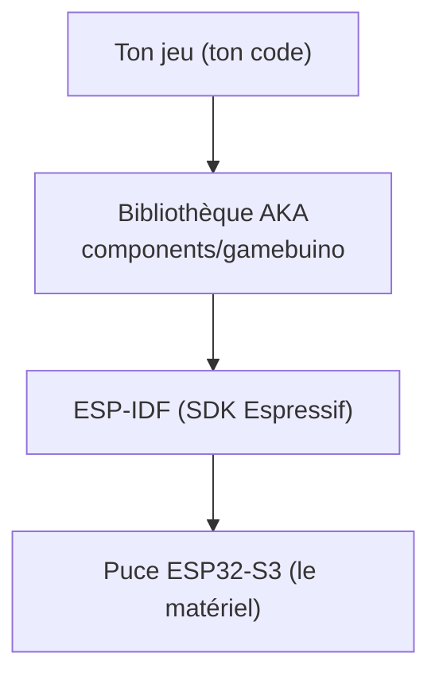

# Chapitre 01 — Introduction

[Accueil](index.md) | [Chapitre suivant »](Chapitre_02.md)


---

## Ce que ce tutoriel est (et n'est pas)

Ce guide t'apprend à écrire un jeu **de zéro** sur la **Gamebuino AKA**, en C++, en
ajoutant les morceaux **un par un**. À chaque étape tu obtiens un programme **complet
et testable** sur la console : on ne balance jamais 300 lignes d'un coup.

Le fil rouge est un **casse-briques** (une balle, une raquette, des briques), parce
qu'il réunit tout ce qu'on retrouve dans presque tous les jeux : dessiner à l'écran,
lire les touches, faire bouger des objets, détecter des collisions, jouer des sons,
sauvegarder.

> Ce tutoriel ne suppose **aucune** connaissance préalable du C++ embarqué. Chaque
> notion nouvelle (tableau, structure, boucle, adressage mémoire…) est expliquée au
> moment où on en a besoin, pas avant.

---

## La console en une image

```
        Gamebuino AKA
 ┌───────────────────────────┐
 │  ┌─────────────────────┐  │   Écran : 320 x 240 pixels, couleur
 │  │                     │  │   Cerveau : puce ESP32-S3 (2 cœurs)
 │  │   écran 320 x 240   │  │   Langage : C++ (via ESP-IDF)
 │  │                     │  │   Entrées : joystick + boutons
 │  └─────────────────────┘  │   Stockage : carte micro-SD
 │   (joy)      A B  RUN MENU │   Son : haut-parleur intégré
 └───────────────────────────┘
```

Concrètement, programmer la AKA veut dire : **remplir une image de 320×240 pixels**,
**lire l'état des touches**, et recommencer ~30 fois par seconde. Tout le reste
(physique, sons, score) se construit par-dessus ces deux idées.

---

## L'outillage, en deux couches

Tu vas utiliser deux choses bien distinctes. C'est important de ne pas les confondre :

1. **La bibliothèque AKA** (le dossier `components/gamebuino`, fourni par l'auteur de
   la console). Elle t'offre des fonctions simples et lisibles : « efface l'écran »,
   « dessine un rectangle », « lis les boutons ». **C'est elle qu'on utilise dans tout
   le tutoriel.** Tu la déposes dans ton projet **telle quelle** et tu n'y touches pas
   (c'est une brique indépendante, mise à jour séparément).

2. **ESP-IDF**, le « SDK » d'Espressif pour la puce ESP32-S3. C'est la couche en
   dessous : le compilateur, l'outil `idf.py`, la gestion mémoire, les tâches. On s'en
   sert pour **compiler et flasher**, et on y touchera très ponctuellement (le temps,
   les tâches). On l'explique quand ça arrive.



> ⚠️ La bibliothèque AKA a une partie « bas niveau » (des fichiers nommés `gb_ll_…`,
> pour *low level*). **On ne les appelle pas directement** : ce sont les pilotes
> internes. On passe toujours par l'API de haut niveau (`gb_core`, `gb_graphics`…),
> qui est faite pour les jeux. Mélanger les deux donne un code fragile et confus.

---

## Le plan du voyage

| # | Chapitre | Ce que tu sauras faire à la fin |
|---|----------|-------------------------------|
| 02 | Installer l'environnement | compiler et flasher un projet vide |
| 03 | Structure du projet | comprendre les `CMakeLists.txt` et où va ton code |
| 04 | Premier affichage | écrire des pixels, lignes, rectangles, sprites |
| 05 | Boucle de jeu | la structure « lire → mettre à jour → dessiner » |
| 06 | Cadence et timing | une vitesse de jeu stable |
| 07 | Lire les entrées | joystick et boutons, appui *maintenu* vs *déclenché* |
| 08 | La raquette | un objet qu'on déplace et qu'on borne |
| 09 | La balle | position, vitesse, rebonds sur les murs |
| 10 | Collision Arkanoid | détecter un contact et calculer un rebond |

À partir du chapitre 11 (briques, audio, sauvegarde, menus…), on assemble le vrai jeu.

---

## À retenir

- On construit **incrémentalement**, chaque étape est testable.
- On utilise l'**API de haut niveau** de la lib AKA, jamais les pilotes `gb_ll_…`.
- Le dossier `components/gamebuino` est une **brique externe** : on ne le modifie pas.

---

[Accueil](index.md) | [Chapitre suivant » : Installation](Chapitre_02.md)
