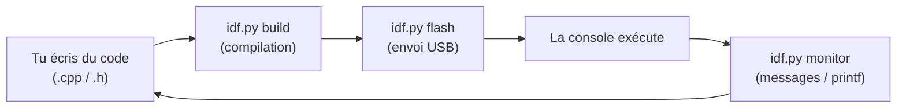

# Chapitre 02 — Installer l'environnement

[« Précédent](Chapitre_01.md) | [Accueil](index.md) | [Suivant »](Chapitre_03.md)


---

## Objectif

Installer de quoi **compiler** ton code (le transformer en programme) et le **flasher**
(l'envoyer dans la console). À la fin, tu auras vérifié que la chaîne fonctionne sur un
projet vide.

---

## Qu'est-ce qu'on installe, au juste ?

Ton PC ne sait pas parler « ESP32-S3 » tout seul. Il faut **ESP-IDF** (*Espressif IoT
Development Framework*), qui contient :

- le **compilateur croisé** (*cross-compiler*) : un compilateur qui tourne sur ton PC
  mais produit du code pour la puce ESP32-S3 (une architecture différente, « Xtensa ») ;
- **`idf.py`** : l'outil en ligne de commande qui orchestre tout (configurer, compiler,
  flasher, voir les messages de la console) ;
- des **outils de build** : CMake et Ninja (on explique leur rôle au chapitre 3).

> 💡 Un *compilateur croisé* : imagine que tu écrives une lettre en France pour qu'elle
> soit lue au Japon. Tu écris chez toi (le PC), mais dans une langue destinée à
> quelqu'un d'autre (la puce). Le compilateur croisé fait exactement ça pour le code.

---

## Installation

Le plus simple et le plus fiable est l'**extension officielle ESP-IDF pour VS Code**,
qui télécharge et configure tout pour toi.

1. Installe **VS Code**.
2. Dans VS Code, ouvre l'onglet Extensions et installe **« ESP-IDF »** (éditeur :
   Espressif).
3. Lance la commande *ESP-IDF: Configure ESP-IDF Extension* → *Express*, choisis une
   version **v5.x** récente, et laisse l'assistant installer la toolchain.

Guide officiel (à garder sous la main) :
<https://docs.espressif.com/projects/esp-idf/en/latest/esp32s3/get-started/index.html>

> Sous Windows, tu peux aussi utiliser l'installateur « ESP-IDF Tools Installer ». Sous
> Linux/macOS, on clone le dépôt puis on lance `./install.sh` et `. ./export.sh`. Les
> trois voies aboutissent au même `idf.py`.

---

## Vérifier que tout marche

Ouvre un terminal **ESP-IDF** (celui où `idf.py` est reconnu) et tape :

```bash
idf.py --version
```

Tu dois voir une ligne du type `ESP-IDF v5.x`. Si oui, la chaîne est prête.

---

## Le cycle de travail (à connaître par cœur)

Pour **n'importe quel** projet AKA, tu répéteras ces trois commandes :

```bash
idf.py set-target esp32s3     # une seule fois par projet : choisit la puce
idf.py build                  # compile ton code
idf.py -p COM3 flash monitor  # envoie sur la console + affiche les messages
```

- Remplace `COM3` par le port de ta console (souvent `COMx` sous Windows,
  `/dev/ttyUSB0` ou `/dev/ttyACM0` sous Linux).
- `monitor` ouvre la **console série** : c'est là que s'affichent tes `printf` de
  débogage. On quitte le moniteur avec `Ctrl+]`.



> ⚠️ **Piège classique** : ESP-IDF n'est **pas** Arduino. Certaines fonctions
> Arduino (`millis()`, `Serial.print`, `delay()`) n'existent pas telles quelles ici. On
> utilisera les équivalents ESP-IDF et ceux de la lib AKA (par ex. `gb.get_millis()`).

---

## Récupérer la bibliothèque AKA

Ton projet aura besoin du dossier `components/gamebuino`. Prends **la version la plus
récente** de la lib et copie ce dossier **tel quel** dans ton projet (structure exacte
au chapitre 3). Tu n'as rien à modifier dedans.

Dépôt de la bibliothèque : <https://github.com/jmp42/Gamebuino_AKA_lib>

---

## À retenir

- On compile/flashe avec **`idf.py`** (build → flash → monitor).
- ESP-IDF **v5.x**, cible **esp32s3**.
- Le **moniteur série** affiche tes `printf` : c'est ton meilleur ami pour déboguer.

---

[« Précédent](Chapitre_01.md) | [Accueil](index.md) | [Suivant » : Structure](Chapitre_03.md)
