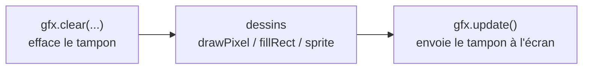

# Chapitre 04 — Premier affichage : du pixel au sprite

[« Précédent](Chapitre_03.md) | [Accueil](index.md) | [Suivant »](Chapitre_05.md)


---

## Objectif

Comprendre **comment** l'écran fonctionne, du plus élémentaire (un pixel) au plus
pratique (un sprite). On va d'abord tout faire « à la main » pour comprendre, **puis**
on utilisera les fonctions toutes prêtes de la lib. Comprendre le principe rend ces
fonctions évidentes au lieu de « magiques ».

---

## 1. L'écran est un tableau : le *framebuffer*

L'écran fait **320 pixels de large** et **240 de haut**. La console garde en mémoire
une copie de l'image, appelée **framebuffer** (« tampon d'image »). C'est simplement un
**grand tableau** de 320 × 240 = **76 800 cases**, une par pixel :

```c
// déjà fourni par la lib (tu n'as pas à le déclarer) :
gb_pixel framebuffer[320 * 240];   // gb_pixel = un entier 16 bits (une couleur)
```

Un **tableau**, en C/C++, c'est une suite de cases numérotées à partir de 0. Ici chaque
case contient **la couleur d'un pixel**.

### Le repère de l'écran

```
      x →   0 . . . . . . . . . . . . . . . 319
   y  ┌───────────────────────────────────────┐
   ↓  │ (0,0)                                  │   x : colonne (0 à gauche → 319 à droite)
   0  │   •                                    │   y : ligne   (0 en haut  → 239 en bas)
      │                                        │
      │                (160,120) = centre •    │
      │                                        │
  239 │                                  (319,239)
      └───────────────────────────────────────┘
```

### Du (x, y) vers une case du tableau

Le tableau est **à une seule dimension**, mais l'écran en a deux. On range donc les
pixels **ligne par ligne** : d'abord toute la ligne 0 (320 pixels), puis la ligne 1,
etc. C'est ce qu'on appelle un rangement *row-major*.

```
mémoire :  [ ligne 0 : 320 px ][ ligne 1 : 320 px ][ ligne 2 : 320 px ] ...
index   :   0            319    320          639    640          959
```

Pour trouver la case du pixel (x, y), on saute `y` lignes complètes (chacune de 320
pixels) puis on avance de `x` :

```
index = y * 320 + x
```

C'est **la** formule à retenir : elle relie une position à l'écran à une case mémoire.

---

## 2. Une couleur tient sur 16 bits

Chaque case du framebuffer est un entier **16 bits**. Pourquoi 16 et pas 24 (le « vrai »
RGB des PC) ? Parce que 76 800 pixels × 2 octets = 150 Ko : c'est déjà beaucoup pour une
petite puce. On code donc chaque couleur de façon compacte : **5 bits de rouge, 6 de
vert, 5 de bleu**.

Sur la AKA, l'ordre des bits met le **rouge en bas** :

```
 bit :  15 14 13 12 11 | 10  9  8  7  6  5 |  4  3  2  1  0
        └─── bleu (5) ─┘└──── vert (6) ────┘└─── rouge (5) ┘
```

Tu n'as pas à faire ce calcul toi-même : la lib fournit une fonction qui prend des
composantes classiques 0–255 et te rend la couleur 16 bits :

```cpp
uint16_t rouge = gfx.makeColor(255,   0,   0);   // R max, V 0, B 0
uint16_t cyan  = gfx.makeColor(  0, 255, 255);
```

Et il existe des couleurs **prédéfinies** prêtes à l'emploi : `color_black`,
`color_white`, `color_red`, `color_green`, `color_blue`, `color_yellow`,
`color_orange`, `color_pink`, `color_gray`… On les utilise directement.

---

## 3. Écrire un pixel… à la main

Maintenant qu'on sait que le framebuffer est un tableau et qu'une couleur est un nombre,
allumer un pixel devient trivial : on **écrit une couleur dans la bonne case**.

```cpp
#include "gamebuino.h"

gb_core     gb;
gb_graphics gfx;

extern "C" void app_main(void)
{
    gb.init();
    gfx.clear(color_black);                       // tout le tampon en noir

    int x = 160, y = 120;                          // le centre
    framebuffer[y * 320 + x] = color_white;        // <-- on allume UNE case

    gfx.update();                                  // envoie le tampon à l'écran

    while (true) gb.delay_ms(100);
}
```

**À tester :** un point blanc apparaît au centre de l'écran noir. Tu viens d'écrire dans
la mémoire vidéo directement — il n'y a pas de magie en dessous.

> ⚠️ Écrire hors du tableau (par ex. `x = 500`) corromprait la mémoire. Tant qu'on
> reste dans 0–319 / 0–239, tout va bien. La fonction de la lib ci-dessous ajoute
> justement cette vérification pour nous.

### La version de la lib fait exactement la même chose

`gfx.drawPixel(x, y, couleur)` calcule `y*320 + x`, vérifie les bornes, puis écrit dans
`framebuffer` — c'est-à-dire **la même ligne que ci-dessus**, en plus sûr. Désormais on
l'utilise :

```cpp
gfx.drawPixel(160, 120, color_white);   // équivalent, borné, recommandé
```

---

## 4. Une ligne = une boucle de pixels

Une ligne horizontale, c'est une suite de pixels à la même hauteur `y`, de `x0` à `x1`.
Une **boucle `for`** parcourt ces `x` :

```cpp
int y = 50;
for (int x = 20; x < 120; x++)          // pour chaque colonne de 20 à 119
    gfx.drawPixel(x, y, color_green);   // on allume le pixel (x, y)
```

Rappel sur le `for` : `int x = 20` (départ), `x < 120` (condition de continuation),
`x++` (incrément à chaque tour). On répète le corps tant que la condition est vraie.

Tu viens de réinventer le tracé de ligne. La lib en propose une version directe (et
optimisée pour les traits horizontaux/verticaux) :

```cpp
gfx.setColor(color_green);          // couleur du "stylo"
gfx.drawFastHLine(20, 50, 100);     // ligne horizontale : x=20, y=50, largeur 100
gfx.drawLine(0, 0, 319, 239);       // ligne quelconque, d'un coin à l'autre
```

> 💡 Beaucoup de fonctions de formes (`drawLine`, `fillRect`, `drawCircle`…) n'ont pas
> de paramètre couleur : elles utilisent la **couleur du stylo** réglée avec
> `gfx.setColor(...)`. On règle le stylo **avant** de dessiner.

---

## 5. Un rectangle plein = deux boucles imbriquées

Un rectangle plein, c'est **empiler des lignes**. Donc une boucle `for` sur les lignes
(`j`), et dedans une boucle `for` sur les colonnes (`i`) :

```cpp
void mon_rectangle(int x, int y, int w, int h, uint16_t couleur) {
    for (int j = 0; j < h; j++)               // pour chaque ligne du rectangle
        for (int i = 0; i < w; i++)           // pour chaque colonne
            gfx.drawPixel(x + i, y + j, couleur);
}
```

Visuellement, la double boucle balaie la zone case par case :

```
        i = 0 1 2 3 4 →
   j=0    ■ ■ ■ ■ ■
   j=1    ■ ■ ■ ■ ■        (x+i, y+j) parcourt tout le rectangle
   j=2    ■ ■ ■ ■ ■
   ↓
```

Ça marche, et c'est très bien pour comprendre. Mais la lib fait ça **beaucoup plus
vite** (elle écrit des blocs mémoire d'un coup au lieu d'appeler une fonction par
pixel). À partir de maintenant, pour un rectangle, on utilise :

```cpp
gfx.setColor(color_white);
gfx.fillRect(x, y, w, h);     // rectangle plein, rapide
gfx.drawRect(x, y, w, h);     // seulement le contour
```

C'est ce `fillRect` qui dessinera notre **raquette**, notre **balle** et nos **briques**
dans les chapitres suivants. On l'utilise sans complexe : on sait maintenant ce qu'il
fait « en dessous ».

---

## 6. Un sprite : une petite image avec de la transparence

Un rectangle uni, c'est limité. Pour un vrai personnage, on veut une **image** : c'est
un **sprite**. Et un sprite, dans le même esprit que l'écran, n'est qu'un **petit
tableau de pixels** avec une largeur et une hauteur :

```cpp
constexpr int W = 4, H = 4;
const uint16_t coeur[W * H] = {
    // rangées lues de gauche à droite, de haut en bas (row-major, comme l'écran)
    0xF81F, color_red,   color_red,   0xF81F,
    color_red, color_red, color_red, color_red,
    0xF81F, color_red,   color_red,   0xF81F,
    0xF81F, 0xF81F,       color_red,   0xF81F,
};
```

### La transparence par « couleur-clé »

Un sprite est rectangulaire, mais un cœur ne l'est pas : il faut pouvoir **ne pas
dessiner** certaines cases (les coins). L'astuce classique : on choisit une couleur qui
ne servira jamais dans le dessin — le **magenta `0xF81F`** (rouge + bleu à fond, sans
vert) — et on décide que « magenta = transparent ». À l'affichage, on **saute** ces
pixels.

```
sprite en mémoire      →   à l'écran (magenta = sauté)
 . ■ ■ .                     ■ ■
 ■ ■ ■ ■                   ■ ■ ■ ■
 . ■ ■ .                     ■ ■
 . . ■ .                       ■
```

### Afficher (blit) le sprite = une double boucle qui saute la clé

Afficher un sprite s'appelle un **blit**. C'est notre double boucle du rectangle, avec
**deux ajouts** : on lit la couleur dans le tableau du sprite, et on **ignore** la
couleur-clé :

```cpp
void draw_sprite(const uint16_t* sprite, int w, int h, int x, int y) {
    for (int j = 0; j < h; j++) {
        for (int i = 0; i < w; i++) {
            uint16_t c = sprite[j * w + i];      // <-- j*w+i : même formule que l'écran !
            if (c == 0xF81F) continue;           // magenta => transparent, on saute
            gfx.drawPixel(x + i, y + j, c);      // sinon on pose le pixel
        }
    }
}
```

Remarque la formule `j * w + i` : c'est **exactement** le `y*320 + x` de l'écran, mais
avec la largeur du sprite. Le principe d'adressage est le même partout — écran comme
sprite. Comprendre le pixel, c'est comprendre tout le reste.

> Pour aller plus loin : on peut gérer un sprite qui dépasse les bords (découpage), le
> retourner (miroir) en parcourant les colonnes à l'envers, ou l'animer en changeant de
> tableau à chaque frame. Ce sont des variations de cette **même** double boucle.

---

## 7. Rien ne s'affiche tant qu'on ne « présente » pas

Tu as peut-être remarqué `gfx.update()`. Point crucial : on dessine **dans la mémoire**
(le framebuffer), et l'écran physique n'est mis à jour **qu'au moment** de
`gfx.update()`. C'est voulu : on prépare toute l'image tranquillement, puis on l'affiche
**d'un coup**. Sinon on verrait l'image se construire par morceaux (scintillement,
déchirures).

Le schéma type d'une image :



---

## 8. Du texte, au passage

On aura besoin d'afficher un score. La lib gère du texte ASCII :

```cpp
gfx.setColor(color_white);
gfx.move_cursor(90, 10);           // position du texte
gfx.print_str("Salut AKA");        // texte simple
gfx.printf("Score: %d", 1200);     // texte formate, comme printf en C
```

> ⚠️ La police est **ASCII pur** : pas d'accents. Écris « terminee », « reglages »… On
> gérera proprement plusieurs langues (toujours sans accent) dans un chapitre dédié.

---

## Récapitulatif « à la main » vs « lib »

| Tu veux… | À la main (pour comprendre) | Fonction de la lib (à utiliser) |
|---|---|---|
| un pixel | `framebuffer[y*320+x] = c;` | `gfx.drawPixel(x, y, c)` |
| une ligne | boucle `for` sur `x` | `gfx.drawFastHLine / drawLine` |
| un rectangle | double boucle `for` | `gfx.fillRect(x, y, w, h)` |
| un sprite | double boucle + saut de la clé | (ta fonction `draw_sprite`) |
| afficher | — | `gfx.update()` |

---

## À retenir

- Le **framebuffer** est un tableau ; le pixel (x, y) est à l'index **`y*320 + x`**.
- Une couleur = 16 bits (**5 rouge, 6 vert, 5 bleu**) ; on la fabrique avec
  `gfx.makeColor(r,g,b)` ou on prend une couleur prédéfinie.
- Pixel → ligne → rectangle → sprite : c'est **toujours la même idée** d'adressage.
- On dessine dans le tampon, puis **`gfx.update()`** l'affiche d'un coup.

---

[« Précédent](Chapitre_03.md) | [Accueil](index.md) | [Suivant » : Boucle de jeu](Chapitre_05.md)
