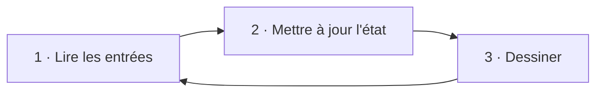

# Chapitre 05 — La boucle de jeu

[« Précédent](Chapitre_04.md) | [Accueil](index.md) | [Suivant »](Chapitre_06.md)


---

## Objectif

Comprendre le **cœur** de tout jeu : une boucle qui, encore et encore, lit les entrées,
met à jour l'état, puis dessine.

---

## L'idée : trois temps qui se répètent

Un jeu n'est jamais « figé ». À chaque **image** (*frame*), il fait trois choses dans
cet ordre :

1. **Lire les entrées** — que fait le joueur en ce moment ? (touches, joystick)
2. **Mettre à jour** — faire avancer le monde : bouger la balle, tester les collisions,
   changer le score.
3. **Dessiner** — représenter le nouvel état à l'écran.

Puis on recommence. Vingt à trente fois par seconde, ça donne l'illusion du mouvement,
exactement comme les images d'un dessin animé.



---

## La forme minimale

```cpp
#include "gamebuino.h"

gb_core     gb;
gb_graphics gfx;

extern "C" void app_main(void)
{
    gb.init();

    while (true) {              // la boucle de jeu : elle ne s'arrête jamais
        // 1. LIRE
        gb.pool();             // met à jour boutons + joystick d'un coup

        // 2. METTRE À JOUR
        // (rien pour l'instant — on ajoutera la balle, la raquette...)

        // 3. DESSINER
        gfx.clear(color_black);            // on repart d'un écran propre
        gfx.setColor(color_white);
        gfx.move_cursor(70, 110);
        gfx.print_str("Boucle de jeu OK");
        gfx.update();                      // on présente l'image
    }
}
```

Trois points de vocabulaire pour un débutant :

- **`while (true) { ... }`** répète le bloc **indéfiniment**. C'est ce qu'on veut : un
  jeu tourne tant que la console est allumée.
- **`gb.pool()`** est **la** lecture du matériel. On l'appelle **une fois par image**,
  au début. Tout le reste du code lira ensuite l'état déjà récupéré (on verra les
  détails au chapitre 7).
- On **efface puis on redessine tout** à chaque image (`gfx.clear` au début,
  `gfx.update` à la fin). C'est plus simple et plus sûr que d'essayer d'effacer
  seulement ce qui a bougé.

**À tester :** le texte s'affiche de façon stable. La boucle tourne.

---

## Pourquoi tout effacer à chaque image ?

On pourrait vouloir « effacer juste l'ancienne position de la balle ». C'est possible,
mais source de bugs (traînées, résidus). Sur la AKA, redessiner tout l'écran est assez
rapide pour un casse-briques. **Règle pour débuter : efface tout, redessine tout.** On
optimisera seulement si un jour c'est nécessaire (chapitre Optimisations).

---

## Un petit défaut à corriger… au chapitre suivant

Telle quelle, la boucle tourne **aussi vite que possible** : sa vitesse dépend de la
charge du moment. Si le dessin prend parfois 5 ms, parfois 12 ms, la balle avancera de
façon **irrégulière**. Il manque un **régulateur de cadence** pour que chaque image dure
une durée **constante**. C'est tout l'objet du chapitre 6.

---

## À retenir

- La boucle de jeu = **lire → mettre à jour → dessiner**, en boucle.
- `gb.pool()` **une fois** par image ; `gfx.clear(...)` au début, `gfx.update()` à la
  fin.
- Pour débuter : **on efface et on redessine tout** à chaque image.

---

[« Précédent](Chapitre_04.md) | [Accueil](index.md) | [Suivant » : Cadence et timing](Chapitre_06.md)
