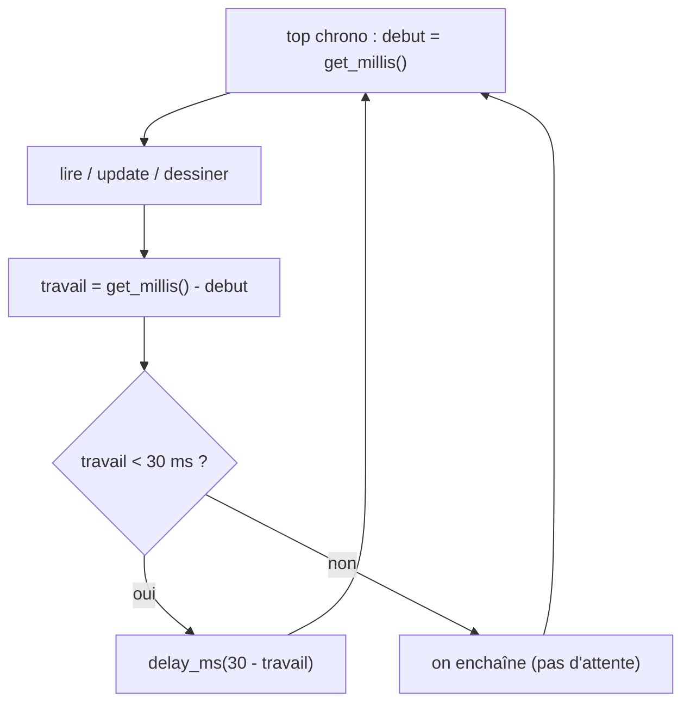

# Chapitre 06 — Cadence et timing

[« Précédent](Chapitre_05.md) | [Accueil](index.md) | [Suivant »](Chapitre_07.md)


---

## Objectif

Faire en sorte que **chaque image dure la même durée**, pour que le jeu avance à
vitesse **constante**, quelle que soit la charge de calcul.

---

## Le problème, concrètement

Notre balle avancera d'un certain nombre de pixels **par image**. Si les images ne
durent pas toutes pareil, la balle accélère et ralentit toute seule :

```
Sans régulation :   |—5ms—||——12ms——||—6ms—||———14ms———|   → vitesse en dents de scie
Avec régulation :   |———30ms———||———30ms———||———30ms———|   → vitesse constante
```

On veut viser une **période fixe** par image. À 30 images/seconde, une image doit durer
**1000 ms / 30 ≈ 33 ms**. On prendra une valeur ronde, `FRAME_MS = 30`.

---

## Mesurer le temps

La lib donne l'heure courante en millisecondes avec `gb.get_millis()` (le nombre de ms
écoulées depuis l'allumage). En notant l'heure au **début** de l'image et en la
comparant à l'heure **après** le travail, on connaît la durée du travail :

```cpp
uint32_t debut = gb.get_millis();     // top chrono au début de l'image
// ... lire / mettre à jour / dessiner ...
uint32_t travail = gb.get_millis() - debut;   // combien de ms a pris cette image
```

---

## Le régulateur de cadence

Si le travail a pris **moins** que `FRAME_MS`, on **attend** le reste. S'il a pris plus
(rare pour nous), on n'attend pas — on enchaîne.

```cpp
constexpr uint32_t FRAME_MS = 30;     // ~33 images/seconde

extern "C" void app_main(void)
{
    gb.init();

    while (true) {
        uint32_t debut = gb.get_millis();

        // 1. LIRE  2. METTRE À JOUR  3. DESSINER
        gb.pool();
        // ... update ...
        gfx.clear(color_black);
        // ... dessins ...
        gfx.update();

        // RÉGULATION : compléter l'image jusqu'à FRAME_MS
        uint32_t travail = gb.get_millis() - debut;
        if (travail < FRAME_MS)
            gb.delay_ms(FRAME_MS - travail);   // on dort le temps qu'il reste
    }
}
```



**À tester :** l'affichage est régulier. Quand on ajoutera la balle (chapitre 9), sa
vitesse sera stable. Si un jour le jeu te paraît trop rapide ou trop lent, c'est le
**seul** chiffre à changer : augmente `FRAME_MS` pour ralentir.

---

## Pourquoi `gb.delay_ms` et pas une attente « à vide » ?

On pourrait « tourner en rond » jusqu'à la bonne heure, mais ça garderait le processeur
occupé pour rien (et chaufferait la batterie). `gb.delay_ms(...)` **rend la main** au
système pendant l'attente : c'est plus propre et ça laisse respirer les autres tâches
(l'audio, par exemple, qu'on ajoutera plus tard).

---

## Bonus : afficher les FPS

La lib peut te donner la cadence réelle mesurée, pratique pour vérifier :

```cpp
gfx.printf("FPS: %.0f", gfx.get_fps());
```

---

## À retenir

- On vise une **période d'image constante** (`FRAME_MS`), pas « le plus vite possible ».
- On **mesure** le travail avec `gb.get_millis()` et on **complète** avec
  `gb.delay_ms(...)`.
- Physique stable = **une seule** variable à régler : `FRAME_MS`.

---

[« Précédent](Chapitre_05.md) | [Accueil](index.md) | [Suivant » : Lire les entrées](Chapitre_07.md)
