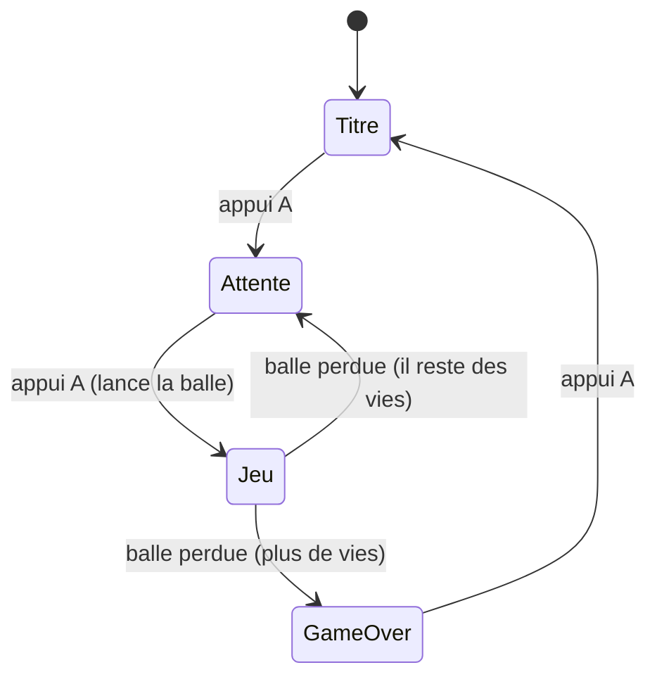

# Chapitre 12 — Organiser les écrans (machine à états)

[« Précédent](Chapitre_11.md) | [Accueil](index.md) | [Suivant »](Chapitre_13.md)


---

## Objectif

Gérer proprement les différents **écrans** du jeu : titre, mise en jeu, partie en cours,
game over. La **machine à états** est **une** façon de faire ça — pratique et lisible —
mais **pas un passage obligé** : on pourrait aussi utiliser une suite de fonctions ou de
`if`. On la présente parce qu'elle passe bien à l'échelle quand les écrans se multiplient.

---

## Le problème

Jusqu'ici la boucle faisait toujours la même chose. Mais un jeu a des **moments**
différents : sur l'écran-titre, on n'anime pas la balle ; sur le game over, on n'écoute
que « rejouer ». Si on met tout dans un seul gros bloc avec plein de `if`, ça devient vite
illisible.

L'idée de la machine à états : à tout instant, le jeu est dans **un** état, et **un
seul**. Chaque état a son comportement. On **transite** d'un état à l'autre sur des
événements (appuyer sur A, perdre la balle…).



---

## Déclarer les états : `enum class`

Un **`enum class`** définit une liste de **valeurs nommées**. Au lieu de retenir « 0 =
titre, 1 = jeu… », on écrit des noms clairs et le compilateur nous protège des mélanges :

```cpp
enum class State {
    Title,          // écran-titre
    WaitingBall,    // la balle est posée sur la raquette, prête à partir
    Playing,        // ça joue
    GameOver        // perdu
};
```

On regroupe tout l'état du jeu dans une structure `Game` (là encore, une `struct` qui
rassemble les données liées) :

```cpp
struct Game {
    State state = State::Title;
    Paddle paddle;
    std::vector<Ball> balls;     // un vector : on pourra avoir plusieurs balles (multi-ball)
    std::vector<Brick> bricks;
    int score = 0;
    int lives = 3;
};
```

---

## La boucle : un `switch` sur l'état

Le **`switch`** choisit le bloc à exécuter selon la valeur. C'est plus lisible qu'une
cascade de `if / else if` :

```cpp
Game g;

while (true) {
    uint32_t debut = gb.get_millis();
    Keys k; read_input(k);

    switch (g.state) {
        case State::Title:       update_title(g, k);   break;
        case State::WaitingBall: update_waiting(g, k); break;
        case State::Playing:     update_playing(g, k); break;
        case State::GameOver:    update_gameover(g, k);break;
    }

    gfx.update();

    uint32_t travail = gb.get_millis() - debut;
    if (travail < FRAME_MS) gb.delay_ms(FRAME_MS - travail);
}
```

Chaque `update_xxx` fait **sa** mise à jour **et** son dessin. Le `break` évite de
« tomber » dans le cas suivant (piège classique du `switch` en C++).

---

## Les états, un par un

```cpp
void update_title(Game& g, const Keys& k) {
    gfx.clear(color_black);
    gfx.setColor(color_white);
    gfx.move_cursor(70, 110); gfx.print_str("Appuie sur A pour jouer");
    if (k.a_press) { new_game(g); g.state = State::WaitingBall; }   // transition
}

void update_waiting(Game& g, const Keys& k) {
    paddle_update(g.paddle, k);
    // la balle suit la raquette tant qu'on n'a pas lancé
    g.balls[0].x = g.paddle.r.x + g.paddle.r.w/2 - g.balls[0].size/2;
    g.balls[0].y = g.paddle.r.y - g.balls[0].size;
    draw_all(g);
    gfx.move_cursor(100, 150); gfx.print_str("A pour lancer");
    if (k.a_press) {                     // lancement sur FRONT (chapitre 7)
        g.balls[0].vx = 2.6f; g.balls[0].vy = -2.6f;
        g.balls[0].active = true;
        g.state = State::Playing;
    }
}

void update_playing(Game& g, const Keys& k) {
    paddle_update(g.paddle, k);
    for (auto& b : g.balls) { ball_update(b); ball_vs_paddle(b, g.paddle);
                              ball_vs_bricks(b, g.score); }
    if (g.balls[0].y > SCREEN_H) {       // balle perdue
        if (--g.lives <= 0) g.state = State::GameOver;
        else                g.state = State::WaitingBall;
    }
    draw_all(g);
}

void update_gameover(Game& g, const Keys& k) {
    gfx.clear(color_black);
    gfx.setColor(color_white);
    gfx.move_cursor(60, 120); gfx.print_str("Partie terminee - A pour rejouer");
    if (k.a_press) g.state = State::Title;
}
```

> 💡 **Conseil issu de l'expérience** : fais passer **toutes** les mises en jeu (nouvelle
> partie, nouvelle vie après une balle perdue) par le **même** état `WaitingBall`. Tu
> évites d'avoir deux chemins de lancement différents — une source de bugs subtils (balle
> lancée toute seule, colle mal réinitialisée…). Et lance toujours la balle sur le
> **front** de A, jamais sur le maintien.

---

## Ce n'est qu'une option

Pour un tout petit jeu, une poignée de `if` suffirait. La machine à états devient
gagnante dès qu'il y a **plusieurs écrans** (pause, options, victoire, boss…) : chaque
ajout est un nouveau `case`, sans toucher aux autres. C'est ça, sa vraie valeur :
**l'ajout d'un écran ne casse pas les précédents.**

**À tester :** le cycle titre → attente → jeu → game over → titre s'enchaîne
proprement, et la balle ne se lance qu'après avoir relâché puis pressé A.

---

## À retenir

- La machine à états est **une** organisation possible, pas une obligation.
- **`enum class`** = valeurs nommées ; **`switch`** = un bloc par état (avec `break`).
- Unifie les mises en jeu via un état d'**attente** commun ; lance sur le **front**.

---

[« Précédent](Chapitre_11.md) | [Accueil](index.md) | [Suivant » : Audio](Chapitre_13.md)
