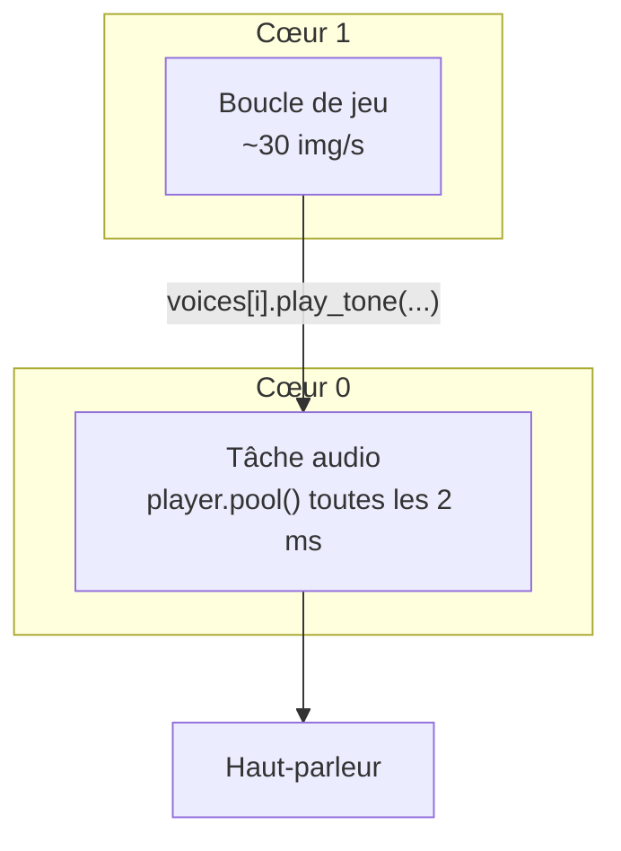

# Chapitre 13 — Le son

[« Précédent](Chapitre_12.md) | [Accueil](index.md) | [Suivant »](Chapitre_14.md)


---

## Objectif

Faire du bruit : un « ploc » quand la balle casse une brique, un « clac » sur la raquette,
un bip de menu. On utilise l'API audio **de la lib** (pas de bidouille bas niveau), et on
découvre au passage une **tâche** (un mini-programme qui tourne en parallèle).

---

## Les deux objets de l'audio

La lib fournit :

- un **lecteur** `gb_audio_player` : il mélange (mixe) les sons et les envoie au
  haut-parleur ;
- des **pistes** `gb_audio_track_tone` : chacune peut jouer **un** son (une note) à la
  fois. On peut brancher **jusqu'à 4 pistes** sur le lecteur.

```cpp
#include "gamebuino.h"    // inclut déjà gb_audio_player.h et gb_audio_track_tone.h

gb_audio_player     player;
gb_audio_track_tone voices[4];   // 4 voix : on pourra jouer 4 sons en même temps
```

Jouer un son sur une piste :

```cpp
// play_tone(frequence_Hz, volume 0.0..1.0, duree_ms, type)
voices[0].play_tone(440.0f, 1.0f, 150, gb_audio_track_tone::SQUARE);
```

Les **types** de timbre disponibles : `SINE` (doux), `SQUARE` (rétro, « 8-bit »),
`TRIANGLE` (entre les deux), `NOISE` (bruit, pour explosions/percussions).

---

## Pourquoi une *tâche* dédiée ?

Le lecteur doit être « alimenté » **très souvent** (toutes les ~2 ms) pour que le son ne
se coupe pas. Or notre boucle de jeu ne tourne que ~30 fois par seconde (toutes les
33 ms). Beaucoup trop lent : le son serait haché.

Solution : confier l'alimentation du son à une **tâche**. Une tâche, c'est un
**deuxième fil d'exécution** qui tourne **en parallèle** de la boucle de jeu — la puce
ESP32-S3 a deux cœurs, elle peut vraiment faire deux choses à la fois. On dédie donc une
tâche au son : elle ne fait que réclamer `player.pool()` en boucle.



`player.pool()` fait tout le travail « matériel » pour nous (mixage + envoi au
haut-parleur). Notre jeu, lui, se contente de **demander** des sons avec `play_tone`.

> ℹ️ Le **matériel** audio est déjà préparé par `gb.init()` (chapitre 3). On n'a donc rien
> à initialiser côté puce : il reste juste à créer le lecteur, brancher les voix, régler
> le volume, et lancer la tâche qui appelle `player.pool()`.

---

## Mise en place

```cpp
#include "freertos/FreeRTOS.h"
#include "freertos/task.h"

// La tâche : une fonction qui tourne en boucle, en parallèle.
static void audio_task(void*) {
    while (true) {
        player.pool();                    // alimente le son
        vTaskDelay(pdMS_TO_TICKS(2));     // rend la main 2 ms puis recommence
    }
}

void audio_init() {
    for (auto& v : voices)
        player.add_track(&v);             // on branche les 4 voix sur le lecteur

    player.set_master_volume(200);        // volume general 0 (muet) .. 255 (max)

    // on lance la tâche audio sur le cœur 0, priorité moyenne
    xTaskCreatePinnedToCore(audio_task, "audio", 4096, nullptr, 5, nullptr, 0);
}
```

- **`player.set_master_volume(200)`** est le **bon** réglage de volume (0 à 255). C'est la
  fonction de la lib prévue pour ça — inutile (et déconseillé) d'aller toucher les pilotes
  bas niveau.
- **`xTaskCreatePinnedToCore(...)`** crée la tâche : la fonction à exécuter (`audio_task`),
  un nom, la taille de sa pile mémoire (4096), sa priorité (5), et le cœur (0).
- **`vTaskDelay(pdMS_TO_TICKS(2))`** endort la tâche 2 ms à chaque tour : elle rend la
  main au système au lieu de monopoliser le cœur.

> ⚠️ **Piège** : le lecteur ne gère que **4 pistes** (`AUDIO_PLAYER_TRACK_COUNT = 4`). Si
> tu essaies d'en brancher plus, les suivantes sont ignorées silencieusement.

---

## Un « bus » d'effets, pour ne pas se couper

Si on jouait toujours sur `voices[0]`, un nouveau son couperait le précédent. On répartit
donc les effets sur les 4 voix **à tour de rôle** (*round-robin*) : chaque son part sur la
voix suivante.

```cpp
struct SfxBus {
    int next = 0;
    void play(float freq, uint16_t ms, float gain = 1.0f,
              gb_audio_track_tone::tone_type type = gb_audio_track_tone::SQUARE) {
        voices[next].play_tone(freq, gain, ms, type);
        next = (next + 1) % 4;            // 0,1,2,3,0,1,2,3...
    }
};
SfxBus sfx;
```

Le **gain par effet** (0.0 à 1.0) sert à **équilibrer** : à volume égal, un son grave est
perçu plus faible qu'un aigu. On monte les sons importants, on baisse les petits bruits :

```cpp
sfx.play(300, 150, 1.00f);   // brique cassée : bien présente
sfx.play(520, 120, 0.55f, gb_audio_track_tone::SINE);   // rebond raquette : discret
sfx.play(660,  35, 0.50f);   // bip de menu : léger
```

Tu appelles `sfx.play(...)` **depuis la boucle de jeu**, au moment de l'événement (une
brique meurt, la balle touche la raquette…). La tâche audio s'occupe du reste.

**À tester :** casse une brique → un « ploc » net ; rebonds plus discrets ; aucun son ne
se fait rare ni haché, même quand plusieurs partent presque en même temps.

---

## À retenir

- **`gb_audio_player` + `gb_audio_track_tone`** : jusqu'à **4 voix**, `play_tone(freq,
  vol, ms, type)`.
- Le son s'alimente dans une **tâche dédiée** (`player.pool()` toutes les ~2 ms) ; le jeu
  se contente de **demander** des sons.
- Volume général : **`player.set_master_volume(0..255)`** (pas de bas niveau).
- Répartir les effets en **round-robin** + un **gain par effet** pour équilibrer.

---

[« Précédent](Chapitre_12.md) | [Accueil](index.md) | [Suivant » : Les bonus](Chapitre_14.md)
