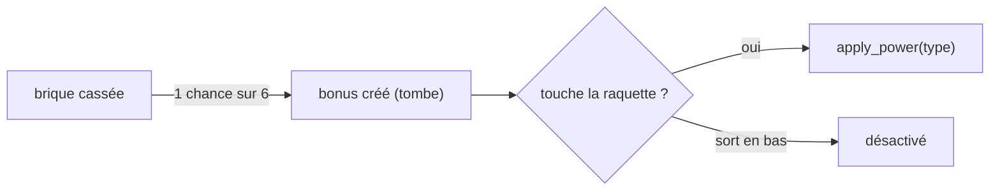

# Chapitre 14 — Les bonus qui tombent

[« Précédent](Chapitre_13.md) | [Accueil](index.md) | [Suivant »](Chapitre_15.md)


---

## Objectif

Quand une brique casse, elle peut lâcher un **bonus** qui tombe. S'il atteint la raquette,
il s'active. On ajoute trois classiques : **colle**, **laser**, **multi-ball**.

---

## Un bonus qui tombe

C'est encore un `Rect` (position + taille), plus son **type** et un drapeau actif. Pour
lister les bonus en train de tomber, on reprend un `std::vector` (chapitre 11).

```cpp
enum class Power { Glue, Laser, Multi };

struct Falling {
    Rect  r;
    Power type;
    bool  active;
};

std::vector<Falling> falling;   // les bonus actuellement en chute
```

---

## Apparition

À la destruction d'une brique, on tente le tirage : par exemple **1 chance sur 6** de
lâcher un bonus, dont on choisit le type au hasard.

```cpp
void maybe_drop_bonus(const Brick& b) {
    if (rand() % 6 != 0) return;                          // 5 fois sur 6 : rien
    Power p = static_cast<Power>(rand() % 3);            // 0,1,2 -> Glue, Laser, Multi
    falling.push_back({ {b.r.x + b.r.w/2 - 6, b.r.y, 12, 12}, p, true });
}
```

`rand()` renvoie un entier « au hasard » ; `rand() % 6` donne un nombre de 0 à 5 (le
reste de la division par 6). On appelle `maybe_drop_bonus(b)` juste après avoir marqué la
brique `alive = false` (chapitre 11).

---

## Chute + capture par la raquette

Chaque image, les bonus descendent. S'ils touchent la raquette (`overlap`, chapitre 10),
on les applique ; s'ils sortent par le bas, on les désactive.

```cpp
void bonus_update(Game& g) {
    for (auto& f : falling) {
        if (!f.active) continue;
        f.r.y += 2;                              // il tombe

        if (overlap(f.r, g.paddle.r)) {          // attrapé !
            apply_power(g, f.type);
            f.active = false;
        }
        else if (f.r.y > SCREEN_H) {             // raté, il sort en bas
            f.active = false;
        }
    }
}
```



---

## Bonus 1 — Multi-ball (le plus simple)

On ajoute une balle en repartant de l'existante, avec une direction opposée. C'est ici
que notre `std::vector<Ball>` (chapitre 12) prend tout son sens.

```cpp
void apply_multi(Game& g) {
    if (g.balls.empty()) return;
    Ball nb = g.balls[0];      // copie de la balle en cours
    nb.vx = -nb.vx;            // repart dans l'autre sens horizontal
    g.balls.push_back(nb);     // on l'ajoute à la liste
}
```

La boucle de jeu (chapitre 12) parcourt déjà **toutes** les balles : le multi-ball marche
sans autre changement. Attention juste à ne considérer la partie perdue que quand **toutes**
les balles sont sorties.

---

## Bonus 2 — La colle (et son piège d'états)

La **colle** attrape la balle sur la raquette pendant un temps, puis la relâche. Le même
mécanisme sert aussi à **poser** la balle avant le lancement initial (chapitre 12). D'où
un piège : il faut distinguer les deux cas, sinon la balle reste collée **pour toujours**.

On ajoute pour cela **deux champs** à la structure `Game` du chapitre 12 : un compteur
`int sticky_timer` (l'état de la colle) et l'indice `int captured` de la balle capturée
(ou -1 si aucune). Une convention simple et sûre :

- `sticky_timer == -1` → **pose initiale** (avant le tout premier lancement). Au
  lancement, on **retire** la colle.
- `sticky_timer > 0` → **bonus colle actif**, il **décompte** chaque image. Quand il
  atteint 0 : on **relâche** la balle capturée **et** on retire la colle.

```cpp
void apply_glue(Game& g) { g.sticky_timer = 90; }   // ~3 s à 30 img/s

void release_captured_ball(Game& g) {
    if (g.captured < 0) return;                  // rien de capturé
    Ball& b = g.balls[g.captured];
    b.vx = 2.0f; b.vy = -2.6f;                   // renvoyée vers le haut
    b.active = true;
    g.captured = -1;                             // plus rien de capturé
}

void glue_update(Game& g) {
    if (g.sticky_timer > 0) {
        g.sticky_timer--;
        // (pendant ce temps, la balle capturée suit la raquette)
        if (g.sticky_timer == 0) release_captured_ball(g);   // relâche proprement
    }
}
```

> 🐛 Le bug d'origine : à l'expiration, l'ancien code remettait `sticky_timer = -1` **en
> gardant** l'état « collé » → la balle restait collée indéfiniment. Correctif : à
> l'expiration, on **relâche + retire** la colle.

---

## Bonus 3 — Le laser

La raquette tire des **projectiles** qui montent et détruisent les briques. Un projectile
est, encore, un petit `Rect` dans un `vector` :

```cpp
struct Shot { Rect r; bool active; };
std::vector<Shot> shots;

void laser_fire(const Paddle& p) {               // sur appui B, par exemple
    shots.push_back({ {p.r.x + p.r.w/2 - 1, p.r.y - 6, 2, 6}, true });
}

void shots_update(Game& g) {
    for (auto& s : shots) {
        if (!s.active) continue;
        s.r.y -= 6;                              // le tir monte
        if (s.r.y < 0) { s.active = false; continue; }
        for (auto& b : g.bricks) {               // touche une brique ?
            if (b.alive && overlap(s.r, b.r)) {
                if (--b.hp <= 0) { b.alive = false; g.score += 100; }
                s.active = false;
                break;
            }
        }
    }
}
```

*(Comme pour les briques, on dessine et on teste seulement les `shots` et `falling`
`active`, et on ne les supprime pas du vector en plein parcours.)*

**À tester :** casse des briques jusqu'à faire tomber des bonus ; attrape la colle (la
balle est capturée puis relâchée), le multi-ball (deux balles en jeu), le laser (B tire
et casse des briques).

---

## À retenir

- Un bonus qui tombe = un `Rect` + un `type` + `active`, stocké dans un `vector`.
- Apparition probabiliste à la casse ; capture par `overlap` avec la raquette.
- **Multi-ball** = ajouter une `Ball` au `vector` ; **colle** = un timer avec une règle
  claire (‑1 = pose, >0 = bonus) ; **laser** = des projectiles qui montent.

---

[« Précédent](Chapitre_13.md) | [Accueil](index.md) | [Suivant » : Niveaux + incassables](Chapitre_15.md)
