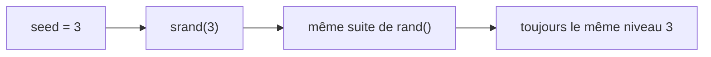

# Chapitre 16 — Générer des niveaux automatiquement

[« Précédent](Chapitre_15.md) | [Accueil](index.md) | [Suivant »](Chapitre_17.md)


---

## Objectif

Créer des niveaux **variés** sans les dessiner un par un à la main : c'est la génération
**procédurale**. Le but n'est pas le hasard total (illisible et parfois injouable), mais
une variété **structurée** et **reproductible**.

---

## Procédural ≠ aléatoire

- **Aléatoire pur** : on tire chaque case à pile ou face → ça donne du « bruit », souvent
  moche et déséquilibré.
- **Procédural** : on applique des **règles** (motifs, symétries, densité) éventuellement
  saupoudrées d'un peu de hasard **contrôlé**. Le résultat reste beau et jouable.

---

## Le *seed* : un hasard reproductible

L'ordinateur ne sait pas vraiment tirer au hasard : il calcule une suite de nombres
« pseudo-aléatoires » à partir d'une **graine** (*seed*). Même graine → **même** suite.
C'est très utile : le niveau 3 sera **toujours** le même niveau 3, mais différent du 4.

```cpp
srand(seed);        // on fixe la graine
int r = rand();     // puis rand() produit une suite déterminée par la graine
```



---

## Une petite bibliothèque de motifs

On écrit quelques **motifs** en fonction de la rangée `r` et de la colonne `c`. Chaque
motif renvoie un **code** (0 vide, 1 normale, 9 incassable — cf. chapitre 15).

```cpp
int motif_damier(int r, int c)   { return ((r + c) % 2 == 0) ? 1 : 0; }
int motif_mur   (int r, int c)   { return (c >= 3 && c <= 5) ? 1 : 0; }
int motif_pyramide(int r, int c) { return (c >= 4 - r && c <= 4 + r) ? 1 : 0; }
int motif_cadre (int r, int c, int rows) {
    return (r == 0 || r == rows-1 || c == 0 || c == BRICK_COLS-1) ? 9 : 1;
}
```

```
   damier            mur central        pyramide           cadre
 1 0 1 0 1 0 1     0 0 0 1 1 1 0 0 0    0 0 0 0 1 0 0 0 0   9 9 9 9 9 9 9 9 9
 0 1 0 1 0 1 0     0 0 0 1 1 1 0 0 0    0 0 0 1 1 1 0 0 0   9 1 1 1 1 1 1 1 9
 1 0 1 0 1 0 1     0 0 0 1 1 1 0 0 0    0 0 1 1 1 1 1 0 0   9 9 9 9 9 9 9 9 9
```

---

## Le générateur

Il choisit un motif selon la graine, remplit le plan, et ajoute un soupçon de hasard
contrôlé (quelques cases vides pour aérer) :

```cpp
Level generate_level(int seed) {
    srand(seed);
    Level lvl;
    lvl.rows = 3 + (seed % 4);                 // 3 à 6 rangées
    lvl.plan.resize(lvl.rows * BRICK_COLS);

    int choix = seed % 4;                       // quel motif de base
    for (int r = 0; r < lvl.rows; r++) {
        for (int c = 0; c < BRICK_COLS; c++) {
            int code;
            switch (choix) {
                case 0: code = motif_damier(r, c);            break;
                case 1: code = motif_mur(r, c);               break;
                case 2: code = motif_pyramide(r, c);          break;
                default:code = motif_cadre(r, c, lvl.rows);   break;
            }
            if (code == 1 && rand() % 100 < 10) code = 0;     // 10% de trous
            lvl.plan[r * BRICK_COLS + c] = code;
        }
    }
    ensure_at_least_one_breakable(lvl);         // sécurité (chapitre 15)
    return lvl;
}
```

---

## Faire monter la difficulté

On peut relier la graine au **numéro de niveau** et durcir peu à peu : plus de rangées,
des briques à 2 coups plus fréquentes, etc.

```cpp
Level lvl = generate_level(numero_niveau);      // niveau 1, 2, 3...
if (numero_niveau >= 3)  /* ... transformer certaines 1 en 2 (plus dures) ... */;
```

> 💡 **Attendre le vrai matériel avant de juger la difficulté.** Sur la console, le calcul
> est plus lent que sur PC : un réglage « parfait » en simulation peut sembler trop dur ou
> trop mou une fois flashé. Teste sur la AKA et ajuste (nombre de rangées, points de vie,
> vitesse de balle).

**À tester :** chaque numéro de niveau produit un agencement différent mais **cohérent**,
et le **même** numéro redonne **toujours** le même niveau.

---

## À retenir

- **Procédural = règles + hasard contrôlé**, pas du bruit.
- Le **seed** rend le hasard **reproductible** (`srand(seed)`).
- On compose des **motifs** simples (damier, mur, pyramide, cadre) et on garantit une
  brique cassable.

---

[« Précédent](Chapitre_15.md) | [Accueil](index.md) | [Suivant » : Sauvegarde SD](Chapitre_17.md)
