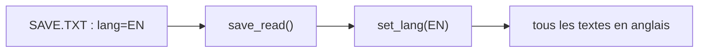

# Chapitre 18 — Texte et multilingue

[« Précédent](Chapitre_17.md) | [Accueil](index.md) | [Suivant »](Chapitre_19.md)


---

## Objectif

Afficher du texte proprement et gérer **plusieurs langues**, en centralisant toutes les
chaînes au même endroit.

---

## La police est ASCII : pas d'accents

Rappel du chapitre 4 : la police intégrée ne connaît que les caractères **ASCII** (a–z,
A–Z, chiffres, ponctuation simple). Les accents (é, è, à, ç…) s'afficheraient de travers.
On écrit donc **sans accent** :

- « Ecran », « Reglages », « Partie terminee », « Reessayer ».

Pour afficher, on a déjà tout (chapitre 4) :

```cpp
gfx.setColor(color_white);
gfx.move_cursor(20, 10);
gfx.print_str("Score");
gfx.printf(" %d", score);       // comme printf, avec des %d, %s...
```

---

## Centraliser les textes

Mauvaise idée : écrire `"Appuie sur A"` en dur un peu partout. Le jour où tu ajoutes
l'anglais, tu dois retrouver chaque chaîne. **Bonne idée** : ranger tous les textes dans
**une table**, indexée par `[langue][identifiant]`.

```cpp
enum Lang { FR, EN, LANG_COUNT };     // les langues
enum Str  { STR_PLAY, STR_LAUNCH, STR_GAMEOVER, STR_COUNT };  // les identifiants

// table [langue][identifiant] — mêmes lignes = mêmes ordres !
static const char* TEXTS[LANG_COUNT][STR_COUNT] = {
    /* FR */ { "Appuie sur A",  "A pour lancer",  "Partie terminee" },
    /* EN */ { "Press A",       "A to launch",    "Game over"       },
};

static Lang g_lang = FR;

const char* T(Str s)      { return TEXTS[g_lang][s]; }   // renvoie le bon texte
void set_lang(Lang l)     { g_lang = l; }
```

Utilisation, la même partout, quelle que soit la langue :

```cpp
gfx.move_cursor(80, 120);
gfx.print_str(T(STR_PLAY));      // "Appuie sur A" ou "Press A" selon g_lang
```

Ajouter une langue = ajouter **une ligne** dans la table. Ajouter un texte = ajouter
**une colonne** (un identifiant) et sa traduction dans chaque langue.

> ✅ **Astuce anti-bug** : chaque langue doit avoir **exactement** `STR_COUNT` chaînes,
> dans le **même ordre**. Une colonne oubliée décale toute la ligne (tu verrais « A to
> launch » au lieu de « Game over »). Un petit test au démarrage peut le vérifier.

---

## Persister la langue

Le choix de langue se sauvegarde comme les autres réglages, sur la carte SD
(chapitre 17). On le lit au démarrage et on appelle `set_lang(...)` en conséquence.



---

## Pour aller plus loin : une police personnalisée (optionnel)

Si tu veux des accents ou un style pixel-art à toi, tu peux dessiner **ta propre
police** : une grande image (un *atlas*) contenant tous les caractères côte à côte. Pour
afficher un caractère, on découpe la bonne case de l'atlas et on la **blitte** — c'est
exactement la fonction `draw_sprite` du chapitre 4, appliquée à une sous-image.

```cpp
// idée : chaque caractère occupe CW x CH dans l'atlas, 16 par ligne
void draw_glyph(int x, int y, char c, const uint16_t* atlas, int CW, int CH) {
    int idx = c - 32;                       // ' ' (espace) = premier caractère
    int src_col = (idx % 16) * CW;
    int src_row = (idx / 16) * CH;
    // ... blit de la sous-image (src_col, src_row, CW, CH) vers (x, y),
    //     en sautant la couleur-clé magenta, comme au chapitre 4 ...
}
```

Ce n'est **pas** nécessaire pour un premier jeu : la police intégrée suffit largement. À
garder en tête pour plus tard.

**À tester :** bascule `g_lang` entre `FR` et `EN` et vérifie que tous les écrans changent
de langue d'un coup ; le choix survit à un redémarrage.

---

## À retenir

- Police intégrée = **ASCII**, donc textes **sans accent**.
- Centralise les chaînes dans une **table `[langue][id]`** ; ajouter une langue = une
  ligne.
- La langue se **sauvegarde** avec les réglages ; une police custom (atlas + blit) reste
  optionnelle.

---

[« Précédent](Chapitre_17.md) | [Accueil](index.md) | [Suivant » : Menu Pause + Options](Chapitre_19.md)
