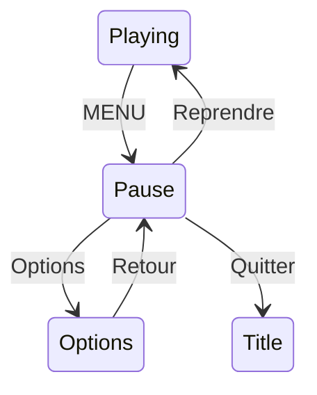

# Chapitre 19 — Menu Pause et Options

[« Précédent](Chapitre_18.md) | [Accueil](index.md) | [Suivant »](Chapitre_20.md)


---

## Objectif

Ajouter un **menu Pause** (Reprendre / Options / Quitter) et un **menu Options** (volume,
langue). C'est l'occasion de voir comment se construit **n'importe quel** menu : une liste
d'entrées + un curseur.

---

## L'anatomie d'un menu

Un menu, c'est deux choses : une **liste d'entrées** (des textes) et un **index** qui
indique l'entrée sélectionnée. On **déplace** l'index avec haut/bas, on **valide** avec A.

```
  ▶ Reprendre        ← index = 0 (surligné)
    Options
    Quitter
```

Rappel crucial du chapitre 7 : on navigue sur le **front** (`pressed`), pas sur le
maintien, sinon le curseur défilerait à toute vitesse.

```cpp
struct Menu {
    const char* const* items;   // le tableau de textes
    int count;                  // combien d'entrées
    int index;                  // entrée sélectionnée
};

void menu_move(Menu& m, const Keys& k) {
    if (k.up_press)   m.index = (m.index - 1 + m.count) % m.count;  // remonte (boucle)
    if (k.down_press) m.index = (m.index + 1) % m.count;           // descend (boucle)
}

void menu_draw(const Menu& m, int x, int y) {
    for (int i = 0; i < m.count; i++) {
        gfx.setColor(i == m.index ? color_yellow : color_gray);   // surligne la sélection
        gfx.move_cursor(x, y + i * 16);
        gfx.print_str(m.items[i]);
    }
}
```

Le `(m.index - 1 + m.count) % m.count` fait « boucler » le curseur : remonter depuis la
première entrée renvoie à la dernière. (Le `+ m.count` évite un index négatif avant le
modulo.)

---

## Le menu Pause

On l'ouvre depuis l'état `Playing` sur la touche MENU (front), et on ajoute un état
`Pause` à la machine du chapitre 12 (ou, si tu n'utilises pas de machine à états, un
simple drapeau `paused`).

```cpp
const char* PAUSE_ITEMS[] = { "Reprendre", "Options", "Quitter" };
Menu pause_menu = { PAUSE_ITEMS, 3, 0 };

void update_pause(Game& g, const Keys& k) {
    menu_move(pause_menu, k);
    if (k.a_press) {
        switch (pause_menu.index) {
            case 0: g.state = State::Playing;  break;   // Reprendre
            case 1: g.state = State::Options;  break;   // aller aux options
            case 2: g.state = State::Title;    break;   // Quitter vers le titre
        }
    }
    draw_all(g);                          // on redessine le jeu figé derrière...
    menu_draw(pause_menu, 120, 90);       // ...puis le menu par-dessus
}
```



---

## Le menu Options : volume et langue

Ici les entrées ne se contentent pas d'agir au A : on **modifie une valeur** avec
gauche/droite (volume) ou on **bascule** (langue). Et on **sauvegarde** à chaque
changement (chapitre 17).

```cpp
const char* OPT_ITEMS[] = { "Volume", "Langue", "Retour" };
Menu opt_menu = { OPT_ITEMS, 3, 0 };

void update_options(Game& g, const Keys& k, SaveData& save) {
    menu_move(opt_menu, k);

    if (opt_menu.index == 0) {                        // VOLUME (0..255)
        if (k.left_press)  save.volume = MAX(0,   save.volume - 15);
        if (k.right_press) save.volume = MIN(255, save.volume + 15);
        player.set_master_volume(save.volume);        // applique tout de suite
        if (k.left_press || k.right_press) save_write(save);
    }
    if (opt_menu.index == 1 && k.a_press) {           // LANGUE (bascule FR/EN)
        set_lang(g_lang == FR ? EN : FR);
        save.lang[0] = (g_lang == FR) ? 'F' : 'E';
        save.lang[1] = (g_lang == FR) ? 'R' : 'N';
        save_write(save);
    }
    if (opt_menu.index == 2 && k.a_press)             // RETOUR
        g.state = State::Pause;

    gfx.clear(color_black);
    menu_draw(opt_menu, 100, 80);
    gfx.setColor(color_white);
    gfx.move_cursor(100, 80 + 3*16);
    gfx.printf("Vol %d   Lang %s", save.volume, save.lang);   // aperçu des valeurs
}
```

- **Volume** : on borne entre 0 et 255 (avec les macros `MIN`/`MAX` de la lib) et on
  applique **immédiatement** avec `player.set_master_volume(...)` (chapitre 13) — c'est
  bien la fonction haut niveau, pas de bas niveau.
- **Langue** : on bascule `g_lang` et on met `save.lang` à jour.
- Chaque changement est **sauvegardé** aussitôt.

**À tester :** MENU met en pause ; dans Options, gauche/droite change le volume (audible)
et A bascule la langue ; après un redémarrage, volume et langue sont conservés.

---

## À retenir

- Un menu = **liste d'entrées + index** ; on navigue au **front** (haut/bas), on valide
  au **front** (A).
- Le curseur « boucle » avec un **modulo**.
- Les Options **appliquent** et **sauvegardent** chaque changement ; le volume passe par
  **`player.set_master_volume(0..255)`**.

---

[« Précédent](Chapitre_18.md) | [Accueil](index.md) | [Suivant » : Optimisations](Chapitre_20.md)
