<a id="sommaire"></a>
# Créer un jeu sur Gamebuino AKA — tutoriel complet (page unique)

Version **une seule page** de tout le tutoriel : les 22 chapitres, le bonus et les deux annexes, à la suite. Pour la version multi-fichiers (navigation chapitre par chapitre), voir `index.md` et les fichiers `Chapitre_XX.md`.

> **Bibliothèque.** API **haut niveau** de la lib AKA (`gb_core`, `gb_graphics`, `gb_audio_player`…), jamais les pilotes `gb_ll_…`. Le dossier `components/gamebuino` est une brique externe, prise à jour et non modifiée. Dépôt : https://github.com/jmp42/Gamebuino_AKA_lib

---

## Sommaire

- [Chapitre 00 — Notions de C++ pour démarrer](#ch00)
- [Chapitre 01 — Introduction](#ch01)
- [Chapitre 02 — Installer l'environnement](#ch02)
- [Chapitre 03 — Structure du projet](#ch03)
- [Chapitre 04 — Premier affichage : du pixel au sprite](#ch04)
- [Chapitre 05 — La boucle de jeu](#ch05)
- [Chapitre 06 — Cadence et timing](#ch06)
- [Chapitre 07 — Lire les entrées](#ch07)
- [Chapitre 08 — La raquette](#ch08)
- [Chapitre 09 — La balle](#ch09)
- [Chapitre 10 — Collision et rebond Arkanoid](#ch10)
- [Chapitre 11 — Les briques](#ch11)
- [Chapitre 12 — Organiser les écrans (machine à états)](#ch12)
- [Chapitre 13 — Le son](#ch13)
- [Chapitre 14 — Les bonus qui tombent](#ch14)
- [Chapitre 15 — Niveaux et briques incassables](#ch15)
- [Chapitre 16 — Générer des niveaux automatiquement](#ch16)
- [Chapitre 17 — Sauvegarder sur la carte SD](#ch17)
- [Chapitre 18 — Texte et multilingue](#ch18)
- [Chapitre 19 — Menu Pause et Options](#ch19)
- [Chapitre 20 — Optimiser (quand c'est utile)](#ch20)
- [Chapitre 21 — Assemblage final et publication](#ch21)
- [Chapitre Bonus — Effets : particules, sprites animés, plein écran, boss](#chbonus)
- [Annexe A — Créer un sprite et le convertir pour le jeu](#annexe-a)
- [Annexe B — Déboguer sur la Gamebuino AKA](#annexe-b)

---

<a id="ch00"></a>
# Chapitre 00 — Notions de C++ pour démarrer


---

## À quoi sert ce chapitre

Le tutoriel n'exige **aucune** connaissance préalable du C++. Ce chapitre pose, en une
page, le vocabulaire minimal pour lire les suivants sans buter. Tu peux le survoler et y
**revenir** quand un mot te surprend (chaque notion renvoie au chapitre qui l'utilise).

Ce n'est **pas** un cours complet de C++ : juste ce qu'il faut pour la AKA.

---

## Variables et types

Une **variable** est une case mémoire à laquelle on donne un nom et un **type** (la nature
de ce qu'elle contient) :

```cpp
int   score = 0;        // un entier (nombre sans virgule)
float vitesse = 2.6f;   // un nombre à virgule (le 'f' = float)
bool  en_jeu = true;    // vrai / faux (true / false)
char  lettre = 'A';     // un caractère
```

### Pourquoi des types comme `uint16_t` et pas juste `int` ?

Sur une petite puce, **la taille compte**. On utilise donc des types à **taille fixe et
connue**, dont le nom dit tout : `u` = *unsigned* (non signé, positif ou nul), le nombre
= les bits.

| Type | Taille | Contient | Va de… à… |
|---|---|---|---|
| `uint8_t`  | 8 bits (1 octet) | entier non signé | 0 à 255 |
| `uint16_t` | 16 bits (2 octets)| entier non signé | 0 à 65 535 |
| `uint32_t` | 32 bits (4 octets)| entier non signé | 0 à ~4 milliards |
| `int16_t` / `int32_t` | 16 / 32 bits | entier **signé** (peut être négatif) | ± moitié |

- **Non signé** (`unsigned`) = jamais négatif. Une couleur, un masque de touches, une
  position d'écran : ça n'a pas de sens d'être négatif, donc on prend du non signé.
- Une **couleur** de pixel tient sur `uint16_t` (16 bits) — voir [chapitre 4](#ch04).
- Le **paquet de boutons** est un `uint16_t` où chaque bit est une touche — voir
  [chapitre 7](#ch07).

---

## Les bits, et le « et » bit à bit (`&`)

Un nombre est, en mémoire, une suite de **bits** (des 0 et des 1). On peut s'en servir
comme d'une rangée d'interrupteurs : chaque bit = un oui/non. C'est ainsi que la lib range
l'état des boutons dans **un seul** nombre.

```
 valeur des boutons :  0 0 0 0 0 0 0 1 0 0 1 0 0 0 0 0
                                     A            LEFT      (exemple)
```

Pour savoir si **A** est enfoncée, on isole **son** bit avec l'opérateur **`&`** (« et »
bit à bit) et le masque `KEY_A` (un nombre qui n'a que le bit de A à 1) :

```cpp
if (etat & gb_buttons::KEY_A) { /* A est enfoncée */ }
```

Le `&` met à 0 tous les bits sauf celui qu'on teste : le résultat n'est « vrai » que si ce
bit précis était à 1. On appelle ça un **masque**. (Utilisé au [chapitre 7](#ch07).)

> Ne confonds pas `&` (un seul, bit à bit) et `&&` (« et » logique entre deux conditions,
> comme dans `if (a && b)`).

---

## `const` et `constexpr`

- **`const`** : « cette valeur ne changera pas ». Protège d'une modification accidentelle.
- **`constexpr`** : une constante **connue dès la compilation**, à laquelle on donne un
  nom lisible. On s'en sert pour les réglages :

```cpp
constexpr int SCREEN_W = 320;     // au lieu d'écrire "320" partout
constexpr int PADDLE_SPEED = 5;   // changer la difficulté = changer ce nombre
```

---

## Les fonctions

Une **fonction** est un bloc de code réutilisable, avec des **paramètres** (ce qu'on lui
donne) et éventuellement une **valeur de retour** (ce qu'elle rend). `void` = « ne rend
rien ».

```cpp
int add(int a, int b) {   // prend deux entiers, en rend un
    return a + b;         // la valeur rendue
}

void efface() {           // ne rend rien
    gfx.clear(color_black);
}
```

---

## `#include`, en-tête et source

**`#include "..."`** recopie le contenu d'un autre fichier à cet endroit, **avant** la
compilation. On s'en sert pour rendre disponibles des fonctions/types définis ailleurs :

```cpp
#include "gamebuino.h"    // rend accessible toute l'API de la lib AKA
```

Un projet se répartit entre **en-têtes** (`.h` : les *déclarations* — « voici ce qui
existe ») et **sources** (`.cpp` : le *code* — « voici comment ça marche »). On
`#include` un `.h` pour utiliser ce qu'il annonce. (Découpage détaillé au
[chapitre 21](#ch21).)

---

## Structures et objets

Une **structure** (`struct`) regroupe plusieurs variables sous un même nom. On accède à
un champ avec un **point** :

```cpp
struct Rect { int x, y, w, h; };   // un rectangle = 4 nombres liés
Rect r;
r.x = 10;  r.w = 48;               // accès avec le point
```

Un **objet** est la même idée, en plus riche : des données **et** des fonctions
regroupées. La lib t'en fournit deux tout prêts : `gb` (la console) et `gfx` (le dessin).
On les utilise exactement comme des structures, avec le point, sauf qu'on **appelle** aussi
leurs fonctions :

```cpp
gb.init();               // on appelle une fonction de l'objet gb
gfx.fillRect(0,0,10,10); // et une de l'objet gfx
```

Pas besoin d'en savoir plus sur les « classes » pour ce tutoriel : structures pour **tes**
données, objets `gb`/`gfx` pour parler à la console. (Structures détaillées au
[chapitre 8](#ch08).)

---

## Références (`&`) et pointeurs (`*`)

Quand on passe une variable à une fonction, C++ en fait normalement une **copie**. Deux
outils permettent d'éviter la copie (utile pour les grosses données) ou de **modifier
l'original** :

- une **référence** `Type& nom` : « l'original, pas une copie ». La fonction peut le
  remplir.

  ```cpp
  void read_input(Keys& k) { ... }   // remplit le vrai k de l'appelant (chapitre 7)
  ```

- un **pointeur** `Type* nom` : contient l'**adresse** d'une donnée. Le nom d'un tableau
  se comporte comme un pointeur vers sa première case — c'est pour ça qu'on passe un
  sprite ainsi :

  ```cpp
  void draw_sprite(const uint16_t* sprite, int w, int h, int x, int y) { ... } // chapitre 4
  ```

Pour débuter, retiens surtout la **référence `&`** (pour que la fonction remplisse ta
structure) et le fait qu'un **tableau se passe via un pointeur `*`**. On n'a pas besoin
d'aller plus loin.

---

## Quelques mots-clés qu'on croisera

- **`auto`** : « déduis le type tout seul ». `for (auto& b : bricks)` = « pour chaque
  brique `b` » sans réécrire le type.
- **`nullptr`** : un pointeur « qui ne pointe sur rien » (aucune adresse).
- **`static`** (dans une fonction) : une variable qui **garde sa valeur** d'un appel à
  l'autre (on l'utilise pour le chrono du combo loader, chapitre 21).

---

## La mémoire est comptée (c'est de l'embarqué !)

Sur un PC, on ne pense presque jamais à la mémoire. Sur l'ESP32-S3, **si**. Quelques
repères pour prendre les bons réflexes dès le départ :

- Le framebuffer (l'écran) occupe déjà **~150 Ko** (320×240×2 octets). C'est énorme à
  cette échelle.
- Un gros sprite coûte cher : chaque pixel = **2 octets** embarqués dans le programme.
  Préfère des sprites petits (8×8 à 24×24) — voir l'[Annexe A](#annexe-a).
- Un `std::vector` qui grandit **alloue** de la mémoire ; on **réserve** sa taille au
  démarrage pour éviter les surprises en jeu (chapitre 20).
- On peut surveiller la mémoire libre avec `gb.free_sram()` et `gb.free_psram()`.

Rien d'inquiétant pour un casse-briques : il suffit d'éviter le gaspillage (gros tableaux
inutiles, allocations en pleine boucle).

---

## À retenir

- Types à taille fixe (`uint8_t/16/32`), **non signé** = jamais négatif.
- Les **bits** et le masque **`&`** servent à lire les boutons.
- **`struct`** pour tes données ; **`gb`/`gfx`** sont des **objets** de la lib.
- **`&`** (référence) évite la copie / modifie l'original ; un **tableau** se passe via un
  **pointeur `*`**.
- La **mémoire est limitée** : petits sprites, `reserve()`, pas d'allocation en pleine
  boucle.

---

---

<a id="ch01"></a>
# Chapitre 01 — Introduction


---

## Ce que ce tutoriel est (et n'est pas)

Ce guide t'apprend à écrire un jeu **de zéro** sur la **Gamebuino AKA**, en C++, en
ajoutant les morceaux **un par un**. À chaque étape tu obtiens un programme **complet
et testable** sur la console : on ne balance jamais 300 lignes d'un coup.

Le fil rouge est un **casse-briques** (une balle, une raquette, des briques), parce
qu'il réunit tout ce qu'on retrouve dans presque tous les jeux : dessiner à l'écran,
lire les touches, faire bouger des objets, détecter des collisions, jouer des sons,
sauvegarder.

> Ce tutoriel ne suppose **aucune** connaissance préalable du C++ embarqué. Chaque
> notion nouvelle (tableau, structure, boucle, adressage mémoire…) est expliquée au
> moment où on en a besoin, pas avant.

---

## La console en une image

```
        Gamebuino AKA
        
                  USB   carte SD     
 ┌───── L1 ──────────────────────── R1 ───┐
 │   ^    ┌─────────────────────┐    D    │   Écran : 320 x 240 pixels, couleur
 │ <   >  │                     │  C   B  │   Cerveau : puce ESP32-S3 (2 cœurs)
 │   v    │   écran 320 x 240   │    A    │   Langage : C++ (via ESP-IDF)
 │        │                     │   //    │   Entrées : joystick + boutons
 │  (joy) └─────────────────────┘  ///    │   Stockage : carte micro-SD
 │         RUN            MENU     //     │   Son : haut-parleur intégré
 └────────────────────────────────────────┘
       Connecteur extension    prise Jack
```

Concrètement, programmer la AKA veut dire : **remplir une image de 320×240 pixels**,
**lire l'état des touches**, et recommencer ~30 fois par seconde. Tout le reste
(physique, sons, score) se construit par-dessus ces deux idées.

---

## L'outillage, en deux couches

Tu vas utiliser deux choses bien distinctes. C'est important de ne pas les confondre :

1. **La bibliothèque AKA** (le dossier `components/gamebuino`, fourni par l'auteur de
   la console). Elle t'offre des fonctions simples et lisibles : « efface l'écran »,
   « dessine un rectangle », « lis les boutons ». **C'est elle qu'on utilise dans tout
   le tutoriel.** Tu la déposes dans ton projet **telle quelle** et tu n'y touches pas
   (c'est une brique indépendante, mise à jour séparément).

2. **ESP-IDF**, le « SDK » d'Espressif pour la puce ESP32-S3. C'est la couche en
   dessous : le compilateur, l'outil `idf.py`, la gestion mémoire, les tâches. On s'en
   sert pour **compiler et flasher**, et on y touchera très ponctuellement (le temps,
   les tâches). On l'explique quand ça arrive.

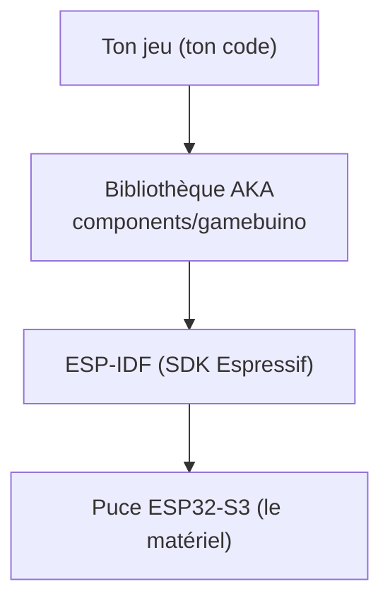

> ⚠️ La bibliothèque AKA a une partie « bas niveau » (des fichiers nommés `gb_ll_…`,
> pour *low level*). **On ne les appelle pas directement** : ce sont les pilotes
> internes. On passe toujours par l'API de haut niveau (`gb_core`, `gb_graphics`…),
> qui est faite pour les jeux. Mélanger les deux donne un code fragile et confus.

---

## Le plan du voyage

| # | Chapitre | Ce que tu sauras faire à la fin |
|---|----------|-------------------------------|
| 02 | Installer l'environnement | compiler et flasher un projet vide |
| 03 | Structure du projet | comprendre les `CMakeLists.txt` et où va ton code |
| 04 | Premier affichage | écrire des pixels, lignes, rectangles, sprites |
| 05 | Boucle de jeu | la structure « lire → mettre à jour → dessiner » |
| 06 | Cadence et timing | une vitesse de jeu stable |
| 07 | Lire les entrées | joystick et boutons, appui *maintenu* vs *déclenché* |
| 08 | La raquette | un objet qu'on déplace et qu'on borne |
| 09 | La balle | position, vitesse, rebonds sur les murs |
| 10 | Collision Arkanoid | détecter un contact et calculer un rebond |

À partir du chapitre 11 (briques, audio, sauvegarde, menus…), on assemble le vrai jeu.

---

## À retenir

- On construit **incrémentalement**, chaque étape est testable.
- On utilise l'**API de haut niveau** de la lib AKA, jamais les pilotes `gb_ll_…`.
- Le dossier `components/gamebuino` est une **brique externe** : on ne le modifie pas.

---

---

<a id="ch02"></a>
# Chapitre 02 — Installer l'environnement


---

## Objectif

Installer de quoi **compiler** ton code (le transformer en programme) et le **flasher**
(l'envoyer dans la console). À la fin, tu auras vérifié que la chaîne fonctionne sur un
projet vide.

---

## Qu'est-ce qu'on installe, au juste ?

Ton PC ne sait pas parler « ESP32-S3 » tout seul. Il faut **ESP-IDF** (*Espressif IoT
Development Framework*), qui contient :

- le **compilateur croisé** (*cross-compiler*) : un compilateur qui tourne sur ton PC
  mais produit du code pour la puce ESP32-S3 (une architecture différente, « Xtensa ») ;
- **`idf.py`** : l'outil en ligne de commande qui orchestre tout (configurer, compiler,
  flasher, voir les messages de la console) ;
- des **outils de build** : CMake et Ninja (on explique leur rôle au chapitre 3).

> 💡 Un *compilateur croisé* : imagine que tu écrives une lettre en France pour qu'elle
> soit lue au Japon. Tu écris chez toi (le PC), mais dans une langue destinée à
> quelqu'un d'autre (la puce). Le compilateur croisé fait exactement ça pour le code.

---

## Installation

Le plus simple et le plus fiable est l'**extension officielle ESP-IDF pour VS Code**,
qui télécharge et configure tout pour toi.

1. Installe **VS Code**.
2. Dans VS Code, ouvre l'onglet Extensions et installe **« ESP-IDF »** (éditeur :
   Espressif).
3. Lance la commande *ESP-IDF: Configure ESP-IDF Extension* → *Express*, choisis une
   version **v5.x** récente, et laisse l'assistant installer la toolchain.

Guide officiel (à garder sous la main) :
<https://docs.espressif.com/projects/esp-idf/en/latest/esp32s3/get-started/index.html>

> Sous Windows, tu peux aussi utiliser l'installateur « ESP-IDF Tools Installer ». Sous
> Linux/macOS, on clone le dépôt puis on lance `./install.sh` et `. ./export.sh`. Les
> trois voies aboutissent au même `idf.py`.

---

## Vérifier que tout marche

Ouvre un terminal **ESP-IDF** (celui où `idf.py` est reconnu) et tape :

```bash
idf.py --version
```

Tu dois voir une ligne du type `ESP-IDF v5.x`. Si oui, la chaîne est prête.

---

## Le cycle de travail (à connaître par cœur)

Pour **n'importe quel** projet AKA, tu répéteras ces trois commandes :

```bash
idf.py set-target esp32s3     # une seule fois par projet : choisit la puce
idf.py build                  # compile ton code
idf.py -p COM3 flash monitor  # envoie sur la console + affiche les messages
```

- Remplace `COM3` par le port de ta console (souvent `COMx` sous Windows,
  `/dev/ttyUSB0` ou `/dev/ttyACM0` sous Linux).
- `monitor` ouvre la **console série** : c'est là que s'affichent tes `printf` de
  débogage. On quitte le moniteur avec `Ctrl+]`.

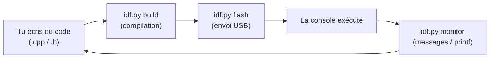

> ⚠️ **Piège classique** : ESP-IDF n'est **pas** Arduino. Certaines fonctions
> Arduino (`millis()`, `Serial.print`, `delay()`) n'existent pas telles quelles ici. On
> utilisera les équivalents ESP-IDF et ceux de la lib AKA (par ex. `gb.get_millis()`).

---

## Récupérer la bibliothèque AKA

Ton projet aura besoin du dossier `components/gamebuino`. Prends **la version la plus
récente** de la lib et copie ce dossier **tel quel** dans ton projet (structure exacte
au chapitre 3). Tu n'as rien à modifier dedans.

Dépôt de la bibliothèque : <https://github.com/jmp42/Gamebuino_AKA_lib>

---

## À retenir

- On compile/flashe avec **`idf.py`** (build → flash → monitor).
- ESP-IDF **v5.x**, cible **esp32s3**.
- Le **moniteur série** affiche tes `printf` : c'est ton meilleur ami pour déboguer.

---

---

<a id="ch03"></a>
# Chapitre 03 — Structure du projet


---

## Objectif

Comprendre **où** va ton code, **pourquoi** il y a des fichiers `CMakeLists.txt`, et
mettre en place un projet vide qui compile.

---

## L'arborescence minimale

```
mon_jeu/
├── CMakeLists.txt              ← décrit le PROJET entier
├── sdkconfig                   ← configuration (généré par idf.py, ne pas éditer à la main)
├── components/
│   └── gamebuino/              ← la bibliothèque AKA (fournie) — on n'y touche PAS
└── main/
    ├── CMakeLists.txt          ← décrit le composant "main" (ton code)
    └── app_main.cpp            ← ton point d'entrée
```

Deux dossiers comptent :

- **`main/`** : c'est **ton** code. Tu y ajouteras `game.cpp`, `paddle.cpp`, etc.
- **`components/gamebuino/`** : la **bibliothèque AKA**. Tu la déposes ici telle quelle.
  C'est une brique indépendante, maintenue à part ; tu ne la modifies pas (si tu trouves
  un bug ou veux une évolution, ça se signale à l'auteur, ça ne se bricole pas en local).

---

## C'est quoi CMake, et pourquoi deux `CMakeLists.txt` ?

Un vrai projet, c'est des dizaines de fichiers `.cpp`/`.h`. On ne les compile pas à la
main un par un. On **décrit** le projet, et un outil génère la « recette » de
compilation. Cet outil, c'est **CMake**.

ESP-IDF ajoute une notion par-dessus CMake : le projet est découpé en **composants**,
de petites bibliothèques indépendantes. **Chaque composant a son propre
`CMakeLists.txt`.** D'où les deux fichiers :

- celui de la **racine** décrit le **projet** dans son ensemble ;
- celui de **`main/`** décrit **un composant** (ton code de jeu).

`components/gamebuino/` est lui aussi un composant, avec son propre `CMakeLists.txt`
(déjà écrit). C'est ainsi qu'on **réutilise** la lib sans recopier son code.

> 📖 Pour creuser : [documentation CMake](https://cmake.org/documentation/) et surtout
> le [système de build ESP-IDF](https://docs.espressif.com/projects/esp-idf/en/latest/esp32s3/api-guides/build-system.html)
> (composants, `idf_component_register`, `REQUIRES`).

### Le `CMakeLists.txt` de la racine

```cmake
cmake_minimum_required(VERSION 3.16)                 # (1)
include($ENV{IDF_PATH}/tools/cmake/project.cmake)    # (2)
project(mon_jeu)                                     # (3)
```

1. Refuse de continuer si CMake est trop vieux (garantit que la syntaxe est comprise).
2. Charge la « mécanique » ESP-IDF (les fonctions comme `idf_component_register`, la
   gestion des composants…). `$ENV{IDF_PATH}` pointe vers ton installation ESP-IDF.
3. Déclare le projet et son **nom** (= le nom du binaire produit). À mettre **après**
   l'`include`.

### Le `CMakeLists.txt` de `main/`

```cmake
idf_component_register(              # (1)
    SRCS "app_main.cpp"             # (2)
    INCLUDE_DIRS "."                # (3)
    REQUIRES gamebuino             # (4)
)
```

1. La fonction ESP-IDF qui **déclare un composant**.
2. **`SRCS`** : la liste des fichiers à **compiler**. Ici un seul ; plus tard tu en
   ajouteras (`game.cpp`, `paddle.cpp`…), séparés par des espaces ou des retours ligne.
3. **`INCLUDE_DIRS`** : les dossiers où chercher **tes** en-têtes (`.h`). `"."` = le
   dossier `main/`, pour que `#include "mon_fichier.h"` marche.
4. **`REQUIRES`** : les **autres composants dont tu dépends**. En mettant `gamebuino`
   ici, ton code peut faire `#include "gamebuino.h"` **et** être lié à la lib.

> ⚠️ **LE piège** : `gamebuino` va dans **`REQUIRES`**, jamais dans `INCLUDE_DIRS`.
> `INCLUDE_DIRS` sert seulement à exposer *tes* en-têtes. Une dépendance mal placée
> compile parfois (les `.h` sont trouvés) mais **échoue à l'édition de liens**
> (`undefined reference to ...`), car la bibliothèque n'est pas reliée au programme.

---

## Le fichier `app_main.cpp` (le point d'entrée)

Sur ESP-IDF, tout programme démarre dans une fonction nommée **`app_main`**. Le
`extern "C"` demande au compilateur de ne pas « décorer » ce nom, pour qu'ESP-IDF
puisse la retrouver et l'appeler au démarrage.

```cpp
#include "gamebuino.h"   // toute l'API AKA en un seul include

gb_core     gb;          // l'objet "console" : écran, boutons, joystick...
gb_graphics gfx;         // l'objet "dessin"

extern "C" void app_main(void)   // le point d'entrée du programme
{
    gb.init();           // démarre l'écran, les entrées, les périphériques

    // (rien encore : on affichera quelque chose au chapitre 4)
    while (true) {
        gb.delay_ms(100);
    }
}
```

- `gb_core gb;` et `gb_graphics gfx;` sont des **objets** de la lib, déclarés une fois,
  en global, pour être accessibles partout.
- `gb.init()` s'appelle **une seule fois**, au tout début.
- La boucle `while (true)` empêche `app_main` de se terminer (sinon la console
  redémarrerait). Elle deviendra notre **boucle de jeu** au chapitre 5.

**À tester :** `idf.py build flash monitor`. La console démarre et ne plante pas. On ne
voit rien à l'écran pour l'instant : normal, on n'a rien dessiné.

---

## À retenir

- **CMake** décrit le projet ; ESP-IDF le découpe en **composants**, chacun avec son
  `CMakeLists.txt`.
- Dépendre de la lib = `REQUIRES gamebuino` (pas `INCLUDE_DIRS`).
- Le programme démarre dans `extern "C" void app_main(void)`.
- On garde `components/gamebuino` **intact**.

---

---

<a id="ch04"></a>
# Chapitre 04 — Premier affichage : du pixel au sprite


---

## Objectif

Comprendre **comment** l'écran fonctionne, du plus élémentaire (un pixel) au plus
pratique (un sprite). On va d'abord tout faire « à la main » pour comprendre, **puis**
on utilisera les fonctions toutes prêtes de la lib. Comprendre le principe rend ces
fonctions évidentes au lieu de « magiques ».

---

## 1. L'écran est un tableau : le *framebuffer*

L'écran fait **320 pixels de large** et **240 de haut**. La console garde en mémoire
une copie de l'image, appelée **framebuffer** (« tampon d'image »). C'est simplement un
**grand tableau** de 320 × 240 = **76 800 cases**, une par pixel :

```c
// déjà fourni par la lib (tu n'as pas à le déclarer) :
gb_pixel framebuffer[320 * 240];   // gb_pixel = un entier 16 bits (une couleur)
```

Un **tableau**, en C/C++, c'est une suite de cases numérotées à partir de 0. Ici chaque
case contient **la couleur d'un pixel**.

### Le repère de l'écran

```
      x →   0 . . . . . . . . . . . . . . . 319
   y  ┌───────────────────────────────────────┐
   ↓  │ (0,0)                                 │   x : colonne (0 à gauche → 319 à droite)
   0  │   •                                   │   y : ligne   (0 en haut  → 239 en bas)
      │                                       │
      │                (160,120) = centre •   │
      │                                       │
  239 │                                  (319,239)
      └───────────────────────────────────────┘
```

### Du (x, y) vers une case du tableau

Le tableau est **à une seule dimension**, mais l'écran en a deux. On range donc les
pixels **ligne par ligne** : d'abord toute la ligne 0 (320 pixels), puis la ligne 1,
etc. C'est ce qu'on appelle un rangement *row-major*.

```
mémoire :  [ ligne 0 : 320 px ][ ligne 1 : 320 px ][ ligne 2 : 320 px ] ...
index   :   0            319    320          639    640          959
```

Pour trouver la case du pixel (x, y), on saute `y` lignes complètes (chacune de 320
pixels) puis on avance de `x` :

```
index = y * 320 + x
```

C'est **la** formule à retenir : elle relie une position à l'écran à une case mémoire.

---

## 2. Une couleur tient sur 16 bits

Chaque case du framebuffer est un entier **16 bits**. Pourquoi 16 et pas 24 (le « vrai »
RGB des PC) ? Parce que 76 800 pixels × 2 octets = 150 Ko : c'est déjà beaucoup pour une
petite puce. On code donc chaque couleur de façon compacte : **5 bits de rouge, 6 de
vert, 5 de bleu**.

Sur la AKA, l'ordre des bits met le **rouge en bas** :

```
 bit :  15 14 13 12 11 | 10  9  8  7  6  5 |  4  3  2  1  0
        └─── bleu (5) ─┘└──── vert (6) ────┘└─── rouge (5) ┘
```

Tu n'as pas à faire ce calcul toi-même : la lib fournit une fonction qui prend des
composantes classiques 0–255 et te rend la couleur 16 bits :

```cpp
uint16_t rouge = gfx.makeColor(255,   0,   0);   // R max, V 0, B 0
uint16_t cyan  = gfx.makeColor(  0, 255, 255);
```

Et il existe des couleurs **prédéfinies** prêtes à l'emploi : `color_black`,
`color_white`, `color_red`, `color_green`, `color_blue`, `color_yellow`,
`color_orange`, `color_pink`, `color_gray`… On les utilise directement.

---

## 3. Écrire un pixel… à la main

Maintenant qu'on sait que le framebuffer est un tableau et qu'une couleur est un nombre,
allumer un pixel devient trivial : on **écrit une couleur dans la bonne case**.

```cpp
#include "gamebuino.h"

gb_core     gb;
gb_graphics gfx;

extern "C" void app_main(void)
{
    gb.init();
    gfx.clear(color_black);                       // tout le tampon en noir

    int x = 160, y = 120;                          // le centre
    framebuffer[y * 320 + x] = color_white;        // <-- on allume UNE case

    gfx.update();                                  // envoie le tampon à l'écran

    while (true) gb.delay_ms(100);
}
```

**À tester :** un point blanc apparaît au centre de l'écran noir. Tu viens d'écrire dans
la mémoire vidéo directement — il n'y a pas de magie en dessous.

> ⚠️ Écrire hors du tableau (par ex. `x = 500`) corromprait la mémoire. Tant qu'on
> reste dans 0–319 / 0–239, tout va bien. La fonction de la lib ci-dessous ajoute
> justement cette vérification pour nous.

### La version de la lib fait exactement la même chose

`gfx.drawPixel(x, y, couleur)` calcule `y*320 + x`, vérifie les bornes, puis écrit dans
`framebuffer` — c'est-à-dire **la même ligne que ci-dessus**, en plus sûr. Désormais on
l'utilise :

```cpp
gfx.drawPixel(160, 120, color_white);   // équivalent, borné, recommandé
```

---

## 4. Une ligne = une boucle de pixels

Une ligne horizontale, c'est une suite de pixels à la même hauteur `y`, de `x0` à `x1`.
Une **boucle `for`** parcourt ces `x` :

```cpp
int y = 50;
for (int x = 20; x < 120; x++)          // pour chaque colonne de 20 à 119
    gfx.drawPixel(x, y, color_green);   // on allume le pixel (x, y)
```

Rappel sur le `for` : `int x = 20` (départ), `x < 120` (condition de continuation),
`x++` (incrément à chaque tour). On répète le corps tant que la condition est vraie.

Tu viens de réinventer le tracé de ligne. La lib en propose une version directe (et
optimisée pour les traits horizontaux/verticaux) :

```cpp
gfx.setColor(color_green);          // couleur du "stylo"
gfx.drawFastHLine(20, 50, 100);     // ligne horizontale : x=20, y=50, largeur 100
gfx.drawLine(0, 0, 319, 239);       // ligne quelconque, d'un coin à l'autre
```

> 💡 Beaucoup de fonctions de formes (`drawLine`, `fillRect`, `drawCircle`…) n'ont pas
> de paramètre couleur : elles utilisent la **couleur du stylo** réglée avec
> `gfx.setColor(...)`. On règle le stylo **avant** de dessiner.

---

## 5. Un rectangle plein = deux boucles imbriquées

Un rectangle plein, c'est **empiler des lignes**. Donc une boucle `for` sur les lignes
(`j`), et dedans une boucle `for` sur les colonnes (`i`) :

```cpp
void mon_rectangle(int x, int y, int w, int h, uint16_t couleur) {
    for (int j = 0; j < h; j++)               // pour chaque ligne du rectangle
        for (int i = 0; i < w; i++)           // pour chaque colonne
            gfx.drawPixel(x + i, y + j, couleur);
}
```

Visuellement, la double boucle balaie la zone case par case :

```
        i = 0 1 2 3 4 →
   j=0    ■ ■ ■ ■ ■
   j=1    ■ ■ ■ ■ ■        (x+i, y+j) parcourt tout le rectangle
   j=2    ■ ■ ■ ■ ■
   ↓
```

Ça marche, et c'est très bien pour comprendre. Mais la lib fait ça **beaucoup plus
vite** (elle écrit des blocs mémoire d'un coup au lieu d'appeler une fonction par
pixel). À partir de maintenant, pour un rectangle, on utilise :

```cpp
gfx.setColor(color_white);
gfx.fillRect(x, y, w, h);     // rectangle plein, rapide
gfx.drawRect(x, y, w, h);     // seulement le contour
```

C'est ce `fillRect` qui dessinera notre **raquette**, notre **balle** et nos **briques**
dans les chapitres suivants. On l'utilise sans complexe : on sait maintenant ce qu'il
fait « en dessous ».

---

## 6. Un sprite : une petite image avec de la transparence

Un rectangle uni, c'est limité. Pour un vrai personnage, on veut une **image** : c'est
un **sprite**. Et un sprite, dans le même esprit que l'écran, n'est qu'un **petit
tableau de pixels** avec une largeur et une hauteur :

```cpp
constexpr int W = 4, H = 4;
const uint16_t coeur[W * H] = {
    // rangées lues de gauche à droite, de haut en bas (row-major, comme l'écran)
    0xF81F, color_red,   color_red,   0xF81F,
    color_red, color_red, color_red, color_red,
    0xF81F, color_red,   color_red,   0xF81F,
    0xF81F, 0xF81F,       color_red,   0xF81F,
};
```

### La transparence par « couleur-clé »

Un sprite est rectangulaire, mais un cœur ne l'est pas : il faut pouvoir **ne pas
dessiner** certaines cases (les coins). L'astuce classique : on choisit une couleur qui
ne servira jamais dans le dessin — le **magenta `0xF81F`** (rouge + bleu à fond, sans
vert) — et on décide que « magenta = transparent ». À l'affichage, on **saute** ces
pixels.

```
sprite en mémoire      →   à l'écran (magenta = sauté)
 . ■ ■ .                     ■ ■
 ■ ■ ■ ■                   ■ ■ ■ ■
 . ■ ■ .                     ■ ■
 . . ■ .                       ■
```

### Afficher (blit) le sprite = une double boucle qui saute la clé

Afficher un sprite s'appelle un **blit**. C'est notre double boucle du rectangle, avec
**deux ajouts** : on lit la couleur dans le tableau du sprite, et on **ignore** la
couleur-clé :

```cpp
void draw_sprite(const uint16_t* sprite, int w, int h, int x, int y) {
    for (int j = 0; j < h; j++) {
        for (int i = 0; i < w; i++) {
            uint16_t c = sprite[j * w + i];      // <-- j*w+i : même formule que l'écran !
            if (c == 0xF81F) continue;           // magenta => transparent, on saute
            gfx.drawPixel(x + i, y + j, c);      // sinon on pose le pixel
        }
    }
}
```

Remarque la formule `j * w + i` : c'est **exactement** le `y*320 + x` de l'écran, mais
avec la largeur du sprite. Le principe d'adressage est le même partout — écran comme
sprite. Comprendre le pixel, c'est comprendre tout le reste.

> Pour aller plus loin : on peut gérer un sprite qui dépasse les bords (découpage), le
> retourner (miroir) en parcourant les colonnes à l'envers, ou l'animer en changeant de
> tableau à chaque frame. Ce sont des variations de cette **même** double boucle.

> 🎨 **D'où vient ce tableau de pixels ?** Ici on l'a écrit à la main, mais en pratique on
> **dessine** le sprite dans un éditeur, on l'exporte en PNG et on le **convertit** en
> fichier `.h`. Tout le pipeline (avec un script prêt à l'emploi) est décrit dans
> l'[Annexe A — Créer et convertir un sprite](#annexe-a).

---

## 7. Rien ne s'affiche tant qu'on ne « présente » pas

Tu as peut-être remarqué `gfx.update()`. Point crucial : on dessine **dans la mémoire**
(le framebuffer), et l'écran physique n'est mis à jour **qu'au moment** de
`gfx.update()`. C'est voulu : on prépare toute l'image tranquillement, puis on l'affiche
**d'un coup**. Sinon on verrait l'image se construire par morceaux (scintillement,
déchirures).

Le schéma type d'une image :

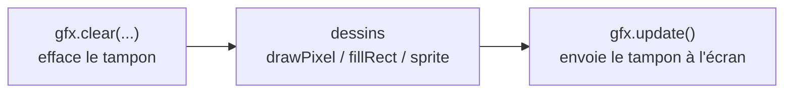

---

## 8. Du texte, au passage

On aura besoin d'afficher un score. La lib gère du texte ASCII :

```cpp
gfx.setColor(color_white);
gfx.move_cursor(90, 10);           // position du texte
gfx.print_str("Salut AKA");        // texte simple
gfx.printf("Score: %d", 1200);     // texte formate, comme printf en C
```

> ⚠️ La police est **ASCII pur** : pas d'accents. Écris « terminee », « reglages »… On
> gérera proprement plusieurs langues (toujours sans accent) dans un chapitre dédié.

---

## Récapitulatif « à la main » vs « lib »

| Tu veux… | À la main (pour comprendre) | Fonction de la lib (à utiliser) |
|---|---|---|
| un pixel | `framebuffer[y*320+x] = c;` | `gfx.drawPixel(x, y, c)` |
| une ligne | boucle `for` sur `x` | `gfx.drawFastHLine / drawLine` |
| un rectangle | double boucle `for` | `gfx.fillRect(x, y, w, h)` |
| un sprite | double boucle + saut de la clé | (ta fonction `draw_sprite`) |
| afficher | — | `gfx.update()` |

---

## À retenir

- Le **framebuffer** est un tableau ; le pixel (x, y) est à l'index **`y*320 + x`**.
- Une couleur = 16 bits (**5 rouge, 6 vert, 5 bleu**) ; on la fabrique avec
  `gfx.makeColor(r,g,b)` ou on prend une couleur prédéfinie.
- Pixel → ligne → rectangle → sprite : c'est **toujours la même idée** d'adressage.
- On dessine dans le tampon, puis **`gfx.update()`** l'affiche d'un coup.

---

---

<a id="ch05"></a>
# Chapitre 05 — La boucle de jeu


---

## Objectif

Comprendre le **cœur** de tout jeu : une boucle qui, encore et encore, lit les entrées,
met à jour l'état, puis dessine.

---

## L'idée : trois temps qui se répètent

Un jeu n'est jamais « figé ». À chaque **image** (*frame*), il fait trois choses dans
cet ordre :

1. **Lire les entrées** — que fait le joueur en ce moment ? (touches, joystick)
2. **Mettre à jour** — faire avancer le monde : bouger la balle, tester les collisions,
   changer le score.
3. **Dessiner** — représenter le nouvel état à l'écran.

Puis on recommence. Vingt à trente fois par seconde, ça donne l'illusion du mouvement,
exactement comme les images d'un dessin animé.

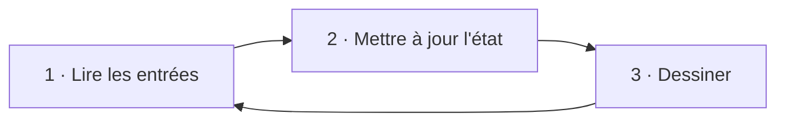

---

## La forme minimale

```cpp
#include "gamebuino.h"

gb_core     gb;
gb_graphics gfx;

extern "C" void app_main(void)
{
    gb.init();

    while (true) {              // la boucle de jeu : elle ne s'arrête jamais
        // 1. LIRE
        gb.pool();             // met à jour boutons + joystick d'un coup

        // 2. METTRE À JOUR
        // (rien pour l'instant — on ajoutera la balle, la raquette...)

        // 3. DESSINER
        gfx.clear(color_black);            // on repart d'un écran propre
        gfx.setColor(color_white);
        gfx.move_cursor(70, 110);
        gfx.print_str("Boucle de jeu OK");
        gfx.update();                      // on présente l'image
    }
}
```

Trois points de vocabulaire pour un débutant :

- **`while (true) { ... }`** répète le bloc **indéfiniment**. C'est ce qu'on veut : un
  jeu tourne tant que la console est allumée.
- **`gb.pool()`** est **la** lecture du matériel. On l'appelle **une fois par image**,
  au début. Tout le reste du code lira ensuite l'état déjà récupéré (on verra les
  détails au chapitre 7).
- On **efface puis on redessine tout** à chaque image (`gfx.clear` au début,
  `gfx.update` à la fin). C'est plus simple et plus sûr que d'essayer d'effacer
  seulement ce qui a bougé.

**À tester :** le texte s'affiche de façon stable. La boucle tourne.

---

## Pourquoi tout effacer à chaque image ?

On pourrait vouloir « effacer juste l'ancienne position de la balle ». C'est possible,
mais source de bugs (traînées, résidus). Sur la AKA, redessiner tout l'écran est assez
rapide pour un casse-briques. **Règle pour débuter : efface tout, redessine tout.** On
optimisera seulement si un jour c'est nécessaire (chapitre Optimisations).

---

## Un petit défaut à corriger… au chapitre suivant

Telle quelle, la boucle tourne **aussi vite que possible** : sa vitesse dépend de la
charge du moment. Si le dessin prend parfois 5 ms, parfois 12 ms, la balle avancera de
façon **irrégulière**. Il manque un **régulateur de cadence** pour que chaque image dure
une durée **constante**. C'est tout l'objet du chapitre 6.

---

## À retenir

- La boucle de jeu = **lire → mettre à jour → dessiner**, en boucle.
- `gb.pool()` **une fois** par image ; `gfx.clear(...)` au début, `gfx.update()` à la
  fin.
- Pour débuter : **on efface et on redessine tout** à chaque image.

---

---

<a id="ch06"></a>
# Chapitre 06 — Cadence et timing


---

## Objectif

Faire en sorte que **chaque image dure la même durée**, pour que le jeu avance à
vitesse **constante**, quelle que soit la charge de calcul.

---

## Le problème, concrètement

Notre balle avancera d'un certain nombre de pixels **par image**. Si les images ne
durent pas toutes pareil, la balle accélère et ralentit toute seule :

```
Sans régulation :   |—5ms—||——12ms——||—6ms—||———14ms———|   → vitesse en dents de scie
Avec régulation :   |———30ms———||———30ms———||———30ms———|   → vitesse constante
```

On veut viser une **période fixe** par image. À 30 images/seconde, une image doit durer
**1000 ms / 30 ≈ 33 ms**. On prendra une valeur ronde, `FRAME_MS = 30`.

---

## Mesurer le temps

La lib donne l'heure courante en millisecondes avec `gb.get_millis()` (le nombre de ms
écoulées depuis l'allumage). En notant l'heure au **début** de l'image et en la
comparant à l'heure **après** le travail, on connaît la durée du travail :

```cpp
uint32_t debut = gb.get_millis();     // top chrono au début de l'image
// ... lire / mettre à jour / dessiner ...
uint32_t travail = gb.get_millis() - debut;   // combien de ms a pris cette image
```

---

## Le régulateur de cadence

Si le travail a pris **moins** que `FRAME_MS`, on **attend** le reste. S'il a pris plus
(rare pour nous), on n'attend pas — on enchaîne.

```cpp
constexpr uint32_t FRAME_MS = 30;     // ~33 images/seconde

extern "C" void app_main(void)
{
    gb.init();

    while (true) {
        uint32_t debut = gb.get_millis();

        // 1. LIRE  2. METTRE À JOUR  3. DESSINER
        gb.pool();
        // ... update ...
        gfx.clear(color_black);
        // ... dessins ...
        gfx.update();

        // RÉGULATION : compléter l'image jusqu'à FRAME_MS
        uint32_t travail = gb.get_millis() - debut;
        if (travail < FRAME_MS)
            gb.delay_ms(FRAME_MS - travail);   // on dort le temps qu'il reste
    }
}
```

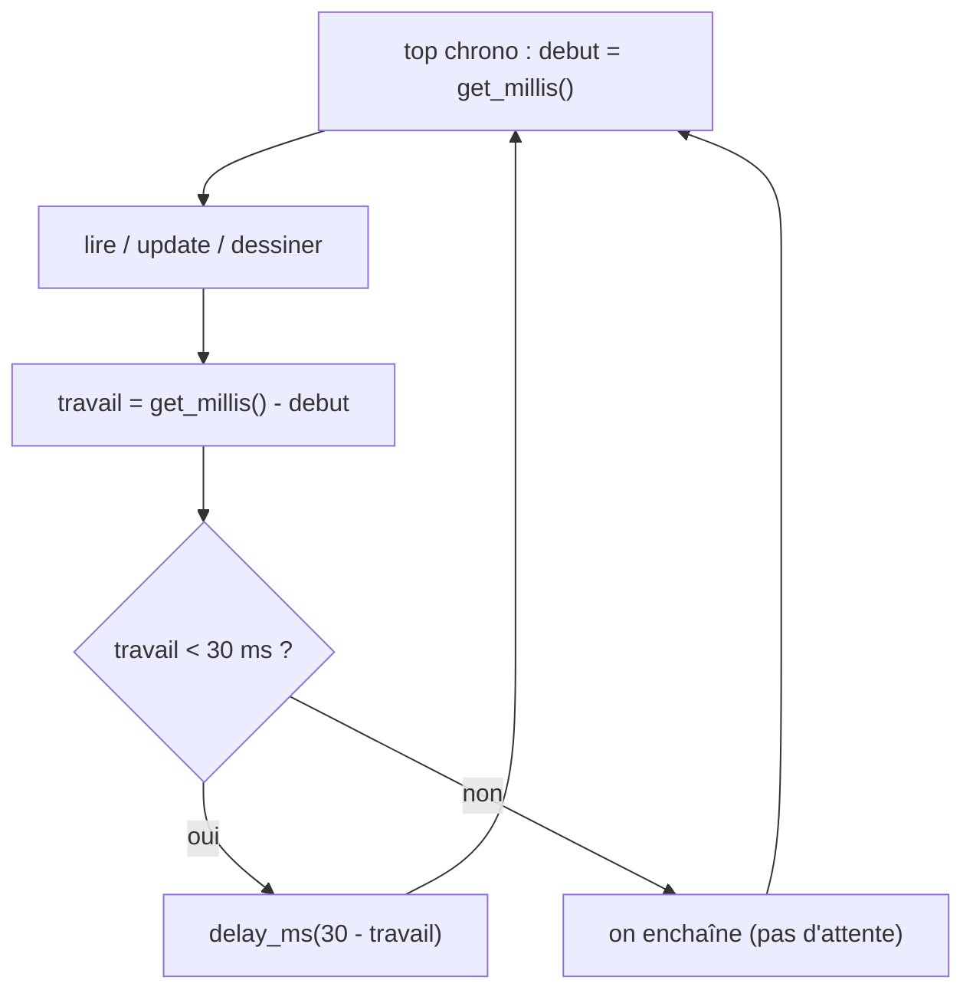

**À tester :** l'affichage est régulier. Quand on ajoutera la balle (chapitre 9), sa
vitesse sera stable. Si un jour le jeu te paraît trop rapide ou trop lent, c'est le
**seul** chiffre à changer : augmente `FRAME_MS` pour ralentir.

---

## Pourquoi `gb.delay_ms` et pas une attente « à vide » ?

On pourrait « tourner en rond » jusqu'à la bonne heure, mais ça garderait le processeur
occupé pour rien (et chaufferait la batterie). `gb.delay_ms(...)` **rend la main** au
système pendant l'attente : c'est plus propre et ça laisse respirer les autres tâches
(l'audio, par exemple, qu'on ajoutera plus tard).

---

## Bonus : afficher les FPS

La lib peut te donner la cadence réelle mesurée, pratique pour vérifier :

```cpp
gfx.printf("FPS: %.0f", gfx.get_fps());
```

---

## À retenir

- On vise une **période d'image constante** (`FRAME_MS`), pas « le plus vite possible ».
- On **mesure** le travail avec `gb.get_millis()` et on **complète** avec
  `gb.delay_ms(...)`.
- Physique stable = **une seule** variable à régler : `FRAME_MS`.

---

---

<a id="ch07"></a>
# Chapitre 07 — Lire les entrées


---

## Objectif

Lire proprement le **joystick** et les **boutons**, et surtout comprendre la différence
entre « la touche **est enfoncée** » et « la touche **vient d'être** enfoncée » — une
distinction qui évite énormément de bugs.

---

## Une seule lecture par image

Tout le matériel d'entrée se lit d'un coup avec **`gb.pool()`**. On l'appelle **une fois
par image**, au début de la boucle. Ensuite, on interroge l'état déjà récupéré autant de
fois qu'on veut, sans relire le matériel.

> ⚠️ Pourquoi une seule lecture ? Les boutons et le joystick partagent le même bus
> interne. Deux lectures concurrentes dans la même image peuvent se gêner. Règle simple :
> **un seul `gb.pool()` par image**, tout le monde lit le résultat.

---

## Les boutons

Après `gb.pool()`, l'objet `gb.buttons` répond à trois questions différentes :

```cpp
gb.pool();

bool a_maintenu    = gb.buttons.state()   & gb_buttons::KEY_A;   // A est-il MAINTENU ?
bool a_vient_appui = gb.buttons.pressed(gb_buttons::KEY_A);       // A vient-il d'être ENFONCÉ ?
```

> 💡 **Le `&` (« et » bit à bit) et le masque de touches.** `gb.buttons.state()` ne
> renvoie pas un seul bouton, mais **tous** d'un coup, empaquetés dans un nombre où
> **chaque bit** représente une touche (1 = enfoncée, 0 = relâchée). `gb_buttons::KEY_A`
> est justement le bit de la touche A. Le `&` (bit à bit) « éteint » tous les autres bits
> et ne garde que celui de A : le résultat est non nul (donc « vrai ») **uniquement** si A
> est enfoncée. C'est un **masque** : on isole une info au milieu des autres. (Voir le
> [Chapitre 0](#ch00) pour les bits.)

En réalité la lib distingue trois notions. Le plus clair est d'utiliser les versions qui
prennent une touche et renvoient un `bool` :

| Question | Appel | Quand c'est vrai |
|---|---|---|
| La touche est-elle **maintenue** ? | `gb.buttons.state()` (masque) | à chaque image tant qu'on appuie |
| Vient-elle d'être **enfoncée** ? | `gb.buttons.pressed(KEY_x)` | **une seule image**, au moment de l'appui |
| Vient-elle d'être **relâchée** ? | `gb.buttons.released(KEY_x)` | **une seule image**, au moment du relâcher |

Les touches disponibles : `KEY_LEFT`, `KEY_RIGHT`, `KEY_UP`, `KEY_DOWN`, `KEY_A`,
`KEY_B`, `KEY_C`, `KEY_D`, `KEY_L1`, `KEY_R1`, `KEY_RUN`, `KEY_MENU` (préfixées
`gb_buttons::`).

### « Maintenu » (niveau) vs « vient d'être enfoncé » (front)

C'est LE concept du chapitre. Imagine qu'on tienne A appuyé pendant 5 images :

```
image :        1     2     3     4     5     6
touche A :    (-)  appui  appui appui appui  (-)
state()   :    0    1     1     1     1     0     ← "maintenu" : vrai tant qu'on appuie
pressed() :    0    1     0     0     0     0     ← "front" : vrai UNE fois, à l'appui
released():    0    0     0     0     0     1     ← "front" : vrai UNE fois, au relâcher
```

- Pour un **déplacement continu** (bouger la raquette tant qu'on pousse), on veut
  **`state()`** / le maintien.
- Pour une **action unique** (lancer la balle, valider un menu, tirer), on veut
  **`pressed()`** / le front — sinon l'action se répéterait à chaque image tant que la
  touche reste enfoncée.

> 🐛 Bug typique : lancer la balle sur le **maintien** de A. Comme A est déjà tenu depuis
> le menu, la balle part instantanément et le joueur n'a rien vu venir. En lançant sur
> le **front** (`pressed`), il faut relâcher puis re-presser : le comportement devient
> correct.

---

## Le joystick

Le joystick donne deux valeurs, de **-1000 à +1000**, autour de 0 au repos :

```cpp
int jx = gb.joystick.get_x();   // gauche négatif  ← 0 →  droite positif
int jy = gb.joystick.get_y();   // haut négatif    ↑ 0 ↓  bas positif
```

Un joystick physique n'est jamais parfaitement à 0 au repos (il « bruite » un peu). Pour
éviter que la raquette dérive toute seule, on ignore les petites valeurs : c'est la
**zone morte**.

```cpp
constexpr int ZONE_MORTE = 200;      // on ignore |jx| < 200
if (jx >  ZONE_MORTE) { /* aller à droite */ }
if (jx < -ZONE_MORTE) { /* aller à gauche */ }
```

```
   -1000        -200     0     +200         +1000
     |------------|-------|-------|------------|
        gauche     ← zone morte →     droite
                  (on n'agit pas)
```

---

## Regrouper proprement

Pour ne pas réécrire tout ça partout, on range l'état lu dans une petite **structure**
`Keys` (une structure = un paquet de variables regroupées sous un nom ; on détaille la
notion au chapitre 8) :

On la déclare **une fois pour toutes** avec tous les champs dont on aura besoin dans la
suite du tutoriel (déplacement au maintien ; actions et navigation au front) :

```cpp
struct Keys {
    // maintien (déplacement continu)
    bool left, right, run, menu;
    // fronts (actions / navigation de menu : une seule image)
    bool a_press, b_press;
    bool up_press, down_press, left_press, right_press;
    // joystick brut
    int  jx, jy;
};

void read_input(Keys& k) {
    gb.pool();                                   // LA lecture unique
    uint16_t s = gb.buttons.state();             // l'état "maintenu" de toutes les touches

    // maintien
    k.left  = s & gb_buttons::KEY_LEFT;
    k.right = s & gb_buttons::KEY_RIGHT;
    k.run   = s & gb_buttons::KEY_RUN;           // servira au retour loader (ch. 21)
    k.menu  = s & gb_buttons::KEY_MENU;          // servira au menu pause (ch. 19)

    // fronts
    k.a_press     = gb.buttons.pressed(gb_buttons::KEY_A);
    k.b_press     = gb.buttons.pressed(gb_buttons::KEY_B);
    k.up_press    = gb.buttons.pressed(gb_buttons::KEY_UP);
    k.down_press  = gb.buttons.pressed(gb_buttons::KEY_DOWN);
    k.left_press  = gb.buttons.pressed(gb_buttons::KEY_LEFT);
    k.right_press = gb.buttons.pressed(gb_buttons::KEY_RIGHT);

    // joystick
    k.jx = gb.joystick.get_x();
    k.jy = gb.joystick.get_y();
}
```

> On remplit `Keys` **en entier** dès maintenant, même si les premiers chapitres n'en
> utilisent qu'une partie : ainsi le menu (ch. 19) et le retour au loader (ch. 21)
> disposeront de `up_press`, `menu`, `run`… sans avoir à revenir modifier cette fonction.

Le `Keys& k` (avec le `&`) veut dire « on te passe la **vraie** structure, pas une
copie » : la fonction la remplit et l'appelant récupère les valeurs. (On reverra les
références plus tard ; pour l'instant, retiens que `&` évite une copie et permet de
modifier l'original.)

**À tester :** affiche `k.jx`/`k.jy` avec `gfx.printf` et bouge le stick ; appuie sur A
et vérifie que `k.a_press` ne s'allume qu'**un instant**, pas tant que tu tiens A.

---

## À retenir

- **Un seul `gb.pool()` par image** ; tout le monde lit le résultat.
- **Maintien** (`state`) pour bouger en continu ; **front** (`pressed`/`released`) pour
  une action unique.
- Le joystick va de **-1000 à +1000** ; ajoute une **zone morte** contre la dérive.

---

---

<a id="ch08"></a>
# Chapitre 08 — La raquette


---

## Objectif

Créer un premier objet du jeu, la **raquette**, qu'on déplace au joystick et aux flèches,
et qui reste dans l'écran. Au passage, on introduit deux outils C++ essentiels : la
**structure** et une **primitive réutilisable**.

---

## D'abord : c'est quoi une structure (`struct`) ?

Un objet du jeu, c'est plusieurs informations qui vont ensemble. La raquette, par
exemple, a une **position** et une **taille**. Plutôt que de trimballer quatre variables
séparées (`px, py, pw, ph`), on les **regroupe** dans une **structure** :

```cpp
struct Rect {     // "Rect" = un rectangle : position + taille
    int x;        // coin haut-gauche, colonne
    int y;        // coin haut-gauche, ligne
    int w;        // largeur
    int h;        // hauteur
};
```

Une `struct`, c'est donc un **nouveau type** qui contient plusieurs champs. On l'utilise
comme n'importe quelle variable :

```cpp
Rect r;                     // on crée un rectangle
r.x = 10; r.y = 20;         // on accède à un champ avec un point
r.w = 48; r.h = 6;
```

> 💡 Pourquoi c'est malin ici : une **raquette**, une **balle**, une **brique** ont
> toutes une position et une taille. Ce sont, géométriquement, des **rectangles**. En
> définissant `Rect` une fois, on va pouvoir le réutiliser pour tout le monde — et,
> surtout, écrire **une seule** fonction de collision qui marche pour n'importe quelle
> paire de rectangles (chapitre 10). C'est le principe du développement « en couches » :
> une petite brique de base, réutilisée partout.

*(Note : on reste en structures simples, très lisibles. Le C++ permet des hiérarchies de
classes avec héritage, mais pour apprendre, des `struct` claires font parfaitement
l'affaire — et restent proches du C.)*

---

## La raquette = un `Rect` + une vitesse

La raquette est un rectangle qui se déplace horizontalement. On lui ajoute donc sa
**vitesse** (de combien de pixels elle avance par image) :

```cpp
constexpr int SCREEN_W = 320, SCREEN_H = 240;
constexpr int PADDLE_W = 48, PADDLE_H = 6;
constexpr int PADDLE_Y = SCREEN_H - 20;    // près du bas
constexpr int PADDLE_SPEED = 5;            // pixels par image

struct Paddle {
    Rect r;                                // position + taille (réutilise Rect)
};

// on crée la raquette centrée, posée en bas
Paddle paddle = { { (SCREEN_W - PADDLE_W) / 2, PADDLE_Y, PADDLE_W, PADDLE_H } };
```

`constexpr` veut dire « constante connue à la compilation » : une valeur fixe à laquelle
on donne un nom lisible. Changer la difficulté = changer un de ces nombres.

---

## Déplacer la raquette

On lit les entrées (chapitre 7) et on ajuste `r.x` :

```cpp
void paddle_update(Paddle& p, const Keys& k) {
    // clavier : maintien => déplacement continu
    if (k.left)  p.r.x -= PADDLE_SPEED;
    if (k.right) p.r.x += PADDLE_SPEED;

    // joystick avec zone morte
    if (k.jx >  200) p.r.x += PADDLE_SPEED;
    if (k.jx < -200) p.r.x -= PADDLE_SPEED;

    // rester dans l'écran (voir ci-dessous)
    if (p.r.x < 0) p.r.x = 0;
    if (p.r.x > SCREEN_W - PADDLE_W) p.r.x = SCREEN_W - PADDLE_W;
}
```

### Le *clamping* (borner une valeur), expliqué

Sans les deux dernières lignes, la raquette sortirait de l'écran. « Borner » (*clamp*),
c'est forcer une valeur à rester entre un minimum et un maximum :

```
   x trop à gauche        x correct           x trop à droite
        x < 0        0 ≤ x ≤ (320 - largeur)     x > 320-largeur
         │                   │                        │
     on remet 0        on ne touche pas        on remet le max
```

- Si `x` devient négatif → on le remet à `0` (bord gauche).
- Si `x` dépasse `SCREEN_W - PADDLE_W` → on le remet à cette valeur (le coin **droit** de
  la raquette touche alors le bord droit).

C'est exactement ce que fait `std::clamp(x, min, max)` de la bibliothèque standard, mais
en l'écrivant à la main on voit ce qui se passe.

---

## Dessiner la raquette

On sait faire depuis le chapitre 4 : un rectangle plein.

```cpp
void paddle_draw(const Paddle& p) {
    gfx.setColor(color_white);
    gfx.fillRect(p.r.x, p.r.y, p.r.w, p.r.h);
}
```

---

## L'assemblage dans la boucle

```cpp
while (true) {
    uint32_t debut = gb.get_millis();

    Keys k;
    read_input(k);              // 1. LIRE (chapitre 7)
    paddle_update(paddle, k);   // 2. METTRE À JOUR

    gfx.clear(color_black);     // 3. DESSINER
    paddle_draw(paddle);
    gfx.update();

    uint32_t travail = gb.get_millis() - debut;   // régulation (chapitre 6)
    if (travail < FRAME_MS) gb.delay_ms(FRAME_MS - travail);
}
```

**À tester :** la raquette suit le joystick et les flèches, et **s'arrête net** aux deux
bords sans jamais sortir.

---

## À retenir

- Une **`struct`** regroupe des variables liées sous un seul nom.
- On définit une **primitive `Rect`** (x, y, w, h) qu'on réutilisera pour la balle et les
  briques — et pour la collision générique du chapitre 10.
- **Borner** (`clamp`) une valeur = la forcer entre un min et un max ; ici pour garder la
  raquette à l'écran.

---

---

<a id="ch09"></a>
# Chapitre 09 — La balle


---

## Objectif

Faire vivre une **balle** : lui donner une position **et une vitesse**, la faire avancer,
et la faire **rebondir** sur les murs. C'est notre première « physique ».

---

## Position + vitesse = mouvement

La raquette avait une position. La balle a en plus une **vitesse**, c'est-à-dire de
combien elle se déplace **par image**, en x et en y :

```cpp
struct Ball {
    float x, y;       // position (en flottant : voir plus bas)
    float vx, vy;     // vitesse : déplacement par image, en x et en y
    int   size;       // côté de la balle (un petit carré, pour commencer)
    bool  active;     // la balle est-elle en jeu ?
};
```

À chaque image, **avancer = ajouter la vitesse à la position** :

```cpp
b.x += b.vx;      // b.x = b.x + b.vx
b.y += b.vy;
```

```
   position à l'image N        position à l'image N+1
        (x, y)      --- + (vx, vy) --->   (x+vx, y+vy)
```

### Pourquoi des `float` (nombres à virgule) ?

Une vitesse comme « 2,6 pixels par image » n'est pas un entier. Si on stockait la
position en entiers, on perdrait ces fractions et les rebonds seraient imprécis (angles
qui « collent » aux axes). On calcule donc en **`float`** (nombres à virgule), et on
n'arrondit **qu'au dernier moment**, pour dessiner :

```cpp
gfx.setColor(color_yellow);
gfx.fillRect((int)b.x, (int)b.y, b.size, b.size);   // (int) = on arrondit pour l'écran
```

`(int)b.x` transforme le flottant en entier (il coupe la partie décimale). L'écran ne
connaît que des pixels entiers, mais la **physique**, elle, garde toute sa précision.

---

## Rebondir sur un mur = inverser une vitesse

Un mur vertical (gauche/droite) renvoie la balle **horizontalement** : on inverse `vx`.
Un mur horizontal (le plafond) renvoie **verticalement** : on inverse `vy`. « Inverser »
= changer le signe.

```
   avant :  balle → mur │            après :  │ mur ← balle
            vx = +2,6                          vx = -2,6
```

```cpp
constexpr int SCREEN_W = 320, SCREEN_H = 240;

void ball_update(Ball& b) {
    if (!b.active) return;

    b.x += b.vx;
    b.y += b.vy;

    // mur gauche
    if (b.x < 0)                 { b.x = 0;                 b.vx = -b.vx; }
    // mur droit
    if (b.x > SCREEN_W - b.size) { b.x = SCREEN_W - b.size; b.vx = -b.vx; }
    // plafond
    if (b.y < 0)                 { b.y = 0;                 b.vy = -b.vy; }
    // le bas = balle perdue : on s'en occupe au chapitre "états"
}
```

Remarque le double geste à chaque mur : on **replace** d'abord la balle exactement sur le
bord (`b.x = 0`, etc.), **puis** on inverse la vitesse. Sans le replacement, la balle
pourrait rester « coincée » un peu au-delà du mur et re-déclencher le rebond à l'image
suivante (elle vibrerait sur place).

---

## Lancer la balle

Pour tester tout de suite, on lance la balle en diagonale au démarrage :

```cpp
Ball ball = { 160.0f, 120.0f, 2.6f, -2.6f, 6, true };
//             x       y       vx     vy   size active
```

`vx = 2.6` (vers la droite) et `vy = -2.6` (vers le haut) : la balle part en diagonale
haut-droite.

---

## Dans la boucle

```cpp
while (true) {
    uint32_t debut = gb.get_millis();

    Keys k; read_input(k);
    paddle_update(paddle, k);
    ball_update(ball);                 // <-- la balle avance et rebondit

    gfx.clear(color_black);
    paddle_draw(paddle);
    gfx.setColor(color_yellow);
    gfx.fillRect((int)ball.x, (int)ball.y, ball.size, ball.size);
    gfx.update();

    uint32_t travail = gb.get_millis() - debut;
    if (travail < FRAME_MS) gb.delay_ms(FRAME_MS - travail);
}
```

**À tester :** la balle part en diagonale et rebondit proprement sur les trois murs
(gauche, droite, plafond), à vitesse constante. Elle traverse encore la raquette : c'est
justement le sujet du chapitre 10.

---

## À retenir

- Une balle = **position + vitesse** ; avancer = **position += vitesse** chaque image.
- On calcule en **`float`** et on **arrondit `(int)`** seulement pour dessiner.
- Rebond sur un mur = **inverser** la vitesse concernée, après avoir **replacé** la balle
  sur le bord.

---

---

<a id="ch10"></a>
# Chapitre 10 — Collision et rebond Arkanoid


---

## Objectif

Deux problèmes bien distincts, qu'on va traiter **l'un après l'autre** :

1. **Détecter** que la balle touche la raquette (une collision).
2. **Réagir** : calculer le rebond. On commencera par le plus simple, puis on
   l'enrichira étape par étape jusqu'au rebond « Arkanoid » où l'angle dépend de l'endroit
   touché.

---

## Partie 1 — Détecter une collision (générique)

### L'idée : deux rectangles se chevauchent-ils ?

La balle et la raquette sont des **rectangles** (on a créé la primitive `Rect` au
chapitre 8). Deux rectangles se touchent si, **et seulement si**, ils se chevauchent à la
fois **horizontalement** ET **verticalement**.

```
   se chevauchent (contact)         ne se chevauchent pas
   ┌─────┐                          ┌─────┐
   │  A  │                          │  A  │
   │   ┌─┼───┐                      └─────┘
   └───┼─┘ B │                          ┌─────┐
       └─────┘                          │  B  │
                                        └─────┘
```

Regardons **un seul axe** (l'horizontal) : A et B se chevauchent en x si le **bord
gauche** de A est plus à gauche que le **bord droit** de B, **et** inversement :

```
A.x  ........ A.x+A.w
        B.x ........ B.x+B.w
        └── chevauchement ──┘     ⇔   A.x < B.x+B.w   ET   A.x+A.w > B.x
```

On applique la même chose en vertical. Les **quatre** conditions ensemble donnent la
collision. C'est l'algorithme « AABB » (*Axis-Aligned Bounding Box* : boîtes alignées sur
les axes).

### La fonction générique

On l'écrit **une fois**, et elle marchera pour n'importe quelle paire : balle/raquette,
balle/brique, etc. C'est le bénéfice d'avoir une primitive `Rect` commune.

```cpp
bool overlap(const Rect& a, const Rect& b) {
    return a.x < b.x + b.w &&      // bord gauche de A avant bord droit de B
           a.x + a.w > b.x &&      // bord droit de A après bord gauche de B
           a.y < b.y + b.h &&      // bord haut de A au-dessus du bas de B
           a.y + a.h > b.y;        // bord bas de A en-dessous du haut de B
}
```

Comme la balle est en `float`, on lui fabrique un `Rect` au vol :

```cpp
Rect ball_rect(const Ball& b) {
    return { (int)b.x, (int)b.y, b.size, b.size };
}
```

**Test simple :** `if (overlap(ball_rect(ball), paddle.r)) { ... }` → vrai quand la balle
touche la raquette. On tient la détection. Reste à décider **quoi faire**.

---

## Partie 2 — Réagir : le rebond, du plus simple au plus fin

### Niveau 1 — Le rebond plat

Le minimum : quand la balle touche la raquette **en descendant**, on la renvoie vers le
haut. On inverse `vy` (et on la force vers le haut pour être sûr) :

```cpp
if (ball.vy > 0 && overlap(ball_rect(ball), paddle.r)) {
    ball.vy = -ball.vy;                       // renvoyée vers le haut
    ball.y  = paddle.r.y - ball.size - 1;     // on la sort de la raquette
}
```

Le `ball.vy > 0` (balle qui descend) évite de re-rebondir si elle remonte déjà. Le
repositionnement évite les **collisions multiples** (sinon elle resterait « dans » la
raquette plusieurs images de suite).

Ça marche… mais c'est **plat** : la balle repart toujours au même angle. Le joueur ne
peut pas viser. Améliorons.

### Niveau 2 — Des zones sur la raquette

Idée : découper la raquette en **zones**. Toucher à gauche renvoie vers la gauche,
toucher au centre renvoie tout droit, toucher à droite renvoie vers la droite.

```
  raquette découpée en 5 zones :
   ┌─────┬─────┬─────┬─────┬─────┐
   │ -2  │ -1  │  0  │ +1  │ +2  │
   └─────┴─────┴─────┴─────┴─────┘
   gauche         centre         droite
```

On calcule dans **quelle** zone la balle a tapé, et on en déduit `vx` :

```cpp
int zone_impact(const Ball& b, const Paddle& p, int nb_zones) {
    int centre_balle = (int)b.x + b.size / 2;
    int rel = centre_balle - p.r.x;                 // 0 .. largeur raquette
    int zone = rel * nb_zones / p.r.w;              // 0 .. nb_zones-1
    return zone - nb_zones / 2;                     // recentre : ... -1, 0, +1 ...
}

// à la collision :
int z = zone_impact(ball, paddle, 5);   // renvoie -2..+2
ball.vx = z * 1.3f;                      // plus la zone est extrême, plus vx est grand
ball.vy = -fabs(ball.vy);                // toujours vers le haut
```

C'est déjà **beaucoup** plus jouable : on peut orienter la balle. Mais la vitesse totale
change selon la zone (une balle très inclinée va plus « vite » en diagonale). Affinons
encore.

### Niveau 3 — Un pourcentage continu

Au lieu de 5 zones, utilisons une valeur **continue** `t` entre **-1** (bord gauche) et
**+1** (bord droit), avec **0** au centre exact :

```cpp
float impact_ratio(const Ball& b, const Paddle& p) {
    float centre_balle   = b.x + b.size / 2.0f;
    float centre_raquette = p.r.x + p.r.w / 2.0f;
    float t = (centre_balle - centre_raquette) / (p.r.w / 2.0f);  // -1 .. +1
    if (t < -1) t = -1;
    if (t >  1) t =  1;
    return t;
}
```

```
   bord gauche      centre      bord droit
       t = -1        t = 0         t = +1
        │─────────────│─────────────│
```

On peut alors moduler la vitesse en douceur :

```cpp
float t = impact_ratio(ball, paddle);
ball.vx = t * 3.0f;
ball.vy = -fabs(ball.vy);
```

C'est fluide et intuitif. Il reste un dernier raffinement, facultatif, si tu veux la
sensation exacte d'Arkanoid : **garder une vitesse totale constante** en ne faisant que
**tourner** la direction.

### Niveau 4 (bonus) — Un vrai angle, à vitesse constante (le sinus, expliqué)

Ici, et seulement ici, on sort la trigonométrie — mais on va comprendre **pourquoi**.

On veut : centre touché → balle **tout droit vers le haut** ; bord touché → balle
renvoyée **en biais**, jusqu'à un angle maximal (disons 60°). Notre `t` (-1..+1) donne
justement « à quel point on est vers le bord ». On le transforme en **angle** :

```
angle = t × 60°     (t=-1 → -60°,  t=0 → 0°,  t=+1 → +60°)
```

Maintenant, comment transformer un **angle** en une **vitesse (vx, vy)** ? C'est le rôle
du **sinus** et du **cosinus**. Sur un cercle de rayon = la vitesse, un angle mesuré
**depuis la verticale** (le « tout droit vers le haut ») se décompose ainsi :

```
            ↑ (tout droit, angle 0)
            │
        \   │   /
         \  │  /   ← direction de sortie, inclinée de "angle"
          \ │ /
   ────────●────────
       vx = vitesse × sin(angle)      (composante horizontale)
       vy = vitesse × cos(angle)      (composante verticale, vers le haut)
```

La propriété clé : pour **n'importe quel** angle, `sin(angle)² + cos(angle)² = 1`. Donc
la **longueur** du vecteur (vx, vy) — c'est-à-dire la **vitesse totale** — reste égale à
`vitesse`, quel que soit l'angle. On ne fait que **pivoter** la direction, sans
accélérer ni ralentir. C'est exactement l'effet Arkanoid.

```cpp
#include <cmath>

void ball_vs_paddle(Ball& b, const Paddle& p) {
    if (b.vy <= 0 || !overlap(ball_rect(b), p.r)) return;

    float t = impact_ratio(b, p);            // -1 .. +1  (niveau 3)
    float angle_max = 1.05f;                 // ~60° en radians
    float angle = t * angle_max;

    float vitesse = std::sqrt(b.vx*b.vx + b.vy*b.vy);   // la vitesse actuelle
    b.vx =  vitesse * std::sin(angle);       // composante horizontale
    b.vy = -vitesse * std::cos(angle);       // composante verticale (vers le haut)

    b.y = p.r.y - b.size - 1;                // on la sort de la raquette
}
```

> Deux mots sur les **radians** : `sin`/`cos` du C++ attendent l'angle en radians, pas en
> degrés. 180° = π ≈ 3,14159 rad ; donc 60° ≈ 1,05 rad. C'est pour ça que `angle_max`
> vaut `1.05f`.

---

## Choisis ton niveau

Tu n'es **pas** obligé d'aller jusqu'au sinus. Chaque niveau est un jeu qui marche :

| Niveau | Sensation | Complexité |
|---|---|---|
| 1 · rebond plat | robotique | triviale |
| 2 · zones | on peut viser | facile |
| 3 · pourcentage | fluide | facile |
| 4 · sinus | vrai Arkanoid, vitesse constante | trigo de base |

Le but pédagogique : **assimiler la brique de base, puis la rendre générique et la
raffiner par couches**. C'est comme ça qu'on progresse sans copier de « code magique ».

---

## À retenir

- **Détecter** et **réagir** sont deux problèmes séparés : traite-les l'un après l'autre.
- La collision **AABB** (`overlap`) est **générique** : une fonction pour toutes les
  paires de `Rect`.
- Le rebond se construit **progressivement** ; le sinus n'est qu'une **dernière couche**
  optionnelle pour garder une vitesse constante — et il se comprend avec un simple cercle.

---

---

<a id="ch11"></a>
# Chapitre 11 — Les briques


---

## Objectif

Remplir le haut de l'écran de **briques** à casser. On découvre au passage un outil C++
très pratique — le **`std::vector`** (un tableau qui grandit tout seul) — et on
**réutilise** la collision générique du chapitre 10.

---

## Une brique = un `Rect` + des infos

On repart de notre primitive `Rect`. Une brique, c'est un rectangle, plus quelques
informations : sa couleur, ses **points de vie** (`hp`, pour les briques à casser en
plusieurs coups) et un drapeau « vivante / cassée ».

```cpp
struct Brick {
    Rect     r;        // position + taille (chapitre 8)
    uint16_t color;    // sa couleur
    int      hp;       // points de vie : nombre de coups avant destruction
    bool     alive;    // encore là ?
};
```

---

## Stocker les briques : `std::vector`

On ne sait pas toujours à l'avance combien de briques il y aura (ça dépend du niveau).
Un **`std::vector`** est un tableau **dont la taille peut varier** : on y ajoute des
éléments avec `push_back(...)`, on connaît sa taille avec `.size()`, et on le parcourt
comme un tableau.

```cpp
#include <vector>
std::vector<Brick> bricks;     // une liste de briques, vide au départ
```

> 💡 Différence avec le tableau classique (`Brick bricks[54];`) : le `vector` gère la
> mémoire pour toi et retient sa taille. Idéal quand le nombre d'éléments change.

---

## Générer la grille

Les briques forment une **grille** : des rangées et des colonnes. On la construit avec…
deux boucles imbriquées (comme le rectangle du chapitre 4, mais cette fois on place des
briques au lieu de pixels).

```cpp
constexpr int BRICK_W = 30, BRICK_H = 12;   // taille d'une brique
constexpr int BRICK_COLS = 9, BRICK_ROWS = 6;
constexpr int BRICK_GAP  = 2;               // espace entre briques
constexpr int BRICK_TOP  = 40;              // hauteur de la 1re rangée
constexpr int BRICK_LEFT = 20;              // marge à gauche

void bricks_init() {
    bricks.clear();                          // on repart d'une liste vide
    for (int j = 0; j < BRICK_ROWS; j++) {           // chaque rangée
        for (int i = 0; i < BRICK_COLS; i++) {       // chaque colonne
            int x = BRICK_LEFT + i * (BRICK_W + BRICK_GAP);
            int y = BRICK_TOP  + j * (BRICK_H + BRICK_GAP);
            bricks.push_back({ {x, y, BRICK_W, BRICK_H}, color_orange, 1, true });
        }
    }
}
```

```
   colonnes i →   0    1    2    3    4    5    6    7    8
   rangée j=0    [ ][ ][ ][ ][ ][ ][ ][ ][ ]      x = LEFT + i*(W+GAP)
   rangée j=1    [ ][ ][ ][ ][ ][ ][ ][ ][ ]      y = TOP  + j*(H+GAP)
   rangée j=2    [ ][ ][ ][ ][ ][ ][ ][ ][ ]
```

---

## Dessiner les briques

On parcourt le vector et on dessine celles qui sont encore vivantes. La boucle
`for (auto& b : bricks)` veut dire « pour chaque brique `b` de la liste » (le `&` évite
de copier chaque brique) :

```cpp
void bricks_draw() {
    for (auto& b : bricks) {
        if (!b.alive) continue;              // on saute les cassées
        gfx.setColor(b.color);
        gfx.fillRect(b.r.x, b.r.y, b.r.w, b.r.h);
    }
}
```

---

## Collision balle / brique : trouver le bon axe de rebond

On sait **détecter** le contact avec `overlap()` (chapitre 10). Mais quel rebond ? Si la
balle arrive par le **côté**, il faut inverser `vx` ; si elle arrive par le **haut ou le
bas**, il faut inverser `vy`. Un simple `vy = -vy` (comme dans une première version
naïve) est faux dès qu'on touche une brique par le flanc.

L'astuce : comparer de **combien** la balle pénètre horizontalement vs verticalement. La
plus **petite** pénétration indique par où elle est entrée, donc l'axe à inverser.

```
   pénétration horizontale (ox) petite  →  entrée par le côté  →  inverser vx
   pénétration verticale   (oy) petite  →  entrée par le haut  →  inverser vy

        ┌───────────┐
        │  brique   │     • = centre de la balle
     •──┤           │     dx, dy = distance entre les 2 centres
        └───────────┘
```

```cpp
void ball_vs_bricks(Ball& ball, int& score) {
    Rect br = ball_rect(ball);
    for (auto& b : bricks) {
        if (!b.alive) continue;
        if (!overlap(br, b.r)) continue;         // pas de contact : suivante

        // dégâts : --b.hp enlève 1 point de vie ET donne la nouvelle valeur à tester
        if (--b.hp <= 0) { b.alive = false; score += 100; }   // 0 pv => cassée

        // axe de rebond = plus petite pénétration
        float dx = (ball.x + ball.size/2.0f) - (b.r.x + b.r.w/2.0f);
        float dy = (ball.y + ball.size/2.0f) - (b.r.y + b.r.h/2.0f);
        float ox = (b.r.w + ball.size)/2.0f - fabs(dx);   // chevauchement en x
        float oy = (b.r.h + ball.size)/2.0f - fabs(dy);   // chevauchement en y
        if (ox < oy) ball.vx = -ball.vx;                  // entrée par le côté
        else         ball.vy = -ball.vy;                  // entrée par le haut/bas
        break;                                            // une brique par image suffit
    }
}
```

Le `break` s'arrête à la première brique touchée : traiter plusieurs collisions dans la
même image donnerait des rebonds incohérents.

---

## Marquer « cassée », pas supprimer

On met `alive = false` au lieu de retirer la brique du vector. Pourquoi ? Supprimer un
élément **pendant** qu'on parcourt la liste est une source classique de bugs (on peut
sauter un élément ou lire une case qui n'existe plus). Marquer « cassée » est plus simple,
plus rapide, et la brique cesse d'être dessinée et testée.

---

## Le niveau est-il fini ?

Le niveau est terminé quand il ne reste **aucune brique vivante** :

```cpp
bool level_cleared() {
    for (auto& b : bricks)
        if (b.alive) return false;   // il en reste une → pas fini
    return true;                     // aucune vivante → gagné
}
```

*(On adaptera ce test au chapitre 15 pour ignorer les briques **incassables**.)*

**À tester :** la balle casse les briques, rebondit correctement selon l'angle d'arrivée
(côté vs dessus), le score monte, et le niveau se termine quand tout est cassé.

---

## À retenir

- Un **`std::vector`** est un tableau extensible : `push_back`, `.size()`, parcours
  `for (auto& x : v)`.
- La collision réutilise **`overlap()`** ; le **bon axe de rebond** se trouve en comparant
  les pénétrations horizontale et verticale.
- On **marque** les briques cassées (`alive=false`), on ne les supprime pas en plein jeu.

---

---

<a id="ch12"></a>
# Chapitre 12 — Organiser les écrans (machine à états)


---

## Objectif

Gérer proprement les différents **écrans** du jeu : titre, mise en jeu, partie en cours,
game over. La **machine à états** est **une** façon de faire ça — pratique et lisible —
mais **pas un passage obligé** : on pourrait aussi utiliser une suite de fonctions ou de
`if`. On la présente parce qu'elle passe bien à l'échelle quand les écrans se multiplient.

---

## Le problème

Jusqu'ici la boucle faisait toujours la même chose. Mais un jeu a des **moments**
différents : sur l'écran-titre, on n'anime pas la balle ; sur le game over, on n'écoute
que « rejouer ». Si on met tout dans un seul gros bloc avec plein de `if`, ça devient vite
illisible.

L'idée de la machine à états : à tout instant, le jeu est dans **un** état, et **un
seul**. Chaque état a son comportement. On **transite** d'un état à l'autre sur des
événements (appuyer sur A, perdre la balle…).

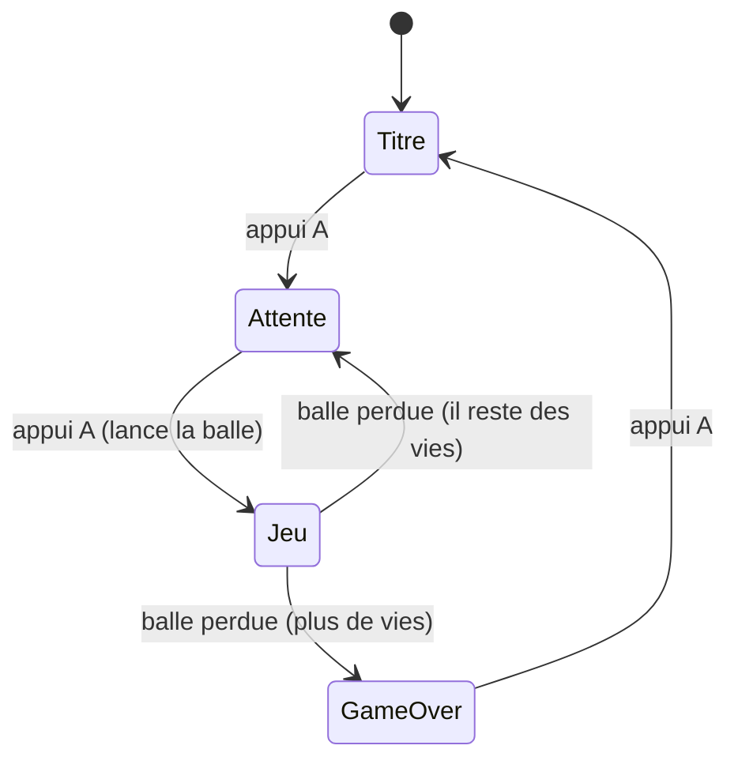

---

## Déclarer les états : `enum class`

Un **`enum class`** définit une liste de **valeurs nommées**. Au lieu de retenir « 0 =
titre, 1 = jeu… », on écrit des noms clairs et le compilateur nous protège des mélanges :

```cpp
enum class State {
    Title,          // écran-titre
    WaitingBall,    // la balle est posée sur la raquette, prête à partir
    Playing,        // ça joue
    GameOver        // perdu
};
```

On regroupe tout l'état du jeu dans une structure `Game` (là encore, une `struct` qui
rassemble les données liées) :

```cpp
struct Game {
    State state = State::Title;
    Paddle paddle;
    std::vector<Ball> balls;     // un vector : on pourra avoir plusieurs balles (multi-ball)
    std::vector<Brick> bricks;
    int score = 0;
    int lives = 3;
};
```

---

## La boucle : un `switch` sur l'état

Le **`switch`** choisit le bloc à exécuter selon la valeur. C'est plus lisible qu'une
cascade de `if / else if` :

```cpp
Game g;

while (true) {
    uint32_t debut = gb.get_millis();
    Keys k; read_input(k);

    switch (g.state) {
        case State::Title:       update_title(g, k);   break;
        case State::WaitingBall: update_waiting(g, k); break;
        case State::Playing:     update_playing(g, k); break;
        case State::GameOver:    update_gameover(g, k);break;
    }

    gfx.update();

    uint32_t travail = gb.get_millis() - debut;
    if (travail < FRAME_MS) gb.delay_ms(FRAME_MS - travail);
}
```

Chaque `update_xxx` fait **sa** mise à jour **et** son dessin. Le `break` évite de
« tomber » dans le cas suivant (piège classique du `switch` en C++).

---

## Les états, un par un

```cpp
void update_title(Game& g, const Keys& k) {
    gfx.clear(color_black);
    gfx.setColor(color_white);
    gfx.move_cursor(70, 110); gfx.print_str("Appuie sur A pour jouer");
    if (k.a_press) { new_game(g); g.state = State::WaitingBall; }   // transition
}

void update_waiting(Game& g, const Keys& k) {
    paddle_update(g.paddle, k);
    // la balle suit la raquette tant qu'on n'a pas lancé
    g.balls[0].x = g.paddle.r.x + g.paddle.r.w/2 - g.balls[0].size/2;
    g.balls[0].y = g.paddle.r.y - g.balls[0].size;
    draw_all(g);
    gfx.move_cursor(100, 150); gfx.print_str("A pour lancer");
    if (k.a_press) {                     // lancement sur FRONT (chapitre 7)
        g.balls[0].vx = 2.6f; g.balls[0].vy = -2.6f;
        g.balls[0].active = true;
        g.state = State::Playing;
    }
}

void update_playing(Game& g, const Keys& k) {
    paddle_update(g.paddle, k);
    for (auto& b : g.balls) { ball_update(b); ball_vs_paddle(b, g.paddle);
                              ball_vs_bricks(b, g.score); }
    if (g.balls[0].y > SCREEN_H) {       // balle perdue
        if (--g.lives <= 0) g.state = State::GameOver;
        else                g.state = State::WaitingBall;
    }
    draw_all(g);
}

void update_gameover(Game& g, const Keys& k) {
    gfx.clear(color_black);
    gfx.setColor(color_white);
    gfx.move_cursor(60, 120); gfx.print_str("Partie terminee - A pour rejouer");
    if (k.a_press) g.state = State::Title;
}
```

> 💡 **Conseil issu de l'expérience** : fais passer **toutes** les mises en jeu (nouvelle
> partie, nouvelle vie après une balle perdue) par le **même** état `WaitingBall`. Tu
> évites d'avoir deux chemins de lancement différents — une source de bugs subtils (balle
> lancée toute seule, colle mal réinitialisée…). Et lance toujours la balle sur le
> **front** de A, jamais sur le maintien.

---

## Ce n'est qu'une option

Pour un tout petit jeu, une poignée de `if` suffirait. La machine à états devient
gagnante dès qu'il y a **plusieurs écrans** (pause, options, victoire, boss…) : chaque
ajout est un nouveau `case`, sans toucher aux autres. C'est ça, sa vraie valeur :
**l'ajout d'un écran ne casse pas les précédents.**

**À tester :** le cycle titre → attente → jeu → game over → titre s'enchaîne
proprement, et la balle ne se lance qu'après avoir relâché puis pressé A.

---

## À retenir

- La machine à états est **une** organisation possible, pas une obligation.
- **`enum class`** = valeurs nommées ; **`switch`** = un bloc par état (avec `break`).
- Unifie les mises en jeu via un état d'**attente** commun ; lance sur le **front**.

---

---

<a id="ch13"></a>
# Chapitre 13 — Le son


---

## Objectif

Faire du bruit : un « ploc » quand la balle casse une brique, un « clac » sur la raquette,
un bip de menu. On utilise l'API audio **de la lib** (pas de bidouille bas niveau), et on
découvre au passage une **tâche** (un mini-programme qui tourne en parallèle).

---

## Les deux objets de l'audio

La lib fournit :

- un **lecteur** `gb_audio_player` : il mélange (mixe) les sons et les envoie au
  haut-parleur ;
- des **pistes** `gb_audio_track_tone` : chacune peut jouer **un** son (une note) à la
  fois. On peut brancher **jusqu'à 4 pistes** sur le lecteur.

```cpp
#include "gamebuino.h"    // inclut déjà gb_audio_player.h et gb_audio_track_tone.h

gb_audio_player     player;
gb_audio_track_tone voices[4];   // 4 voix : on pourra jouer 4 sons en même temps
```

Jouer un son sur une piste :

```cpp
// play_tone(frequence_Hz, volume 0.0..1.0, duree_ms, type)
voices[0].play_tone(440.0f, 1.0f, 150, gb_audio_track_tone::SQUARE);
```

Les **types** de timbre disponibles : `SINE` (doux), `SQUARE` (rétro, « 8-bit »),
`TRIANGLE` (entre les deux), `NOISE` (bruit, pour explosions/percussions).

---

## Pourquoi une *tâche* dédiée ?

Le lecteur doit être « alimenté » **très souvent** (toutes les ~2 ms) pour que le son ne
se coupe pas. Or notre boucle de jeu ne tourne que ~30 fois par seconde (toutes les
33 ms). Beaucoup trop lent : le son serait haché.

Solution : confier l'alimentation du son à une **tâche**. Une tâche, c'est un
**deuxième fil d'exécution** qui tourne **en parallèle** de la boucle de jeu — la puce
ESP32-S3 a deux cœurs, elle peut vraiment faire deux choses à la fois. On dédie donc une
tâche au son : elle ne fait que réclamer `player.pool()` en boucle.

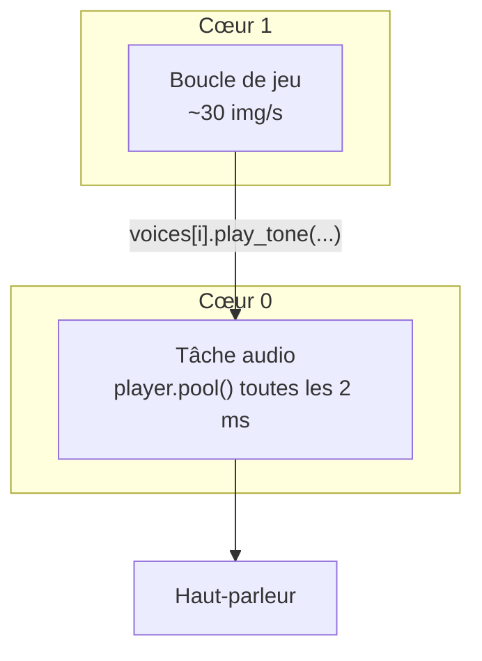

`player.pool()` fait tout le travail « matériel » pour nous (mixage + envoi au
haut-parleur). Notre jeu, lui, se contente de **demander** des sons avec `play_tone`.

> ℹ️ Le **matériel** audio est déjà préparé par `gb.init()` (chapitre 3). On n'a donc rien
> à initialiser côté puce : il reste juste à créer le lecteur, brancher les voix, régler
> le volume, et lancer la tâche qui appelle `player.pool()`.

---

## Mise en place

```cpp
#include "freertos/FreeRTOS.h"
#include "freertos/task.h"

// La tâche : une fonction qui tourne en boucle, en parallèle.
static void audio_task(void*) {
    while (true) {
        player.pool();                    // alimente le son
        vTaskDelay(pdMS_TO_TICKS(2));     // rend la main 2 ms puis recommence
    }
}

void audio_init() {
    for (auto& v : voices)
        player.add_track(&v);             // on branche les 4 voix sur le lecteur

    player.set_master_volume(200);        // volume general 0 (muet) .. 255 (max)

    // on lance la tâche audio sur le cœur 0, priorité moyenne
    xTaskCreatePinnedToCore(audio_task, "audio", 4096, nullptr, 5, nullptr, 0);
}
```

- **`player.set_master_volume(200)`** est le **bon** réglage de volume (0 à 255). C'est la
  fonction de la lib prévue pour ça — inutile (et déconseillé) d'aller toucher les pilotes
  bas niveau.
- **`xTaskCreatePinnedToCore(...)`** crée la tâche : la fonction à exécuter (`audio_task`),
  un nom, la taille de sa pile mémoire (4096), sa priorité (5), et le cœur (0).
- **`vTaskDelay(pdMS_TO_TICKS(2))`** endort la tâche 2 ms à chaque tour : elle rend la
  main au système au lieu de monopoliser le cœur.

> ⚠️ **Piège** : le lecteur ne gère que **4 pistes** (`AUDIO_PLAYER_TRACK_COUNT = 4`). Si
> tu essaies d'en brancher plus, les suivantes sont ignorées silencieusement.

---

## Un « bus » d'effets, pour ne pas se couper

Si on jouait toujours sur `voices[0]`, un nouveau son couperait le précédent. On répartit
donc les effets sur les 4 voix **à tour de rôle** (*round-robin*) : chaque son part sur la
voix suivante.

```cpp
struct SfxBus {
    int next = 0;
    void play(float freq, uint16_t ms, float gain = 1.0f,
              gb_audio_track_tone::tone_type type = gb_audio_track_tone::SQUARE) {
        voices[next].play_tone(freq, gain, ms, type);
        next = (next + 1) % 4;            // 0,1,2,3,0,1,2,3...
    }
};
SfxBus sfx;
```

Le **gain par effet** (0.0 à 1.0) sert à **équilibrer** : à volume égal, un son grave est
perçu plus faible qu'un aigu. On monte les sons importants, on baisse les petits bruits :

```cpp
sfx.play(300, 150, 1.00f);   // brique cassée : bien présente
sfx.play(520, 120, 0.55f, gb_audio_track_tone::SINE);   // rebond raquette : discret
sfx.play(660,  35, 0.50f);   // bip de menu : léger
```

Tu appelles `sfx.play(...)` **depuis la boucle de jeu**, au moment de l'événement (une
brique meurt, la balle touche la raquette…). La tâche audio s'occupe du reste.

**À tester :** casse une brique → un « ploc » net ; rebonds plus discrets ; aucun son ne
se fait rare ni haché, même quand plusieurs partent presque en même temps.

---

## À retenir

- **`gb_audio_player` + `gb_audio_track_tone`** : jusqu'à **4 voix**, `play_tone(freq,
  vol, ms, type)`.
- Le son s'alimente dans une **tâche dédiée** (`player.pool()` toutes les ~2 ms) ; le jeu
  se contente de **demander** des sons.
- Volume général : **`player.set_master_volume(0..255)`** (pas de bas niveau).
- Répartir les effets en **round-robin** + un **gain par effet** pour équilibrer.

---

---

<a id="ch14"></a>
# Chapitre 14 — Les bonus qui tombent


---

## Objectif

Quand une brique casse, elle peut lâcher un **bonus** qui tombe. S'il atteint la raquette,
il s'active. On ajoute trois classiques : **colle**, **laser**, **multi-ball**.

---

## Un bonus qui tombe

C'est encore un `Rect` (position + taille), plus son **type** et un drapeau actif. Pour
lister les bonus en train de tomber, on reprend un `std::vector` (chapitre 11).

```cpp
enum class Power { Glue, Laser, Multi };

struct Falling {
    Rect  r;
    Power type;
    bool  active;
};

std::vector<Falling> falling;   // les bonus actuellement en chute
```

---

## Apparition

À la destruction d'une brique, on tente le tirage : par exemple **1 chance sur 6** de
lâcher un bonus, dont on choisit le type au hasard.

```cpp
void maybe_drop_bonus(const Brick& b) {
    if (rand() % 6 != 0) return;                          // 5 fois sur 6 : rien
    Power p = static_cast<Power>(rand() % 3);            // 0,1,2 -> Glue, Laser, Multi
    falling.push_back({ {b.r.x + b.r.w/2 - 6, b.r.y, 12, 12}, p, true });
}
```

`rand()` renvoie un entier « au hasard » ; `rand() % 6` donne un nombre de 0 à 5 (le
reste de la division par 6). On appelle `maybe_drop_bonus(b)` juste après avoir marqué la
brique `alive = false` (chapitre 11).

---

## Chute + capture par la raquette

Chaque image, les bonus descendent. S'ils touchent la raquette (`overlap`, chapitre 10),
on les applique ; s'ils sortent par le bas, on les désactive.

```cpp
void bonus_update(Game& g) {
    for (auto& f : falling) {
        if (!f.active) continue;
        f.r.y += 2;                              // il tombe

        if (overlap(f.r, g.paddle.r)) {          // attrapé !
            apply_power(g, f.type);
            f.active = false;
        }
        else if (f.r.y > SCREEN_H) {             // raté, il sort en bas
            f.active = false;
        }
    }
}
```

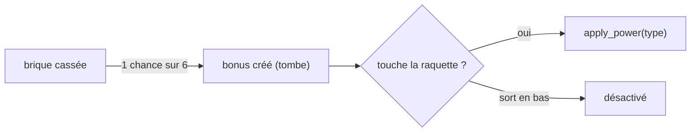

---

## Bonus 1 — Multi-ball (le plus simple)

On ajoute une balle en repartant de l'existante, avec une direction opposée. C'est ici
que notre `std::vector<Ball>` (chapitre 12) prend tout son sens.

```cpp
void apply_multi(Game& g) {
    if (g.balls.empty()) return;
    Ball nb = g.balls[0];      // copie de la balle en cours
    nb.vx = -nb.vx;            // repart dans l'autre sens horizontal
    g.balls.push_back(nb);     // on l'ajoute à la liste
}
```

La boucle de jeu (chapitre 12) parcourt déjà **toutes** les balles : le multi-ball marche
sans autre changement. Attention juste à ne considérer la partie perdue que quand **toutes**
les balles sont sorties.

---

## Bonus 2 — La colle (et son piège d'états)

La **colle** attrape la balle sur la raquette pendant un temps, puis la relâche. Le même
mécanisme sert aussi à **poser** la balle avant le lancement initial (chapitre 12). D'où
un piège : il faut distinguer les deux cas, sinon la balle reste collée **pour toujours**.

On ajoute pour cela **deux champs** à la structure `Game` du chapitre 12 : un compteur
`int sticky_timer` (l'état de la colle) et l'indice `int captured` de la balle capturée
(ou -1 si aucune). Une convention simple et sûre :

- `sticky_timer == -1` → **pose initiale** (avant le tout premier lancement). Au
  lancement, on **retire** la colle.
- `sticky_timer > 0` → **bonus colle actif**, il **décompte** chaque image. Quand il
  atteint 0 : on **relâche** la balle capturée **et** on retire la colle.

```cpp
void apply_glue(Game& g) { g.sticky_timer = 90; }   // ~3 s à 30 img/s

void release_captured_ball(Game& g) {
    if (g.captured < 0) return;                  // rien de capturé
    Ball& b = g.balls[g.captured];
    b.vx = 2.0f; b.vy = -2.6f;                   // renvoyée vers le haut
    b.active = true;
    g.captured = -1;                             // plus rien de capturé
}

void glue_update(Game& g) {
    if (g.sticky_timer > 0) {
        g.sticky_timer--;
        // (pendant ce temps, la balle capturée suit la raquette)
        if (g.sticky_timer == 0) release_captured_ball(g);   // relâche proprement
    }
}
```

> 🐛 Le bug d'origine : à l'expiration, l'ancien code remettait `sticky_timer = -1` **en
> gardant** l'état « collé » → la balle restait collée indéfiniment. Correctif : à
> l'expiration, on **relâche + retire** la colle.

---

## Bonus 3 — Le laser

La raquette tire des **projectiles** qui montent et détruisent les briques. Un projectile
est, encore, un petit `Rect` dans un `vector` :

```cpp
struct Shot { Rect r; bool active; };
std::vector<Shot> shots;

void laser_fire(const Paddle& p) {               // sur appui B, par exemple
    shots.push_back({ {p.r.x + p.r.w/2 - 1, p.r.y - 6, 2, 6}, true });
}

void shots_update(Game& g) {
    for (auto& s : shots) {
        if (!s.active) continue;
        s.r.y -= 6;                              // le tir monte
        if (s.r.y < 0) { s.active = false; continue; }
        for (auto& b : g.bricks) {               // touche une brique ?
            if (b.alive && overlap(s.r, b.r)) {
                if (--b.hp <= 0) { b.alive = false; g.score += 100; }
                s.active = false;
                break;
            }
        }
    }
}
```

*(Comme pour les briques, on dessine et on teste seulement les `shots` et `falling`
`active`, et on ne les supprime pas du vector en plein parcours.)*

**À tester :** casse des briques jusqu'à faire tomber des bonus ; attrape la colle (la
balle est capturée puis relâchée), le multi-ball (deux balles en jeu), le laser (B tire
et casse des briques).

---

## À retenir

- Un bonus qui tombe = un `Rect` + un `type` + `active`, stocké dans un `vector`.
- Apparition probabiliste à la casse ; capture par `overlap` avec la raquette.
- **Multi-ball** = ajouter une `Ball` au `vector` ; **colle** = un timer avec une règle
  claire (‑1 = pose, >0 = bonus) ; **laser** = des projectiles qui montent.

---

---

<a id="ch15"></a>
# Chapitre 15 — Niveaux et briques incassables


---

## Objectif

Sortir de la grille uniforme : définir des **niveaux** dessinés à partir d'un **plan**
(un *pattern*), et introduire des **briques incassables** qui renvoient la balle sans
jamais se briser.

---

## Décrire un niveau avec un plan

Plutôt que de coder chaque niveau « en dur », on le décrit avec une grille de **codes**,
un par emplacement de brique :

```
 0 = rien (vide)
 1 = brique normale
 2 = brique solide (2 coups)
 9 = brique incassable
```

Un niveau, c'est donc une liste de codes (une ligne par rangée) :

```cpp
struct Level {
    int rows;
    std::vector<int> plan;    // BRICK_ROWS * BRICK_COLS codes
};
```

Exemple de plan (9 colonnes, 4 rangées) — un cadre incassable autour de briques
normales :

```
 9 9 9 9 9 9 9 9 9
 9 1 1 1 1 1 1 1 9
 9 1 2 2 2 2 2 1 9
 9 9 9 9 9 9 9 9 9
```

---

## La brique gagne un drapeau « incassable »

On enrichit la structure `Brick` du chapitre 11 :

```cpp
struct Brick {
    Rect     r;
    uint16_t color;
    int      hp;
    bool     alive;
    bool     indestructible;   // <-- nouveau
};
```

---

## Construire les briques à partir du plan

On parcourt le plan et on crée une brique selon le code (on saute le code 0) :

```cpp
std::vector<Brick> build_level(const Level& lvl) {
    std::vector<Brick> out;
    for (int j = 0; j < lvl.rows; j++) {
        for (int i = 0; i < BRICK_COLS; i++) {
            int code = lvl.plan[j * BRICK_COLS + i];    // j*w+i, encore l'adressage !
            if (code == 0) continue;                    // vide : pas de brique

            int x = BRICK_LEFT + i * (BRICK_W + BRICK_GAP);
            int y = BRICK_TOP  + j * (BRICK_H + BRICK_GAP);

            Brick b;
            b.r = { x, y, BRICK_W, BRICK_H };
            b.alive = true;
            b.indestructible = (code == 9);
            b.hp    = (code == 9) ? 9999 : code;        // 1 ou 2 coups
            b.color = (code == 9) ? color_gray
                    : (code == 2) ? color_red
                    :               color_orange;
            out.push_back(b);
        }
    }
    return out;
}
```

---

## Les 3 règles à ne PAS oublier pour les incassables

C'est là que se cachent les bugs. Une brique incassable doit :

**1. Rebondir sans dégât ni casse.** Dans la collision (chapitre 11), on teste le drapeau
avant d'infliger des dégâts :

```cpp
if (b.indestructible) {
    // rebond seul, aucun dégât
    sfx.play(880, 30, 0.5f);        // petit "clink"
} else {
    if (--b.hp <= 0) { b.alive = false; score += 100; }
}
// (le calcul de l'axe de rebond reste identique dans les deux cas)
```

**2. Être ignorée pour la fin de niveau.** Sinon le niveau ne se termine **jamais** (il
reste toujours des incassables). On corrige le test du chapitre 11 :

```cpp
bool level_cleared(const std::vector<Brick>& bricks) {
    for (auto& b : bricks)
        if (b.alive && !b.indestructible)   // on ne compte que les CASSABLES
            return false;
    return true;
}
```

**3. Ne pas être détruite par le laser** (chapitre 14) : le tir s'arrête dessus mais ne
la casse pas.

```cpp
if (b.alive && overlap(s.r, b.r)) {
    if (!b.indestructible && --b.hp <= 0) { b.alive = false; g.score += 100; }
    s.active = false;                       // le tir s'arrête dans tous les cas
    break;
}
```

---

## Sécurité : jamais un niveau 100 % incassable

Un plan entièrement composé de `9` serait **impossible à finir**. Quand tu génères des
niveaux (chapitre 16), garantis **au moins une** brique cassable — par exemple en
forçant une rangée normale si le compte de cassables tombe à zéro.

**À tester :** les briques grises renvoient la balle sans se casser, le laser ne les
entame pas, et le niveau se termine **quand même** dès que les briques normales sont
détruites.

---

## À retenir

- Un niveau se décrit par un **plan** de codes ; `build_level` en fabrique les briques.
- Les **incassables** : rebond **sans dégât**, **ignorées** pour la fin de niveau,
  **insensibles** au laser.
- Toujours garantir **au moins une** brique cassable, sinon niveau infini.

---

---

<a id="ch16"></a>
# Chapitre 16 — Générer des niveaux automatiquement


---

## Objectif

Créer des niveaux **variés** sans les dessiner un par un à la main : c'est la génération
**procédurale**. Le but n'est pas le hasard total (illisible et parfois injouable), mais
une variété **structurée** et **reproductible**.

---

## Procédural ≠ aléatoire

- **Aléatoire pur** : on tire chaque case à pile ou face → ça donne du « bruit », souvent
  moche et déséquilibré.
- **Procédural** : on applique des **règles** (motifs, symétries, densité) éventuellement
  saupoudrées d'un peu de hasard **contrôlé**. Le résultat reste beau et jouable.

---

## Le *seed* : un hasard reproductible

L'ordinateur ne sait pas vraiment tirer au hasard : il calcule une suite de nombres
« pseudo-aléatoires » à partir d'une **graine** (*seed*). Même graine → **même** suite.
C'est très utile : le niveau 3 sera **toujours** le même niveau 3, mais différent du 4.

```cpp
srand(seed);        // on fixe la graine
int r = rand();     // puis rand() produit une suite déterminée par la graine
```

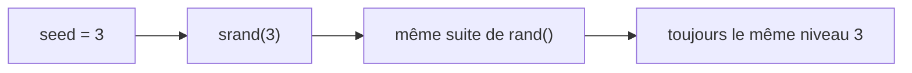

---

## Une petite bibliothèque de motifs

On écrit quelques **motifs** en fonction de la rangée `r` et de la colonne `c`. Chaque
motif renvoie un **code** (0 vide, 1 normale, 9 incassable — cf. chapitre 15).

```cpp
int motif_damier(int r, int c)   { return ((r + c) % 2 == 0) ? 1 : 0; }
int motif_mur   (int r, int c)   { return (c >= 3 && c <= 5) ? 1 : 0; }
int motif_pyramide(int r, int c) { return (c >= 4 - r && c <= 4 + r) ? 1 : 0; }
int motif_cadre (int r, int c, int rows) {
    return (r == 0 || r == rows-1 || c == 0 || c == BRICK_COLS-1) ? 9 : 1;
}
```

```
   damier            mur central        pyramide           cadre
 1 0 1 0 1 0 1     0 0 0 1 1 1 0 0 0    0 0 0 0 1 0 0 0 0   9 9 9 9 9 9 9 9 9
 0 1 0 1 0 1 0     0 0 0 1 1 1 0 0 0    0 0 0 1 1 1 0 0 0   9 1 1 1 1 1 1 1 9
 1 0 1 0 1 0 1     0 0 0 1 1 1 0 0 0    0 0 1 1 1 1 1 0 0   9 9 9 9 9 9 9 9 9
```

---

## Le générateur

Il choisit un motif selon la graine, remplit le plan, et ajoute un soupçon de hasard
contrôlé (quelques cases vides pour aérer) :

```cpp
Level generate_level(int seed) {
    srand(seed);
    Level lvl;
    lvl.rows = 3 + (seed % 4);                 // 3 à 6 rangées
    lvl.plan.resize(lvl.rows * BRICK_COLS);

    int choix = seed % 4;                       // quel motif de base
    for (int r = 0; r < lvl.rows; r++) {
        for (int c = 0; c < BRICK_COLS; c++) {
            int code;
            switch (choix) {
                case 0: code = motif_damier(r, c);            break;
                case 1: code = motif_mur(r, c);               break;
                case 2: code = motif_pyramide(r, c);          break;
                default:code = motif_cadre(r, c, lvl.rows);   break;
            }
            if (code == 1 && rand() % 100 < 10) code = 0;     // 10% de trous
            lvl.plan[r * BRICK_COLS + c] = code;
        }
    }
    ensure_at_least_one_breakable(lvl);         // sécurité (chapitre 15)
    return lvl;
}
```

---

## Faire monter la difficulté

On peut relier la graine au **numéro de niveau** et durcir peu à peu : plus de rangées,
des briques à 2 coups plus fréquentes, etc.

```cpp
Level lvl = generate_level(numero_niveau);      // niveau 1, 2, 3...
if (numero_niveau >= 3)  /* ... transformer certaines 1 en 2 (plus dures) ... */;
```

> 💡 **Attendre le vrai matériel avant de juger la difficulté.** Sur la console, le calcul
> est plus lent que sur PC : un réglage « parfait » en simulation peut sembler trop dur ou
> trop mou une fois flashé. Teste sur la AKA et ajuste (nombre de rangées, points de vie,
> vitesse de balle).

**À tester :** chaque numéro de niveau produit un agencement différent mais **cohérent**,
et le **même** numéro redonne **toujours** le même niveau.

---

## À retenir

- **Procédural = règles + hasard contrôlé**, pas du bruit.
- Le **seed** rend le hasard **reproductible** (`srand(seed)`).
- On compose des **motifs** simples (damier, mur, pyramide, cadre) et on garantit une
  brique cassable.

---

---

<a id="ch17"></a>
# Chapitre 17 — Sauvegarder sur la carte SD


---

## Objectif

Conserver le **meilleur score** et les **réglages** (volume, langue) d'une partie à
l'autre, dans un fichier sur la carte SD.

---

## La carte est déjà montée

Bonne nouvelle : `gb.init()` (chapitre 3) **monte** déjà la carte SD. Elle est accessible
sous le chemin **`/sdcard`**. Tu écris donc dans des fichiers comme
`/sdcard/AKABRICK/SAVE.TXT`, avec les fonctions de fichiers standard du C.

> ⚠️ **Piège vécu** : ne **re-monte pas** la carte toi-même. Un second montage sous une
> carte déjà montée **casse l'accès** aux fichiers (symptôme : « aucun score », sauvegarde
> impossible). On laisse `gb.init()` s'en charger, un point c'est tout.

### Noms de fichiers : la règle du 8.3

Le système de fichiers de la carte est de type FAT. Pour éviter tout souci, garde des
noms **8.3** : au plus **8 caractères** + un point + **3** d'extension, en majuscules.
`SAVE.TXT`, `SCORES.DAT`, un dossier `AKABRICK`… sont sûrs.

> ℹ️ La console n'a **pas d'horloge réglée** : les fichiers n'auront pas de date de
> modification correcte. C'est **normal**, pas un bug.

---

## Lire et écrire un fichier, pour un débutant

En C, un fichier se manipule via un **`FILE*`** obtenu avec `fopen`. On précise le mode :
`"w"` (écrire, écrase), `"r"` (lire), `"a"` (ajouter). On **doit** refermer avec `fclose`.

```cpp
FILE* f = fopen("/sdcard/AKABRICK/SAVE.TXT", "w");   // ouvrir en écriture
if (f) {                                             // toujours vérifier !
    fprintf(f, "Bonjour\n");                         // écrire comme un printf
    fclose(f);                                       // refermer (important)
}
```

- `fprintf(f, ...)` écrit **dans le fichier** (au lieu de l'écran).
- `fscanf(f, ...)` lit **depuis le fichier**.
- Si `fopen` échoue, il renvoie `nullptr` : on teste **toujours** avant d'écrire/lire.

---

## Un format texte, simple et lisible

Pour débuter, un fichier **texte** « clé = valeur » est parfait : facile à écrire, à
relire, et même à ouvrir sur un PC pour vérifier.

```
score=12345
volume=200
lang=FR
```

### La structure des données à sauver

```cpp
struct SaveData {
    int  best_score = 0;
    int  volume     = 200;      // 0..255 (chapitre 13)
    char lang[3]    = "FR";     // "FR" ou "EN"
};
```

### Écrire

```cpp
void save_write(const SaveData& s) {
    ensure_dir("/sdcard/AKABRICK");                  // crée le dossier si besoin (voir plus bas)
    FILE* f = fopen("/sdcard/AKABRICK/SAVE.TXT", "w");
    if (!f) { printf("SD: echec ecriture\n"); return; }
    fprintf(f, "score=%d\n",  s.best_score);
    fprintf(f, "volume=%d\n", s.volume);
    fprintf(f, "lang=%s\n",   s.lang);
    fclose(f);
}
```

### Lire

```cpp
bool save_read(SaveData& s) {
    FILE* f = fopen("/sdcard/AKABRICK/SAVE.TXT", "r");
    if (!f) return false;                            // pas de fichier = première partie
    char cle[16], val[16];
    // format "%15[^=]=%15s" : lire jusqu'a 15 caracteres qui ne sont PAS '=' (la clé),
    // puis le '=', puis jusqu'a 15 caracteres sans espace (la valeur).
    // fscanf renvoie le nombre de champs lus : on continue tant qu'on en lit bien 2.
    while (fscanf(f, "%15[^=]=%15s\n", cle, val) == 2) {   // lit "cle=val" ligne à ligne
        if      (!strcmp(cle, "score"))  s.best_score = atoi(val);
        else if (!strcmp(cle, "volume")) s.volume     = atoi(val);
        else if (!strcmp(cle, "lang"))   { s.lang[0]=val[0]; s.lang[1]=val[1]; s.lang[2]=0; }
    }
    fclose(f);
    return true;
}
```

`atoi(val)` convertit le texte `"12345"` en nombre `12345` ; `strcmp` compare deux
chaînes (renvoie 0 si égales).

---

## Créer le dossier si besoin

Avant d'écrire, le dossier `AKABRICK` doit exister. On le crée avec `mkdir` (sans erreur
s'il est déjà là) :

```cpp
#include <sys/stat.h>
void ensure_dir(const char* path) {
    mkdir(path, 0777);        // crée le dossier ; ne fait rien s'il existe déjà
}
```

---

## Quand sauver / charger ?

```cpp
extern "C" void app_main(void) {
    gb.init();
    SaveData save;
    save_read(save);          // au démarrage : on récupère l'existant

    // ... jeu ...
    // à la fin d'une partie, si on bat le record :
    if (g.score > save.best_score) { save.best_score = g.score; save_write(save); }
    // et à chaque changement de réglage (volume, langue) : save_write(save);
}
```

> 💡 Charge les réglages **après** le montage SD (donc après `gb.init()`) et **avant**
> d'appliquer le volume (`player.set_master_volume(save.volume)`), pour partir sur les
> bonnes valeurs.

**À tester :** fais un score, éteins/rallume la console : le meilleur score et tes
réglages sont toujours là. Ouvre `SAVE.TXT` sur un PC pour voir le contenu en clair.

---

## À retenir

- La SD est montée par `gb.init()` sous **`/sdcard`** : **ne la remonte pas**.
- Noms de fichiers **8.3** ; pas de date de fichier fiable (pas d'horloge).
- `fopen`/`fprintf`/`fscanf`/`fclose`, en **vérifiant** toujours `fopen` ; un format
  **texte** « clé=valeur » est idéal pour débuter.

---

---

<a id="ch18"></a>
# Chapitre 18 — Texte et multilingue


---

## Objectif

Afficher du texte proprement et gérer **plusieurs langues**, en centralisant toutes les
chaînes au même endroit.

---

## La police est ASCII : pas d'accents

Rappel du chapitre 4 : la police intégrée ne connaît que les caractères **ASCII** (a–z,
A–Z, chiffres, ponctuation simple). Les accents (é, è, à, ç…) s'afficheraient de travers.
On écrit donc **sans accent** :

- « Ecran », « Reglages », « Partie terminee », « Reessayer ».

Pour afficher, on a déjà tout (chapitre 4) :

```cpp
gfx.setColor(color_white);
gfx.move_cursor(20, 10);
gfx.print_str("Score");
gfx.printf(" %d", score);       // comme printf, avec des %d, %s...
```

---

## Centraliser les textes

Mauvaise idée : écrire `"Appuie sur A"` en dur un peu partout. Le jour où tu ajoutes
l'anglais, tu dois retrouver chaque chaîne. **Bonne idée** : ranger tous les textes dans
**une table**, indexée par `[langue][identifiant]`.

```cpp
enum Lang { FR, EN, LANG_COUNT };     // les langues
enum Str  { STR_PLAY, STR_LAUNCH, STR_GAMEOVER, STR_COUNT };  // les identifiants

// table [langue][identifiant] — mêmes lignes = mêmes ordres !
static const char* TEXTS[LANG_COUNT][STR_COUNT] = {
    /* FR */ { "Appuie sur A",  "A pour lancer",  "Partie terminee" },
    /* EN */ { "Press A",       "A to launch",    "Game over"       },
};

static Lang g_lang = FR;

const char* T(Str s)      { return TEXTS[g_lang][s]; }   // renvoie le bon texte
void set_lang(Lang l)     { g_lang = l; }
```

Utilisation, la même partout, quelle que soit la langue :

```cpp
gfx.move_cursor(80, 120);
gfx.print_str(T(STR_PLAY));      // "Appuie sur A" ou "Press A" selon g_lang
```

Ajouter une langue = ajouter **une ligne** dans la table. Ajouter un texte = ajouter
**une colonne** (un identifiant) et sa traduction dans chaque langue.

> ✅ **Astuce anti-bug** : chaque langue doit avoir **exactement** `STR_COUNT` chaînes,
> dans le **même ordre**. Une colonne oubliée décale toute la ligne (tu verrais « A to
> launch » au lieu de « Game over »). Un petit test au démarrage peut le vérifier.

---

## Persister la langue

Le choix de langue se sauvegarde comme les autres réglages, sur la carte SD
(chapitre 17). On le lit au démarrage et on appelle `set_lang(...)` en conséquence.

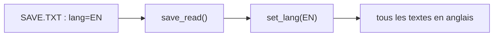

---

## Pour aller plus loin : une police personnalisée (optionnel)

Si tu veux des accents ou un style pixel-art à toi, tu peux dessiner **ta propre
police** : une grande image (un *atlas*) contenant tous les caractères côte à côte. Pour
afficher un caractère, on découpe la bonne case de l'atlas et on la **blitte** — c'est
exactement la fonction `draw_sprite` du chapitre 4, appliquée à une sous-image.

```cpp
// idée : chaque caractère occupe CW x CH dans l'atlas, 16 par ligne
void draw_glyph(int x, int y, char c, const uint16_t* atlas, int CW, int CH) {
    int idx = c - 32;                       // ' ' (espace) = premier caractère
    int src_col = (idx % 16) * CW;
    int src_row = (idx / 16) * CH;
    // ... blit de la sous-image (src_col, src_row, CW, CH) vers (x, y),
    //     en sautant la couleur-clé magenta, comme au chapitre 4 ...
}
```

Ce n'est **pas** nécessaire pour un premier jeu : la police intégrée suffit largement. À
garder en tête pour plus tard.

**À tester :** bascule `g_lang` entre `FR` et `EN` et vérifie que tous les écrans changent
de langue d'un coup ; le choix survit à un redémarrage.

---

## À retenir

- Police intégrée = **ASCII**, donc textes **sans accent**.
- Centralise les chaînes dans une **table `[langue][id]`** ; ajouter une langue = une
  ligne.
- La langue se **sauvegarde** avec les réglages ; une police custom (atlas + blit) reste
  optionnelle.

---

---

<a id="ch19"></a>
# Chapitre 19 — Menu Pause et Options


---

## Objectif

Ajouter un **menu Pause** (Reprendre / Options / Quitter) et un **menu Options** (volume,
langue). C'est l'occasion de voir comment se construit **n'importe quel** menu : une liste
d'entrées + un curseur.

---

## L'anatomie d'un menu

Un menu, c'est deux choses : une **liste d'entrées** (des textes) et un **index** qui
indique l'entrée sélectionnée. On **déplace** l'index avec haut/bas, on **valide** avec A.

```
  ▶ Reprendre        ← index = 0 (surligné)
    Options
    Quitter
```

Rappel crucial du chapitre 7 : on navigue sur le **front** (`pressed`), pas sur le
maintien, sinon le curseur défilerait à toute vitesse.

```cpp
struct Menu {
    const char* const* items;   // le tableau de textes
    int count;                  // combien d'entrées
    int index;                  // entrée sélectionnée
};

void menu_move(Menu& m, const Keys& k) {
    if (k.up_press)   m.index = (m.index - 1 + m.count) % m.count;  // remonte (boucle)
    if (k.down_press) m.index = (m.index + 1) % m.count;           // descend (boucle)
}

void menu_draw(const Menu& m, int x, int y) {
    for (int i = 0; i < m.count; i++) {
        gfx.setColor(i == m.index ? color_yellow : color_gray);   // surligne la sélection
        gfx.move_cursor(x, y + i * 16);
        gfx.print_str(m.items[i]);
    }
}
```

Le `(m.index - 1 + m.count) % m.count` fait « boucler » le curseur : remonter depuis la
première entrée renvoie à la dernière. (Le `+ m.count` évite un index négatif avant le
modulo.)

---

## Le menu Pause

On l'ouvre depuis l'état `Playing` sur la touche MENU (front), et on ajoute un état
`Pause` à la machine du chapitre 12 (ou, si tu n'utilises pas de machine à états, un
simple drapeau `paused`).

```cpp
const char* PAUSE_ITEMS[] = { "Reprendre", "Options", "Quitter" };
Menu pause_menu = { PAUSE_ITEMS, 3, 0 };

void update_pause(Game& g, const Keys& k) {
    menu_move(pause_menu, k);
    if (k.a_press) {
        switch (pause_menu.index) {
            case 0: g.state = State::Playing;  break;   // Reprendre
            case 1: g.state = State::Options;  break;   // aller aux options
            case 2: g.state = State::Title;    break;   // Quitter vers le titre
        }
    }
    draw_all(g);                          // on redessine le jeu figé derrière...
    menu_draw(pause_menu, 120, 90);       // ...puis le menu par-dessus
}
```

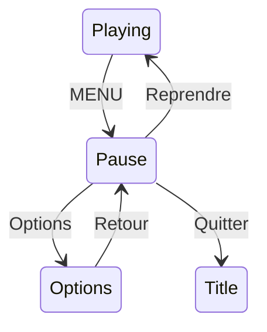

---

## Le menu Options : volume et langue

Ici les entrées ne se contentent pas d'agir au A : on **modifie une valeur** avec
gauche/droite (volume) ou on **bascule** (langue). Et on **sauvegarde** à chaque
changement (chapitre 17).

```cpp
const char* OPT_ITEMS[] = { "Volume", "Langue", "Retour" };
Menu opt_menu = { OPT_ITEMS, 3, 0 };

void update_options(Game& g, const Keys& k, SaveData& save) {
    menu_move(opt_menu, k);

    if (opt_menu.index == 0) {                        // VOLUME (0..255)
        if (k.left_press)  save.volume = MAX(0,   save.volume - 15);
        if (k.right_press) save.volume = MIN(255, save.volume + 15);
        player.set_master_volume(save.volume);        // applique tout de suite
        if (k.left_press || k.right_press) save_write(save);
    }
    if (opt_menu.index == 1 && k.a_press) {           // LANGUE (bascule FR/EN)
        set_lang(g_lang == FR ? EN : FR);
        save.lang[0] = (g_lang == FR) ? 'F' : 'E';
        save.lang[1] = (g_lang == FR) ? 'R' : 'N';
        save_write(save);
    }
    if (opt_menu.index == 2 && k.a_press)             // RETOUR
        g.state = State::Pause;

    gfx.clear(color_black);
    menu_draw(opt_menu, 100, 80);
    gfx.setColor(color_white);
    gfx.move_cursor(100, 80 + 3*16);
    gfx.printf("Vol %d   Lang %s", save.volume, save.lang);   // aperçu des valeurs
}
```

- **Volume** : on borne entre 0 et 255 (avec les macros `MIN`/`MAX` de la lib) et on
  applique **immédiatement** avec `player.set_master_volume(...)` (chapitre 13) — c'est
  bien la fonction haut niveau, pas de bas niveau.
- **Langue** : on bascule `g_lang` et on met `save.lang` à jour.
- Chaque changement est **sauvegardé** aussitôt.

**À tester :** MENU met en pause ; dans Options, gauche/droite change le volume (audible)
et A bascule la langue ; après un redémarrage, volume et langue sont conservés.

---

## À retenir

- Un menu = **liste d'entrées + index** ; on navigue au **front** (haut/bas), on valide
  au **front** (A).
- Le curseur « boucle » avec un **modulo**.
- Les Options **appliquent** et **sauvegardent** chaque changement ; le volume passe par
  **`player.set_master_volume(0..255)`**.

---

---

<a id="ch20"></a>
# Chapitre 20 — Optimiser (quand c'est utile)


---

## Objectif

Rendre le jeu plus fluide **si besoin**. Règle d'or d'abord : **on n'optimise pas à
l'aveugle**. On mesure, on trouve ce qui coûte, on corrige ce point précis. Optimiser du
code qui n'est pas le goulot d'étranglement, c'est du temps perdu et des bugs en plus.

---

## D'abord : mesurer

La lib donne la cadence réelle. Affiche-la et observe **quand** elle chute :

```cpp
gfx.setColor(color_white);
gfx.move_cursor(2, 2);
gfx.printf("FPS %.0f", gfx.get_fps());
```

Si les FPS s'effondrent quand il y a beaucoup de briques/particules, c'est **là** qu'il
faut regarder. S'ils sont stables, **ne touche à rien**.

---

## Les optimisations qui rapportent vraiment

### 1. Préférer les fonctions de formes au pixel-par-pixel

On l'a vu au chapitre 4 : `gfx.fillRect(...)` remplit une zone bien plus vite qu'une
double boucle de `drawPixel`. Pour de grandes surfaces, une seule fonction de forme vaut
des milliers d'appels individuels. **Utilise les formes de la lib** pour tout ce qui est
rectangle/ligne/cercle.

### 2. Réserver la mémoire des `vector` une fois pour toutes

Quand un `vector` grandit, il peut devoir **réallouer** (recopier) son contenu — coûteux
si ça arrive en plein jeu. Si tu connais un maximum raisonnable, réserve-le **au
démarrage** :

```cpp
bricks.reserve(64);      // place pour 64 briques, allouée une seule fois
shots.reserve(16);
falling.reserve(16);
```

L'idée générale : **éviter d'allouer/libérer de la mémoire pendant le jeu**. On prépare
les réserves à l'init, on réutilise ensuite.

### 3. Ne pas recalculer ce qui ne change pas

Sors des boucles les valeurs constantes. Par exemple, si tu utilises souvent
`p.r.w / 2`, calcule-le une fois dans une variable plutôt qu'à chaque itération. Un calcul
trivial une fois par image ne coûte rien ; le **même** calcul répété des milliers de fois
par image, si.

### 4. L'audio sur son cœur, le jeu sur le sien

On l'a fait au chapitre 13 : la tâche audio tourne sur le **cœur 0**, la boucle de jeu
sur l'autre. Ça évite que les gros calculs du jeu (beaucoup de collisions) ne fassent
« bégayer » le son. Si tu ajoutes une IA lourde (jeu de plateau, etc.), même logique :
mets-la sur une tâche à part.

---

## Ce qui est déjà géré pour toi

- **Le découpage aux bords** (*clipping*) : `gfx.drawPixel` vérifie déjà les bornes de
  l'écran (chapitre 4). Tu peux dessiner un objet qui dépasse : les pixels hors écran sont
  simplement ignorés. Pas besoin de le gérer toi-même pour commencer.
- **Le transfert vers l'écran** : `gfx.update()` envoie le framebuffer à l'écran de façon
  efficace (transfert en bloc). Tu appelles `update()` **une fois** par image, pas plus.

---

## Fausses bonnes idées (pièges)

- **« Effacer seulement ce qui a bougé »** : tentant, mais source de traînées et de bugs.
  Sur un casse-briques, redessiner tout l'écran chaque image est assez rapide. Ne
  complexifie que si la mesure le justifie.
- **« Micro-optimiser chaque ligne »** : illisible, risqué, et souvent inutile. Le
  compilateur optimise déjà énormément. Vise la **clarté** d'abord.
- **Optimiser avant de mesurer** : tu risques de durcir un code qui n'était pas le
  problème.

---

## À retenir

- **Mesure d'abord** (`get_fps`), optimise **ensuite**, et seulement le point qui coûte.
- Gains réels : **formes de la lib** plutôt que pixel-par-pixel, **`reserve()`** sur les
  vectors, **pas d'allocation en jeu**, audio/jeu **sur des cœurs séparés**.
- Le **clipping** et le **transfert écran** sont déjà gérés par la lib.

---

---

<a id="ch21"></a>
# Chapitre 21 — Assemblage final et publication


---

## Objectif

Rassembler tout ce qu'on a construit en un projet **propre**, découpé en fichiers, et le
publier sur GitHub.

---

## Découper le code en fichiers

Jusqu'ici on a pu tout garder dans `app_main.cpp` pour apprendre. Pour un vrai projet, on
sépare par **responsabilité** — un couple `.h`/`.cpp` par domaine :

```
main/
├── CMakeLists.txt
├── app_main.cpp        ← init + boucle + machine à états
├── config.h            ← constantes (tailles, vitesses, couleurs)
├── entities.h          ← Rect, Ball, Paddle, Brick, structures communes
├── input.h / .cpp      ← Keys + read_input (chapitre 7)
├── physics.h / .cpp    ← overlap, rebonds, collisions (chapitres 9-11)
├── level.h / .cpp      ← plans + génération (chapitres 15-16)
├── audio.h / .cpp      ← player, voices, SfxBus (chapitre 13)
├── save.h / .cpp       ← lecture/écriture SD (chapitre 17)
├── i18n.h / .cpp       ← table de textes (chapitre 18)
└── ui.h / .cpp         ← menus (chapitre 19)
```

Le **`.h`** (en-tête) déclare *ce que le module offre* (les fonctions, les structures) ;
le **`.cpp`** contient *le code*. Les autres fichiers font `#include "physics.h"` pour
utiliser la physique sans connaître ses détails. C'est le développement « en couches »
appliqué à l'échelle du projet.

> Rappel du chapitre 3 : chaque nouveau `.cpp` doit être ajouté au `SRCS` du
> `main/CMakeLists.txt`, sinon il n'est pas compilé.

---

## Le squelette de `app_main.cpp`

Tout se ramène à : initialiser, charger, puis tourner la boucle qui distribue le travail
selon l'état.

```cpp
#include "gamebuino.h"
#include "config.h"
#include "input.h"
#include "audio.h"
#include "save.h"
#include "i18n.h"
// ...

gb_core     gb;
gb_graphics gfx;

extern "C" void app_main(void) {
    gb.init();
    audio_init();                 // tâche + volume (chapitre 13)
    SaveData save; save_read(save);
    set_lang(save.lang[0]=='E' ? EN : FR);
    player.set_master_volume(save.volume);

    Game g; new_game(g);

    while (true) {
        uint32_t debut = gb.get_millis();
        Keys k; read_input(k);

        checkReturnToLoader(k);   // RUN+MENU 500 ms (voir ci-dessous)

        switch (g.state) {
            case State::Title:       update_title(g, k);   break;
            case State::WaitingBall: update_waiting(g, k); break;
            case State::Playing:     update_playing(g, k); break;
            case State::Pause:       update_pause(g, k);   break;
            case State::Options:     update_options(g, k, save); break;
            case State::GameOver:    update_gameover(g, k);break;
        }

        gfx.update();
        uint32_t travail = gb.get_millis() - debut;
        if (travail < FRAME_MS) gb.delay_ms(FRAME_MS - travail);
    }
}
```

---

## Revenir au menu de la console (loader)

Un jeu propre sait rendre la main. On revient au **loader** de la AKA en redémarrant sur
sa partition, quand le joueur maintient **RUN + MENU** ~500 ms — une combinaison peu
probable par accident.

```cpp
#include "esp_ota_ops.h"
#include "esp_partition.h"

void checkReturnToLoader(const Keys& k) {
    static uint32_t combo_start = 0;
    uint32_t now = gb.get_millis();
    bool run_menu = k.run && k.menu;             // les deux maintenues

    if (run_menu) {
        if (combo_start == 0) combo_start = now;
        else if (now - combo_start >= 500) {
            const esp_partition_t* loader = esp_partition_find_first(
                ESP_PARTITION_TYPE_APP, ESP_PARTITION_SUBTYPE_APP_OTA_1, nullptr);
            if (loader) { esp_ota_set_boot_partition(loader); esp_restart(); }
        }
    } else combo_start = 0;                       // relâché : on réarme
}
```

> Appelle-la **à chaque image, dans tous les états** (pas seulement en jeu), à partir de
> la lecture unique `read_input`. `k.run` / `k.menu` viennent de `gb.buttons.state()` avec
> `KEY_RUN` / `KEY_MENU`.

---

## Publier sur GitHub

Une fois le jeu prêt, un dépôt soigné donne envie de l'essayer :

- un **README** clair : de quoi il s'agit, une **capture d'écran** (ou un GIF), comment
  compiler (`idf.py set-target esp32s3` → `build` → `flash`), les commandes du jeu ;
- la **licence** (par ex. MIT) ;
- le dossier `components/gamebuino` **tel quel** (ou un lien vers la lib + instructions
  pour la déposer) ;
- éventuellement un dossier `assets/` (sprites, sons) et un `docs/` (ce tutoriel !).

**À tester :** clone ton propre dépôt dans un dossier neuf, compile, flashe. Si ça marche
« à froid », il est prêt à être partagé.

---

## À retenir

- Découpe par **responsabilité** (`.h` = ce qu'on offre, `.cpp` = le code) et **ajoute
  chaque `.cpp`** au `CMakeLists.txt`.
- `app_main` = init + chargement + boucle qui **distribue** selon l'état.
- Prévois le **retour au loader** (RUN+MENU) et un **README** de qualité pour publier.

---

---

<a id="chbonus"></a>
# Chapitre Bonus — Effets : particules, sprites animés, plein écran, boss


---

## Objectif

Ajouter du « jus » : des petits effets qui donnent vie au jeu. Tous reposent sur des
notions déjà vues (structures, `vector`, framebuffer, blit). Ce chapitre est une boîte à
idées avec du code de départ — à picorer selon l'envie.

---

## Particules : un `vector` de petits points qui vivent puis meurent

Une particule est un point avec une **position**, une **vitesse**, une **durée de vie**
et une couleur. À chaque image elle avance, vieillit, puis disparaît. C'est exactement la
même mécanique que la balle (chapitre 9), en tout petit et en grand nombre.

```cpp
struct Particle { float x, y, vx, vy; int life; uint16_t col; };
std::vector<Particle> particles;

// à la casse d'une brique : projeter quelques éclats
void spawn_burst(int x, int y, uint16_t col) {
    for (int n = 0; n < 8; n++) {
        float a = (rand() % 628) / 100.0f;         // angle 0..2π (approx)
        float s = 1.0f + (rand() % 200) / 100.0f;  // vitesse
        particles.push_back({ (float)x, (float)y,
                              cosf(a)*s, sinf(a)*s, 20, col });   // vit 20 images
    }
}

void particles_update() {
    for (auto& p : particles) {
        if (p.life <= 0) continue;
        p.x += p.vx; p.y += p.vy;
        p.vy += 0.05f;          // un peu de gravité : les éclats retombent
        p.life--;               // vieillit
    }
}

void particles_draw() {
    for (auto& p : particles)
        if (p.life > 0) gfx.drawPixel((int)p.x, (int)p.y, p.col);
}
```

Comme pour les briques, on **réutilise** les particules « mortes » (`life <= 0`) plutôt
que de les supprimer du `vector` en plein jeu (chapitre 11). Pense à `particles.reserve(...)`
(chapitre 20).

---

## Sprites animés : changer d'image au fil du temps

Un sprite animé, c'est plusieurs images (*frames*) qu'on affiche à tour de rôle. On garde
un compteur : toutes les N images de jeu, on passe à la frame suivante. L'affichage
réutilise le **blit** du chapitre 4.

```cpp
struct AnimSprite {
    const uint16_t* frames[4];   // 4 images
    int w, h;
    int frame = 0;               // image courante
    int timer = 0;               // compteur
    int speed = 6;               // change de frame toutes les 6 images de jeu
};

void anim_update(AnimSprite& a) {
    if (++a.timer >= a.speed) { a.timer = 0; a.frame = (a.frame + 1) % 4; }
}

void anim_draw(const AnimSprite& a, int x, int y) {
    draw_sprite(a.frames[a.frame], a.w, a.h, x, y);   // draw_sprite : chapitre 4
}
```

```
 frame 0   frame 1   frame 2   frame 3   → puis on reboucle
  ▲ ▲       ▲ ▲       ▲ ▲       ▲ ▲
  ███       ███       ███       ███
  █ █       ▐ ▌       █ █       ▐ ▌
```

---

## Effets « plein écran » : écrire directement le framebuffer

Un « flash » blanc, un fondu, une teinte… ce sont des effets qu'on applique à **tout**
l'écran. Comme le framebuffer est un simple tableau (chapitre 4), on peut le parcourir.

```cpp
// flash : recouvre tout l'écran d'une couleur, opacité décroissante gérée par la durée
void flash(uint16_t col) {
    for (int i = 0; i < SCREEN_WIDTH * SCREEN_HEIGHT; i++)
        framebuffer[i] = col;
}
```

Pour un vrai fondu progressif, on mélangerait chaque pixel avec la couleur cible (en
décomposant R/V/B — chapitre 4). Reste **léger** : parcourir 76 800 pixels par image a un
coût, à réserver aux moments clés (transition, dégâts, victoire).

---

## Un boss : une grosse entité avec de la vie et un comportement

Un boss n'est qu'un objet plus gros, avec des **points de vie** et un **déplacement**
scripté. On réutilise `Rect`, la collision `overlap`, et un petit automate pour son
comportement (va-et-vient, phases selon les hp…).

```cpp
struct Boss {
    Rect r;
    int  hp;
    float vx;      // vitesse de patrouille
};

void boss_update(Boss& b) {
    b.r.x += (int)b.vx;
    if (b.r.x < 0 || b.r.x > SCREEN_W - b.r.w) b.vx = -b.vx;   // rebond sur les bords
    // touché par la balle ? -> overlap(ball_rect(ball), b.r) -> b.hp--
    // hp bas -> change de phase (va plus vite, tire...)
}
```

---

## À retenir

- Tous ces effets **réutilisent** l'acquis : `vector` (particules), blit (sprites
  animés), framebuffer (plein écran), `Rect`/`overlap` (boss).
- On **recycle** les objets morts plutôt que de les supprimer en plein jeu, et on
  **réserve** la mémoire à l'avance.
- Les effets plein écran sont puissants mais **coûteux** : à utiliser aux moments forts.

Bravo — tu as fait le tour de tout ce qui compose un vrai petit moteur de jeu sur la AKA.
À toi de créer le tien. 🎮

---

---

<a id="annexe-a"></a>
# Annexe A — Créer un sprite et le convertir pour le jeu


---

## Objectif

Au chapitre 4, on a vu **ce qu'est** un sprite (un petit tableau de pixels 16 bits) et
comment l'**afficher** (le blit, avec la transparence magenta). Il manque le début de
l'histoire : **comment fabriquer** ce tableau à partir d'une image dessinée dans un
éditeur. C'est le **pipeline d'asset** : dessiner → exporter → convertir → intégrer.

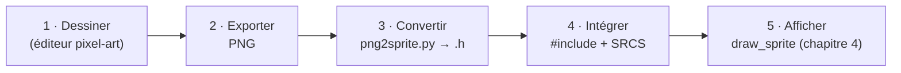

> Pour les **sons**, la lib fournit déjà un outil équivalent (`convert.bat` +
> `Bin2Hex.exe` dans `components/gamebuino/.../assets`, qui transforme un `.wav` en
> tableau C). Pour les **images**, il n'y a pas d'outil livré : on utilise le petit script
> Python fourni ici, qui suit exactement la même idée (embarquer les données dans un
> `.h`).

---

## 1. Dessiner le sprite

Utilise n'importe quel éditeur **pixel-art** : [Piskel](https://www.piskelapp.com)
(gratuit, dans le navigateur), [Aseprite](https://www.aseprite.org) (payant, la
référence), [GIMP](https://www.gimp.org) ou même Paint pour un test.

Deux règles pour que la conversion se passe bien :

- **Travaille à la taille finale** (par ex. 16×16 px). Un sprite de 200×200 pèsera très
  lourd une fois embarqué (chaque pixel = 2 octets). Un personnage de casse-briques fait
  typiquement 8×8 à 24×24.
- **Gère la transparence** de l'une de ces deux façons :
  - soit un **fond transparent** (canal alpha) — recommandé, propre ;
  - soit un **fond en magenta pur** `RGB(255, 0, 255)` — la couleur-clé du chapitre 4.

```
  exemple 8x8 (T = transparent) :
   T ██ ██ T T ██ ██ T
   ██ ██ ██ ██ ██ ██ ██ ██
   ██ ██ ██ ██ ██ ██ ██ ██
   ...
```

---

## 2. Exporter en PNG

Exporte en **PNG** (il conserve les couleurs exactes et la transparence, contrairement au
JPEG qui « bave »). Garde un nom compatible avec une variable C : lettres, chiffres, `_`,
pas d'espace ni d'accent (`hero.png`, `brick_red.png`).

---

## 3. Convertir le PNG en fichier `.h`

Le script **`tools/png2sprite.py`** (fourni) lit le PNG et écrit un `.h` contenant le
tableau de couleurs au **format 16 bits de la AKA** (`(r>>3) | (g>>2)<<5 | (b>>3)<<11`,
rouge en bits de poids faible, comme au chapitre 4). Les pixels transparents (ou magenta
pur) deviennent la clé `0xF81F`.

```bash
# dépendance, une fois :
pip install Pillow

# conversion :
python3 tools/png2sprite.py hero.png --name hero
# -> génère hero.h
```

Le fichier généré ressemble à ça (exemple d'un petit cœur 8×8) :

```cpp
// Fichier genere par png2sprite.py - ne pas editer a la main.
#pragma once
#include <stdint.h>

constexpr int  coeur_W = 8;
constexpr int  coeur_H = 8;
constexpr uint16_t coeur_KEY = 0xF81F;   // couleur transparente

const uint16_t coeur[8 * 8] = {
    0xF81F, 0x18FB, 0x18FB, 0xF81F, 0xF81F, 0x18FB, 0x18FB, 0xF81F,
    0x18FB, 0x18FB, 0x18FB, 0x18FB, 0x18FB, 0x18FB, 0x18FB, 0x18FB,
    // ... une ligne du tableau = une rangée de l'image ...
};
```

On retrouve **exactement** la structure du chapitre 4 : une largeur, une hauteur, et un
tableau `largeur × hauteur` rangé **ligne par ligne** (row-major). Les `0xF81F` sont les
pixels transparents ; les autres sont des couleurs.

> Options utiles : `--name` fixe le nom de la variable, `--out` le fichier de sortie,
> `--alpha-threshold` règle à partir de quelle opacité un pixel est considéré transparent
> (défaut 128).

---

## 4. Intégrer le `.h` dans le projet

Deux gestes (rappel du chapitre 3) :

1. Place `hero.h` dans ton dossier `main/` (ou un sous-dossier `main/assets/`).
2. Il suffit de l'**inclure** ; comme c'est un `.h` avec les données dedans, tu n'as
   **rien à ajouter au `SRCS`** du `CMakeLists.txt` (on n'ajoute au `SRCS` que les
   `.cpp`). Si tu ranges tes assets dans un sous-dossier, ajoute-le à `INCLUDE_DIRS`.

```cpp
#include "hero.h"     // apporte : hero, hero_W, hero_H, hero_KEY
```

---

## 5. L'afficher (blit du chapitre 4)

On réutilise `draw_sprite` du chapitre 4, en lui passant les constantes générées :

```cpp
draw_sprite(hero, hero_W, hero_H, x, y);   // les pixels hero_KEY (magenta) sont sautés
```

Rappel de la fonction (chapitre 4), pour mémoire :

```cpp
void draw_sprite(const uint16_t* sprite, int w, int h, int x, int y) {
    for (int j = 0; j < h; j++)
        for (int i = 0; i < w; i++) {
            uint16_t c = sprite[j * w + i];    // j*w+i : même adressage que l'écran
            if (c == 0xF81F) continue;         // transparent -> on saute
            gfx.drawPixel(x + i, y + j, c);
        }
}
```

**À tester :** convertis un petit PNG, inclus le `.h`, appelle `draw_sprite(...)` dans ta
boucle. Ton dessin apparaît à l'écran, coins transparents compris.

---

## Automatiser (optionnel)

Si tu as beaucoup de sprites, convertis tout un dossier d'un coup :

```bash
for f in assets/*.png; do python3 tools/png2sprite.py "$f"; done
```

Tu peux aussi générer un **atlas** (plusieurs sprites dans une seule image) et découper
des sous-images au blit — pratique notamment pour une **police personnalisée**
(chapitre 18) ou des **sprites animés** (chapitre bonus), où toutes les frames tiennent
dans un même fichier.

---

## À retenir

- Un asset se fabrique par un **pipeline** : dessiner (PNG, transparence) → **convertir**
  en `.h` → **inclure** → **blitter**.
- `tools/png2sprite.py` produit le tableau 16 bits au **format AKA**, transparence =
  **magenta `0xF81F`**.
- Un `.h` d'asset s'**inclut** simplement (rien à mettre dans `SRCS`) ; l'affichage
  réutilise le **`draw_sprite`** du chapitre 4.

---

---

<a id="annexe-b"></a>
# Annexe B — Déboguer sur la Gamebuino AKA


---

## Objectif

Un jeu ne compile jamais du premier coup, et ne marche jamais parfaitement au premier
flash. Cette annexe rassemble les **réflexes** qui font gagner des heures : lire les
erreurs dans le bon ordre, utiliser le moniteur série, et reconnaître les pannes
classiques.

---

## Règle d'or : lis la PREMIÈRE erreur, pas la dernière

Le compilateur C++ peut cracher des **centaines** d'erreurs à partir d'**une seule** faute.
Exemple vécu : une ligne de texte français oubliée **hors** d'un commentaire dans un `.h`…

```cpp
// dans fruits.h, ligne 17 :
tile_r/tile_c/prev_tile_/pixel_offset/dir   // <-- du texte, mais SANS // devant !
```

…déclenche un déluge du genre :

```
error: 'pixel_offset' does not name a type
error: 'size_t' has not been declared
error: 'ptrdiff_t' does not name a type
... (des centaines de lignes venant de <vector>, <type_traits>, <new> ...)
```

Ces centaines de lignes ne sont **pas** des vrais problèmes : dès qu'une erreur de syntaxe
survient **avant** que les en-têtes standards finissent d'être lus, le compilateur se
**désynchronise** et tout ce qui suit devient du charabia à ses yeux.

**La méthode :** remonte tout en haut, corrige la **première** erreur (ici : remettre la
ligne 17 dans un commentaire), recompile. Le plus souvent, les centaines d'autres
disparaissent d'un coup. Ne perds jamais de temps sur les erreurs du milieu ou de la fin
avant d'avoir traité la première.

---

## Ton meilleur outil : `printf` + le moniteur série

`idf.py monitor` (ou `flash monitor`) ouvre la **console série** : tout ce que tu écris
avec `printf(...)` s'y affiche pendant que le jeu tourne. C'est LA façon de voir ce qui se
passe « à l'intérieur ».

```cpp
printf("balle x=%.1f y=%.1f  vies=%d\n", ball.x, ball.y, g.lives);
printf("combo run=%d menu=%d\n", (int)k.run, (int)k.menu);   // débogage du retour loader
```

- Affiche les valeurs qui te surprennent (position, état, résultat d'un test).
- Un `printf` bien placé répond à la question « est-ce que ce code est seulement exécuté ? »
- On quitte le moniteur avec `Ctrl+]`.

> Astuce « bissection » : si tu ne sais pas d'où vient un bug, mets un `printf("ici 1\n")`,
> `printf("ici 2\n")`… à des points clés. Le dernier « ici N » affiché te dit **jusqu'où**
> le programme arrive avant de planter.

---

## Le tableau des pannes classiques

| Symptôme | Cause probable | Correctif |
|---|---|---|
| `undefined reference to ...` (à l'édition de liens) | dépendance non liée | mettre `gamebuino` dans **`REQUIRES`** (pas `INCLUDE_DIRS`), ch. 3 ; et **chaque `.cpp`** dans `SRCS` |
| `'X' does not name a type` en cascade | texte/typo hors commentaire, ou `#include` manquant dans un `.h` | corriger la **première** erreur (voir plus haut) |
| Redémarrages en boucle / `Guru Meditation` / `LoadProhibited` | accès mémoire invalide : indice de tableau hors bornes, pointeur nul | vérifier les bornes (`framebuffer` : 0..319 / 0..239), ne pas déréférencer un `nullptr` |
| `Stack overflow in task ...` | trop de données **locales** (gros tableau dans une fonction) ou récursion profonde | déplacer les gros tableaux en **`static`** ou en mémoire dynamique (PSRAM) ; agrandir la pile de la tâche |
| **Écran noir** alors que tu dessines | tu as oublié `gfx.update()` | appeler `gfx.update()` **une fois** en fin d'image (ch. 4-5) |
| **Aucun son** ou son haché | `player.pool()` pas assez fréquent, volume à 0, ou > 4 voix | tâche audio toutes les ~2 ms, `set_master_volume(200)`, max **4** pistes (ch. 13) |
| **Pas de score / sauvegarde impossible** | double montage de la carte SD, ou nom de fichier non-8.3 | laisser `gb.init()` monter la SD (ne pas remonter), noms **8.3** (ch. 17) |
| La raquette **dérive** toute seule | pas de zone morte sur le joystick | ignorer `|jx| < 200` (ch. 7) |
| La balle **traverse** ou **colle** à une brique | rebond sans repositionnement, ou collision multiple | replacer la balle au bord après rebond, `break` après la 1re brique (ch. 9-11) |
| Le combo **RUN+MENU** ne réagit pas | mauvaise touche testée, ou test hors de tous les états | lire `KEY_RUN`/`KEY_MENU`, appeler la vérif **chaque image, dans tous les états** (ch. 21) |

---

## Compiler et repartir propre

Quand des erreurs deviennent incompréhensibles (surtout après avoir changé de cible ou la
config), un **nettoyage** résout souvent le problème :

```bash
idf.py fullclean     # efface les fichiers de build
idf.py build         # reconstruit tout à neuf
```

Et si un flash se passe mal, vérifie le **port** (`-p COMx`) et que la console est bien en
mode réception.

---

## L'état d'esprit

- **Un bug à la fois.** Ne change pas dix choses en même temps : tu ne saurais pas laquelle
  a corrigé (ou cassé) quoi.
- **Reproduis d'abord.** Trouve les étapes exactes qui déclenchent le bug avant de le
  traquer.
- **Reviens à une version qui marche.** Garde des sauvegardes (ou un dépôt Git) : pouvoir
  comparer « avant/après » vaut de l'or.

---

## À retenir

- **Toujours** corriger la **première** erreur du compilateur ; les suivantes en découlent
  souvent.
- `printf` + **moniteur série** = ta lampe torche ; la « bissection » localise un plantage.
- La plupart des pannes sont dans le **tableau** ci-dessus : `undefined reference`, écran
  noir, son muet, SD, dérive joystick, combo loader.

---
